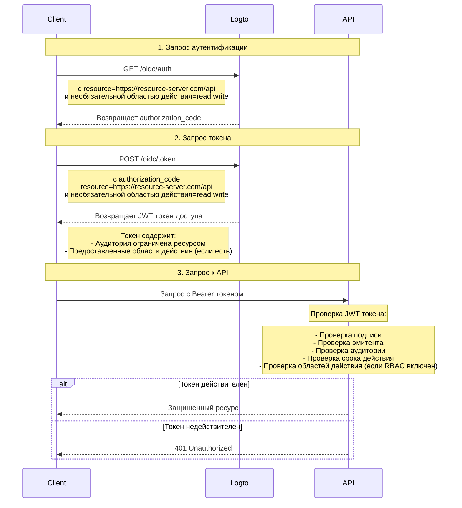

# Защита вашего API

Если вам не нужны гибкие, детализированные политики управления доступом, вы можете просто защитить ваш API напрямую. Мы проведем вас через диаграмму последовательности и необходимые шаги, чтобы показать, как интегрировать управление доступом в ваше приложение.



В этом руководстве

- Endpoint Logto: `https://tenant-id.logto.app`
- Клиентское приложение: `https://client.example.org`
- Сервер ресурсов API: `https://resource-server.com/api`

Вы должны заменить их на ваши фактические endpoints при реализации.

## Запрос аутентификации \{#authentication-request}

Предоставьте список параметров индикатора ресурса в [Запросе аутентификации](https://openid.net/specs/openid-connect-core-1_0.html#AuthRequest). Это укажет все защищенные ресурсы, которые пользователь может запросить.

```bash
GET https://tenant-id.logto.app/oidc/auth?response_type=code
    &client_id=s6BhdRkqt3
    &state=tNwzQ87pC6llebpmac_IDeeq-mCR2wLDYljHUZUAWuI
    &redirect_uri=https%3A%2F%2Fclient.example.org%2Fcb
    &resource=https%3A%2F%2Fresource-server.com%2Fapi
    &scope=read%20write
```

Logto проверит и сохранит эти индикаторы ресурсов. `authorization_code` будет предоставлен и возвращен с областями действия, ограниченными этими указанными ресурсами.

Пример конфигурации Logto SDK:

```tsx
const config: LogtoConfig = {
  // ...другие конфигурации
  resources: ['https://resource-server.com/api'],
  scopes: ['read', 'write'],
};
```

## Запрос токена \{#token-request}

Когда параметр ресурса присутствует в [Запросе токена](https://openid.net/specs/openid-connect-core-1_0.html#TokenRequest) вместе с предоставленным выше `authorization_code`, он укажет целевую аудиторию ресурса API, для которой запрашивается токен доступа.

```bash
POST https://tenant-id.logto.app/oidc/token HTTP/1.1
Content-Type: application/x-www-form-urlencoded

grant_type=authorization_code&redirect_uri=https%3A%2F%2Fclient.example.org%2Fcb&code=10esc29BWC2qZB0acc9v8zAv9ltc2pko105tQauZ&resource=https%3A%2F%2Fresource-server.com%2Fapi
```

Зашифрованный токен доступа с аудиторией, ограниченной этим запрашиваемым ресурсом, будет предоставлен Logto. Токен содержит все данные, необходимые для представления статуса авторизации запроса, например, идентичность и роль пользователя, аудиторию токена и время его истечения.

Пример кода Logto SDK:

```tsx
const accessToken = await logtoClient.getAccessToken('https://resource-server.com/api');
```

Полезная нагрузка accessToken будет содержать:

```tsx
{
  iss: '<your-logto-endpoint>/oidc',
  aud: 'https://resource-server.com/api',
  scope: 'read write'
}
```

## Запрос к ресурсу API \{#request-to-the-api-resource}

Пользователь клиента отправил запрос к ресурсу API, предоставив данный `access_token` в заголовке Authorization.

```bash
GET https://resource-server.com/api/users
Authorization: Bearer eyJhbGciOiJIUz...
```

Logto следует стандартному протоколу авторизации на основе токенов для защиты ваших ресурсов API. Чтобы узнать больше об OAuth 2.0, пожалуйста, обратитесь к [официальному документу](https://datatracker.ietf.org/doc/html/rfc6749#section-1.3.1) OAuth 2.0.

## Проверка токенов авторизации для запросов API \{#validate-authorization-tokens-for-api-requests}

Logto выдает стандартный токен авторизации в формате [JWT](https://datatracker.ietf.org/doc/html/rfc7519) для каждого авторизованного запроса API. Токен зашифрован и подписан как токен [JWS](https://datatracker.ietf.org/doc/html/rfc7515).

#### Понимание токена JWS \{#understanding-jws-token}

Закодированный токен [JWS](https://datatracker.ietf.org/doc/html/rfc7515) состоит из трех частей:

- Заголовок JOSE: Объявляет тип кода и алгоритм кодирования
- Полезная нагрузка JWS: Включает все утверждения токена
- Подпись JWS: Подпись, подписанная с использованием [JWK](https://datatracker.ietf.org/doc/html/rfc7517)

Стандартная схема полезной нагрузки JWS, выданной Logto: (утверждения могут варьироваться в зависимости от вашей пользовательской конфигурации OIDC)

| ключ      | описание                             |
| --------- | ------------------------------------ |
| jti       | уникальный идентификатор JWT         |
| sub       | субъект, обычно user-id              |
| iat       | временная метка выпуска токена       |
| exp       | временная метка истечения токена     |
| client_id | идентификатор приложения             |
| iss       | идентичность эмитента токена         |
| aud       | аудитория токена                     |
| scope     | области действия (разрешения) токена |

:::note

Для разработки, чтобы визуально проверить JWT токен, вы можете посетить [инструмент декодера JWT](https://www.jstoolset.com/jwt), чтобы декодировать и проверить полученные токены. Будьте осторожны или никогда не используйте токены из производственной среды. Поскольку это предоставляемый третьей стороной публичный онлайн-сервис, ваш токен может быть раскрыт.

:::

#### Проверка токена авторизации \{#validate-the-authorization-token}

1. [Проверка JWT](https://datatracker.ietf.org/doc/html/rfc7519#section-7.2)
2. [Проверка подписи JWS](https://datatracker.ietf.org/doc/html/rfc7515#section-5.2)
3. Эмитент токена — `https://<your-logto-domain>/oidc` (выдан вашим сервером аутентификации Logto)
4. Аудитория токена равна индикатору ресурса текущего получателя, зарегистрированному в Logto Admin Console
5. Токен находится в пределах времени его истечения
6. (Только [RBAC](/authorization/role-based-access-control/protect-api-resources-with-rbac)) Токен имеет желаемую `scope`

Существует множество библиотек с открытым исходным кодом и пакетов, которые могут помочь вам легко проверить и декодировать JWT токен. Вы можете выбрать одну из них и интегрировать с вашим серверным приложением в зависимости от используемого языка и фреймворка. Пожалуйста, ознакомьтесь с некоторыми из наших примеров:

- [Node (Express)](/authorization/api-resources/node-express)
- [Spring Boot](/authorization/api-resources/spring-boot)
- [Python](/authorization/api-resources/python)

## Справка \{#reference}

Logto использует протокол авторизации OAuth 2.0 на основе кода, чтобы сделать ваш запрос к API безопасным. Если вас интересует стратегия, стоящая за этим, обратитесь к [спецификации](https://datatracker.ietf.org/doc/html/rfc6749#section-1.3.1) OAuth 2.0 для получения более подробной информации.

## Часто задаваемые вопросы \{#faqs}

<details>

<summary>

### Как протестировать взаимодействие клиентской стороны, Logto и серверной стороны без создания клиента? \{#how-to-test-the-client-side-logto-and-server-side-interaction-without-building-the-client}

</summary>

Вы можете автоматизировать этот процесс без необходимости создания клиента. Один из вариантов — использовать Personal Access Token (PAT). PAT позволяет вам имитировать аутентификацию на стороне клиента, представляя конкретного пользователя с различными ролями и разрешениями. Это может быть использовано для тестирования вашей серверной логики, такой как проверка токена доступа или JWT, без необходимости в полностью построенном клиенте. Чтобы начать, обратитесь к [Personal access token](/user-management/personal-access-token).

</details>
