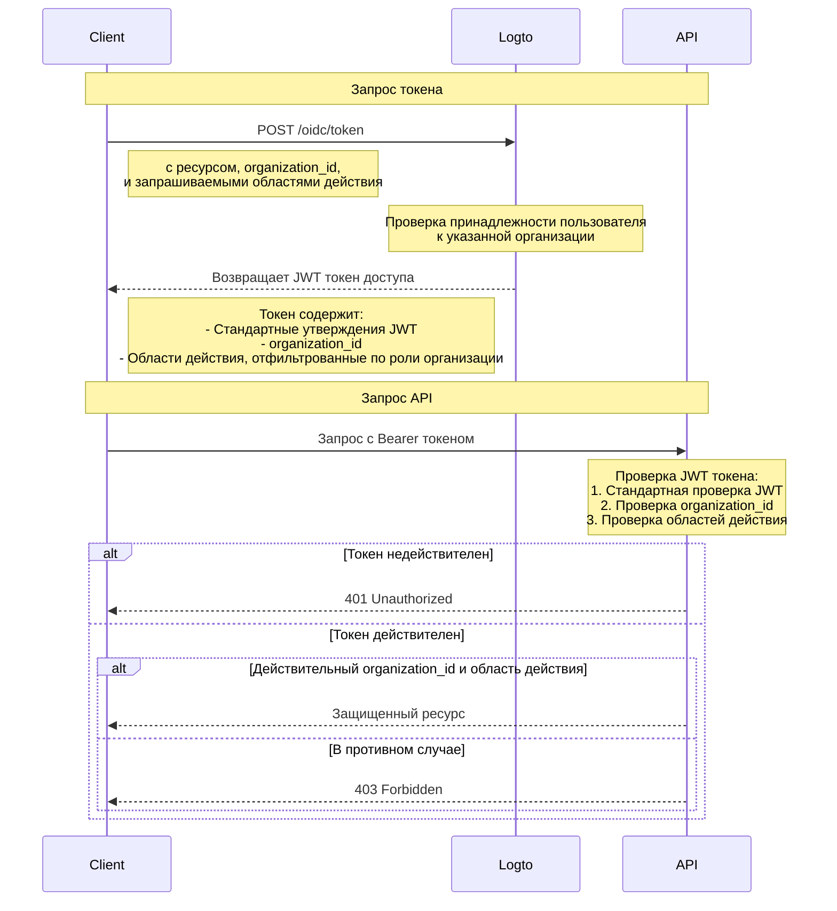

# Защита ресурса API с помощью шаблона организации

В дополнение к [Защите вашего API](/authorization/api-resources/protect-your-api), которая обеспечивает безопасность ресурсов, гарантируя наличие действительного JWT, организационные роли также могут применяться для фильтрации областей действия. В этой статье мы сосредоточимся на том, как организационная роль влияет на делегирование и проверку областей действия в вашем процессе аутентификации.



## Дополнительный параметр `organization_id` \{#the-additional-organization_id-parameter}

В дополнение к обычному запросу на предоставление токена доступа, в диаграмме мы добавляем дополнительный параметр `organization_id`, который указывает Logto сузить области действия до ролей конкретной организации.

## Настройка клиента \{#client-setup}

Если вы используете SDK Logto, вы можете добавить `organization_id` в качестве второго параметра метода `getAccessToken`.

```tsx
const accessToken = await logto.getAccessToken('https://my-resource.com/api', 'org_1');

// Или получение утверждений напрямую
const accessTokenClaims = await logto.getAccessTokenClaims('https://my-resource.com/api', 'org_1');
console.log(accessTokenClaims.organization_id); // 'org_1'
console.log(accessTokenClaims.aud); // 'https://my-resource.com/api'
```

Тогда только области действия, унаследованные от ролей этой организации, будут включены в токен доступа, а также дополнительное утверждение `organization_id`.

## Проверка на сервере API \{#api-server-validation}

В дополнение к обычной проверке JWT токена доступа, вам нужно будет добавить дополнительный уровень проверки, чтобы убедиться, что `organization_id` присутствует и действителен.
