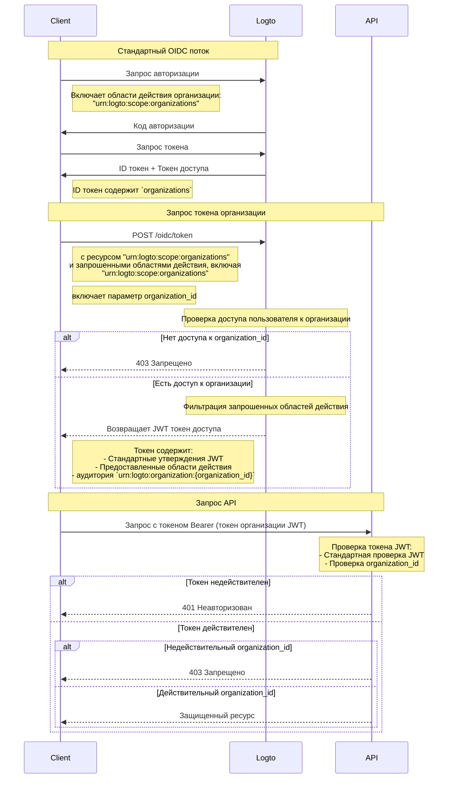

import TabItem from '@theme/TabItem';
import Tabs from '@theme/Tabs';

# Защита ресурсов организации

В дополнение к [Защите вашего API](/authorization/api-resources/protect-your-api), где API рассматривается как ресурс, организация также может быть ресурсом, и вы можете защищать ресурс вашей организации аналогичным образом. В этой статье мы сосредоточимся на том, как изменить защиту ресурса вашей организации аналогичным образом.



## Шаг 1: Получение идентификаторов организаций из OIDC потока \{#step-1-get-organization-ids-from-oidc-flow}

Logto расширяет стандартный протокол [OpenID Connect](https://openid.net/specs/openid-connect-core-1_0.html), чтобы позволить вашему приложению получать информацию об организации от пользователя. Есть два способа сделать это:

- Если вы используете Logto SDK с поддержкой организаций, вы можете добавить область действия `urn:logto:scope:organizations` в параметр `scopes` объекта конфигурации. Обычно в SDK будет перечисление для этой области, например, `UserScope.Organizations` в [Logto JS SDKs](https://github.com/logto-io/js).

<Tabs groupId="sdk">

  <TabItem value="js" label="JavaScript">

```ts
import { LogtoClient, UserScope } from '@logto/browser'; // или @logto/node, @logto/client

const logto = new LogtoClient({
  // ...
  scopes: [UserScope.Organizations],
});
```

  </TabItem>
  <TabItem value="react" label="React">

```tsx
import { LogtoProvider, UserScope } from '@logto/react';

const App = () => (
  <LogtoProvider
    config={{
      // ...
      scopes: [UserScope.Organizations],
    }}
  >
    {/* ... */}
  </LogtoProvider>
);
```

  </TabItem>
  <TabItem value="python" label="Python">

```python
from logto import UserInfoScope

client = LogtoClient(
    LogtoConfig(
        # ...
        scopes=[UserInfoScope.organizations],
    )
)
```

  </TabItem>
  <TabItem value="php" label="PHP">

```php
use Logto\Sdk\Constants\UserScope;

$client = new LogtoClient(
  new LogtoConfig(
    // ...
    scopes: [UserScope::organizations],
  )
);
```

  </TabItem>
  <TabItem value="swift" label="Swift">

```swift
import Logto
import LogtoClient

let config = try? LogtoConfig(
    // ...
    scopes: [
        UserScope.organizations.rawValue,
    ],
    // ...
)
let client = LogtoClient(useConfig: config)
```

  </TabItem>
  <TabItem value="others" label="Другие">

```ts
const config = {
  // ...
  scope: 'openid offline_access urn:logto:scope:organizations',
};
```

  </TabItem>

</Tabs>
    
- В других случаях вам нужно добавить область действия `urn:logto:scope:organizations` в параметр `scope` конфигурации SDK (или запроса авторизации).

После завершения пользователем процесса аутентификации вы можете получить информацию об организации из `idToken`:

```tsx
// Используем JavaScript в качестве примера
const idToken = await logto.getIdTokenClaims();

console.log(idToken.organizations); // Массив строк с идентификаторами организаций
```

Поле `organizations` (утверждение) также будет включено в ответ от [конечной точки UserInfo](https://openid.net/specs/openid-connect-core-1_0.html#UserInfo).

### Необязательно: Получение ролей организации \{#optional-get-organization-roles}

Если вы еще не настроили роли организации, обратитесь к [этой секции](/authorization/organization-template/configure-organization-template/#create-organization-role).

Чтобы получить все роли организации текущего пользователя:

- Если вы используете Logto SDK с поддержкой организаций, вы можете добавить область действия `urn:logto:scope:organization_roles` в параметр `scopes` объекта конфигурации. Обычно в SDK будет перечисление для этой области, например, `UserScope.OrganizationRoles` в [Logto JS SDKs](https://github.com/logto-io/js).
- В других случаях вам нужно добавить область действия `urn:logto:scope:organization_roles` в параметр `scope` конфигурации SDK (или запроса авторизации).

Затем вы можете получить роли организации из `idToken`:

```tsx
// Используем JavaScript в качестве примера
const idToken = await logto.getIdTokenClaims();

console.log(idToken.organization_roles); // Массив строк с ролями организации
```

Каждая строка в массиве имеет формат `organization_id:role_id`, например, `org_123:admin` означает, что пользователь имеет роль `admin` в организации с идентификатором `org_123`.

Поле `organization_roles` (утверждение) также будет включено в ответ от [конечной точки UserInfo](https://openid.net/specs/openid-connect-core-1_0.html#UserInfo).

## Шаг 2. Получение токена организации \{#step-2-fetch-organization-token}

Чтобы выполнять действия в контексте организации, пользователю необходимо предоставить токен доступа для этой организации (токен организации). Токен организации — это JWT токен, содержащий идентификатор организации и разрешения пользователя (области действия) в организации.

### Добавление параметров в запрос аутентификации \{#add-parameters-to-the-authentication-request}

- Если вы используете Logto SDK с поддержкой организаций, вы можете добавить область действия `urn:logto:scope:organizations` в параметр `scopes` объекта конфигурации, так же как [Получение идентификаторов организаций текущего пользователя](/authorization/organization-template/protect-organization-resources/#step-1-get-organization-ids-from-oidc-flow).
  - Logto SDK с поддержкой организаций автоматически обработает остальную часть конфигурации.
- В других случаях вам нужно добавить области действия `offline_access` и `urn:logto:scope:organizations` в параметр `scope` и ресурс `urn:logto:resource:organizations` в параметр `resource` конфигурации SDK (или запроса авторизации).
  - Примечание: `offline_access` необходим для получения `refresh_token`, который можно использовать для получения токенов организации.

```tsx
// Только для других случаев. Для Logto SDK, см. выше.
const config = {
  // ...
  scope: 'openid offline_access urn:logto:scope:organizations',
  resource: 'urn:logto:resource:organizations',
};
```

:::note

Ресурс `urn:logto:resource:organizations` — это специальный ресурс, представляющий шаблон организации.

:::

### Получение токена организации \{#fetch-the-organization-token}

Logto расширяет стандартный тип предоставления `refresh_token`, чтобы позволить вашему приложению получать токены организации.

- Если вы используете Logto SDK с поддержкой организаций, вы можете вызвать метод `getOrganizationToken()` (или метод `getOrganizationTokenClaims()`) SDK.
- В других случаях вам нужно вызвать конечную точку токена с следующими параметрами:
  - `grant_type`: `refresh_token`.
  - `client_id`: ID приложения, которое пользователь использовал для аутентификации.
  - `refresh_token`: `refresh_token`, полученный в процессе аутентификации.
  - `organization_id`: ID организации, для которой вы хотите получить токен.
  - `scope` (необязательно): Области действия, которые вы хотите предоставить пользователю в организации. Если не указано, сервер авторизации попытается предоставить те же области действия, что и в процессе аутентификации.

<Tabs groupId="sdk">

  <TabItem value="js" label="JavaScript">

```ts
const token = await logto.getOrganizationToken('<organization-id>');
```

  </TabItem>
  <TabItem value="react" label="React">

```tsx
const App = () => {
  const { getOrganizationToken } = useLogto();

  const getToken = async () => {
    const token = await getOrganizationToken('<organization-id>');
  };

  return <button onClick={getToken}>Получить токен организации</button>;
};
```

  </TabItem>
  <TabItem value="python" label="Python">

```python
token = await client.getOrganizationToken("<organization-id>")
# или
claims = await client.getOrganizationTokenClaims("<organization-id>")
```

  </TabItem>
  <TabItem value="php" label="PHP">

```php
$token = $client->getOrganizationToken('<organization-id>');
// или
$claims = $client->getOrganizationTokenClaims('<organization-id>');
```

  </TabItem>
  <TabItem value="swift" label="Swift">

```swift
let token = try await client.getOrganizationToken(forId: "<organization-id>")
```

  </TabItem>
  <TabItem value="others" label="Другие">

```ts
// Используем JavaScript в качестве примера

const params = new URLSearchParams();

params.append('grant_type', 'refresh_token');
params.append('client_id', 'YOUR_CLIENT_ID');
params.append('refresh_token', 'REFRESH_TOKEN');
params.append('organization_id', 'org_123');

const response = await fetch('https://YOUR_LOGTO_ENDPOINT/oidc/token', {
  method: 'POST',
  headers: {
    'Content-Type': 'application/x-www-form-urlencoded',
  },
  body: params,
});
```

  </TabItem>

</Tabs>

Ответ будет в том же формате, что и [стандартная конечная точка токена](https://openid.net/specs/openid-connect-core-1_0.html#TokenEndpoint), и `access_token` является токеном организации в формате JWT.

Помимо обычных утверждений токена доступа, токен организации также содержит следующие утверждения:

- `aud`: Аудитория токена организации — `urn:logto:organization:{organization_id}`.
- `scope`: Области действия, предоставленные пользователю в организации, с пробелом в качестве разделителя.

### Пример \{#example}

Хороший пример может заменить тысячу слов. Предположим, наш шаблон организации имеет следующую настройку:

- Разрешения: `read:logs`, `write:logs`, `read:users`, `write:users`.
- Роли: `admin`, `member`.
  - Роль `admin` имеет все разрешения.
  - Роль `member` имеет разрешения `read:logs` и `read:users`.

И у пользователя следующая настройка:

- Идентификаторы организаций: `org_1`, `org_2`.
- Роли организаций: `org_1:admin`, `org_2:member`.

В конфигурации Logto SDK (или запросе авторизации) мы правильно настроили другие параметры и добавили следующие области действия:

- `urn:logto:scope:organizations`
- `openid`
- `offline_access`
- `read:logs`
- `write:logs`

Теперь, когда пользователь завершает процесс аутентификации, мы можем получить идентификаторы организаций из `idToken`:

```tsx
// Используем JavaScript в качестве примера
const idToken = await logto.getIdTokenClaims();

console.log(idToken.organizations); // ['org_1', 'org_2']
```

Если мы хотим получить токены организаций:

```tsx
// Используем JavaScript в качестве примера
const org1Token = await logto.getOrganizationTokenClaims('org_1');
const org2Token = await logto.getOrganizationTokenClaims('org_2');

console.log(org1Token.aud); // 'urn:logto:organization:org_1'
console.log(org1Token.scope); // 'read:logs write:logs'
console.log(org2Token.aud); // 'urn:logto:organization:org_2'
console.log(org2Token.scope); // 'read:logs'

const org3Token = await logto.getOrganizationTokenClaims('org_3'); // Ошибка: Пользователь не является членом организации
```

Объяснение:

- Для `org_1` пользователь имеет роль `admin`, поэтому токен организации должен иметь все доступные разрешения (области действия).
- Для `org_2` пользователь имеет роль `member`, поэтому токен организации должен иметь разрешения `read:logs` и `read:users`.

Поскольку мы запросили только области действия `read:logs` и `write:logs` в процессе аутентификации, токены организаций были "сужены" соответственно, что привело к пересечению запрошенных областей действия и доступных областей действия.

### Получение токена организации для приложения машина-машина \{#fetch-organization-token-for-a-machine-to-machine-application}

Аналогично получению токенов организаций для пользователей, вы также можете получить токены организаций для приложений машина-машина. Единственное отличие заключается в том, что вам нужно использовать тип предоставления `client_credentials` вместо `refresh_token`.

Чтобы узнать больше о приложениях машина-машина, см. [Машина-машина: Аутентификация с Logto](/quick-starts/m2m/).

## Шаг 3. Проверка токенов организации \{#step-3-verify-organization-tokens}

Как только приложение получает токен организации, оно может использовать токен так же, как обычный токен доступа, например, вызывать API с токеном в заголовке `Authorization` в формате `Bearer {token}`.

В вашем API способ проверки токена организации очень похож на [Защиту вашего API](/authorization/api-resources/protect-your-api/#validate-authorization-tokens-for-api-requests). Основные отличия:

- В отличие от токенов доступа для ресурсов API, пользователь НЕ МОЖЕТ получить токен организации, если он не является членом организации.
- Аудитория токена организации — `urn:logto:organization:{organization_id}`.
- Для определенных разрешений (областей действия) вам нужно проверить утверждение `scope` токена организации, разделив строку пробелом в качестве разделителя.
