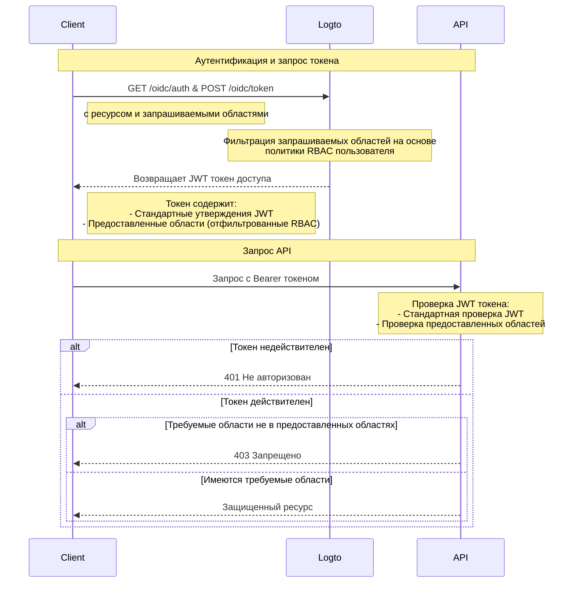

# Защита ресурсов API с помощью RBAC

В дополнение к [Защите вашего API](/authorization/api-resources/protect-your-api), которая обеспечивает безопасность ресурсов, гарантируя наличие действительного JWT, также может быть применено управление доступом на основе ролей (RBAC).

В этой статье мы сосредоточимся на том, как RBAC влияет на делегирование и проверку областей действия в вашем процессе аутентификации.

## Диаграмма потока авторизации \{#authorization-flow-diagram}



Как видно из диаграммы, основное отличие от базовой защиты API заключается в обработке областей. Вместо того чтобы напрямую предоставлять все запрашиваемые области, Logto теперь фильтрует их на основе политики RBAC пользователя. JWT токен будет содержать только те области, которые пользователю были предоставлены через их роли. На стороне API, после проверки подлинности токена, проводится дополнительная проверка, чтобы убедиться, что токен содержит необходимые области для запрашиваемого ресурса.

## Необязательно: Обработка изменения разрешений пользователя \{#optional-handle-user-permission-change}

Разрешения пользователя могут изменяться в течение сеанса — например, им могут быть назначены новые роли или изменены разрешения существующих ролей. В этих сценариях может потребоваться обнаружение этих изменений и обновление пользовательского интерфейса приложения.

Что происходит, когда изменяются разрешения пользователя? Есть два случая.

### В систему не вводятся новые разрешения \{#no-new-permissions-introduced-into-the-system}

Текущие токены доступа останутся действительными до истечения срока их действия, даже после изменения разрешений пользователя. Однако новые разрешения будут отражены в последующих токенах доступа, а любые отозванные разрешения будут исключены.

Вот некоторые **рекомендуемые действия**:

**Вариант 1: Используйте короткие сроки действия токенов доступа**

Краткосрочные токены доступа обеспечивают более частое обновление разрешений пользователя. Настройте параметры истечения срока действия токенов в настройках [Ресурса API](/authorization/api-resources/#logto-api-resource-schema) в Консоли. Недостатком является увеличение использования токенов.

**Вариант 2: Динамическая проверка разрешений**

Периодически вызывайте конечные точки [Logto Management API](/integrate-logto/interact-with-management-api) (например, SWR) или используйте такие техники, как WebSocket, для реализации долгосрочных соединений для динамического получения разрешений пользователя. При обнаружении изменений очистите существующий токен доступа, и вновь выданные токены автоматически отразят изменения в областях разрешений. - API: User-role - API: Role-permission

    При обнаружении изменений разрешений сначала очистите токен доступа из хранилища, а затем вызовите метод SDK `getAccessToken()`, чтобы получить новый. Вновь выданный токен доступа должен отразить изменения разрешений.

### В систему вводится новое разрешение и назначается пользователю \{#new-permission-is-introduced-into-the-system-and-assigned-to-a-user}

Это происходит, когда в вашу систему вводятся новые разрешения. В этом случае вам сначала нужно включить вновь введенные области разрешений при инициализации клиента Logto. Например:

```tsx
new LogtoClient({
  appId: 'your-app-id',
  endpoint: 'your-logto-endpoint',
  resources: ['your-api-resource'],
  scopes: [
    // ... ваши существующие области разрешений,
    'new-scope',
  ],
});
```

Во-вторых, каждому вашему клиентскому приложению нужно повторно получить согласие или повторно войти в систему, чтобы получить изменения разрешений. Затем новая область разрешений будет отражена в новых токенах доступа.

Пример кода для повторного получения согласия:

```tsx
signIn({ redirectUri: 'your-redirect-url', prompt: 'consent' });
```

## Связанные ресурсы \{#related-resources}

<Url href="https://blog.logto.io/logto-x-cloudflare-workers">
  Logto x Cloudflare Workers: Как защитить ваших работников от публичного доступа?
</Url>

<Url href="https://blog.logto.io/secure-api-for-machine-to-machine">
  Защитите ваши ресурсы API для связи машина-машина
</Url>
