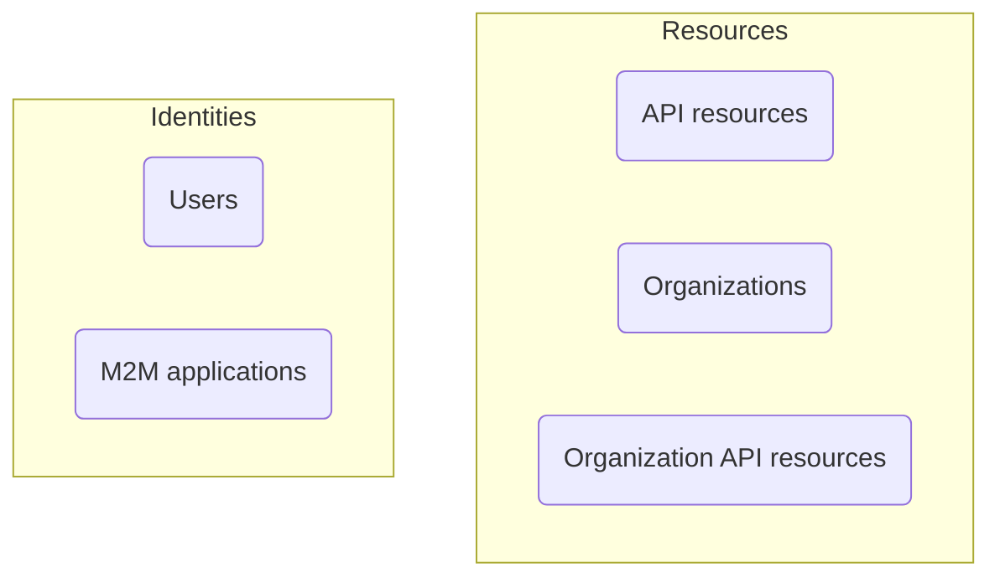

# Аутентификация и авторизация

Разницу между **аутентификацией** и **авторизацией** можно описать следующим образом:

- **Аутентификация** отвечает на вопрос «Какую личность вы представляете?»
- **Авторизация** отвечает на вопрос «Что вы можете делать?»

Для полного введения в управление идентификацией и доступом клиентов (CIAM), вы можете обратиться к нашей серии статей о CIAM:

- [CIAM 101: Аутентификация, Идентификация, Единый вход (SSO)](https://blog.logto.io/ciam-101-intro-authn-sso/)
- [CIAM 102: Авторизация и управление доступом на основе ролей (RBAC)](https://blog.logto.io/ciam-102-authz-and-rbac/)

## Аутентификация \{#authentication}

Logto поддерживает различные интерактивные и неинтерактивные методы аутентификации, например:

- **Опыт входа**: Процесс аутентификации для конечных пользователей.
- **Аутентификация между машинами (M2M)**: Процесс аутентификации для сервисов или приложений.

Конечная цель аутентификации чрезвычайно проста: проверить и получить уникальный идентификатор сущности (в Logto, пользователя или приложения).

## Авторизация \{#authorization}

В Logto авторизация осуществляется через управление доступом на основе ролей (RBAC). Это дает вам полный контроль над управлением доступа ваших пользователей или M2M приложений к следующим элементам:

- **Ресурсы API**: Глобальная сущность, представленная абсолютным URI.
- **Организации**: Группа пользователей или приложений.
- **Ресурсы API организации**: Ресурс API, принадлежащий организации.

Чтобы узнать больше об этих концепциях, вы можете обратиться к следующим ресурсам:

- [Управление доступом на основе ролей (RBAC)](/authorization/role-based-access-control)
- [Организации (Мультитенантность)](/organizations)

Вот визуальное представление отношений между этими концепциями:

Вкратце, авторизация заключается в определении правил, которые определяют, какие сущности в группе "Identities" могут получить доступ к сущностям в группе "Resources".

## Часто задаваемые вопросы \{#frequently-asked-questions}

### Мне нужно указать, какие пользователи могут войти в приложение \{#i-need-to-specify-which-users-can-sign-in-to-an-application}

Из-за природы единого входа (SSO), Logto в настоящее время не поддерживает использование приложений в качестве ресурсов. Вместо этого вы можете определить ресурсы API и разрешения для управления доступом к вашим ресурсам.

### Мне нужно, чтобы мои пользователи входили в организацию \{#i-need-my-users-to-sign-in-to-an-organization}

Как упоминалось ранее, аутентификация включает проверку личности сущности, в то время как управление доступом осуществляется через авторизацию. Поэтому:

- Определение того, к какой организации(ям) принадлежит пользователь, относится к авторизации.
- Процесс входа относится к аутентификации.

Это означает, что в Logto нет концепции «входа в организацию». После аутентификации пользователя он может быть авторизован для доступа ко всем ресурсам (включая ресурсы организации) на основе определенных разрешений.

Эта модель эффективна и понятна, так как разделяет задачи аутентификации и авторизации. Все современные SaaS-приложения, такие как GitHub и Notion, следуют этой модели.

Однако в некоторых случаях вам может понадобиться установить однозначное соответствие между источниками пользователей и организациями. В этом случае могут быть полезны [корпоративный единый вход (SSO)](/end-user-flows/enterprise-sso) и [JIT-подготовка организаций (Just-in-Time Provisioning)](/organizations/just-in-time-provisioning).

### Нашим клиентам нужно кастомное оформление для их страниц входа \{#our-customers-need-custom-branding-for-their-sign-in-pages}

Пожалуйста, ознакомьтесь с [оформлением для конкретного приложения](/customization/match-your-brand/#app-specific-branding) и [оформлением для конкретной организации](/customization/match-your-brand/#organization-specific-branding) для соответствующих настроек.
