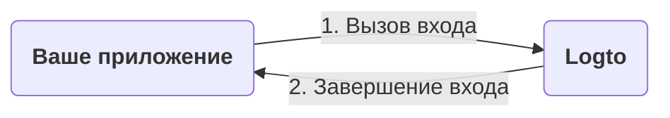
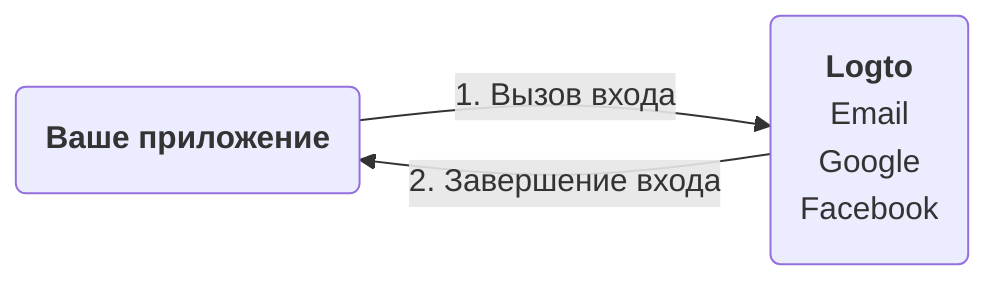
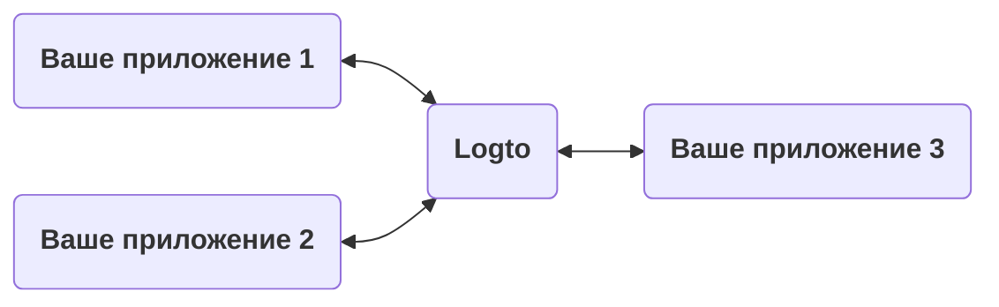
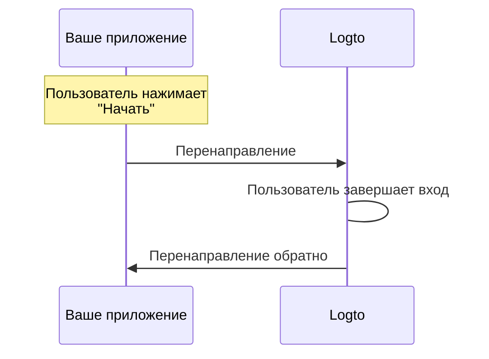
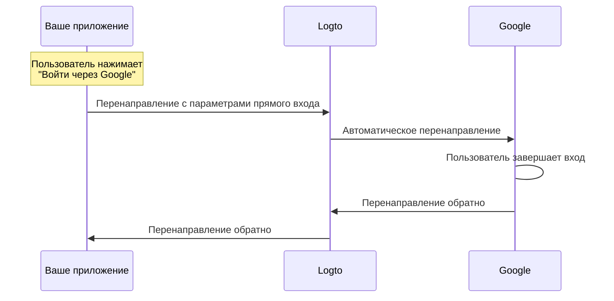

# Объяснение опыта входа

На этой странице объясняется опыт входа в Logto и почему он разработан именно так.

## Введение \{#introduction}

Опыт входа — это процесс аутентификации пользователей в Logto. Процесс можно упростить следующим образом:



1. Ваше приложение вызывает метод входа.
2. Пользователь перенаправляется на страницу входа Logto. Для нативных приложений открывается системный браузер.
3. Пользователь входит в систему и перенаправляется обратно в ваше приложение (сконфигурированное как "Redirect URI" в Logto).

Хотя процесс прост, часть с перенаправлением может иногда казаться излишней. Однако это может быть полезно и безопасно во многих отношениях. Мы объясним причины в следующих разделах.

## Почему перенаправление? \{#why-redirect}

### Гибкость \{#flexibility}

Перенаправление позволяет отделить процесс аутентификации от вашего приложения. По мере роста вашего бизнеса вы можете сохранить тот же процесс аутентификации без изменения вашего приложения. Например, вы можете добавить многофакторную аутентификацию (MFA) или изменить методы входа без изменения вашего приложения.



### Поддержка нескольких приложений \{#multi-app-support}

Если у вас есть несколько приложений, ваши пользователи могут войти один раз и получить доступ ко всем приложениям без повторного входа. Это особенно полезно для SaaS-бизнесов или компаний с несколькими сервисами.



### Нативные приложения \{#native-apps}

Для нативных приложений перенаправление в системный браузер является безопасным способом аутентификации пользователей и имеет встроенную поддержку как для iOS, так и для Android.

- **iOS**: Apple предлагает [ASWebAuthenticationSession](https://developer.apple.com/documentation/authenticationservices/aswebauthenticationsession) для безопасной аутентификации.
- **Android**: Google предоставляет [Custom Tabs](https://developer.chrome.com/docs/android/custom-tabs) для бесшовного опыта.

### Безопасность \{#security}

Под капотом Logto является провайдером [OpenID Connect (OIDC)](https://openid.net/specs/openid-connect-core-1_0.html). OIDC — это широко принятый стандарт для аутентификации пользователей.

Logto применяет строгие меры безопасности, такие как [PKCE](https://tools.ietf.org/html/rfc7636), и отключает небезопасные потоки, такие как implicit flow. Перенаправление — это безопасный способ аутентификации пользователей и может предотвратить многие распространенные атаки.

## Что если мне нужно показать некоторые компоненты входа в моем приложении? \{#what-if-i-need-to-show-some-sign-in-components-in-my-app}

Иногда ваша команда может захотеть показать некоторые компоненты входа в приложении, такие как кнопка "Войти через Google". Это можно сделать, используя функцию "Direct sign-in" в Logto.

### Как это работает? \{#how-does-it-work}

Предположим, у вас есть две кнопки призыва к действию в вашем приложении: "Начать" и "Войти через Google". Эти кнопки предназначены для:

- "Начать": Перенаправление на обычную страницу входа.
- "Войти через Google": Перенаправление на страницу входа Google.

Обе операции должны завершить процесс входа и перенаправить обратно в ваше приложение.

---

#### Процесс нажатия "Начать" \{#process-of-clicking-get-started}

В этом случае опыт входа такой же, как и по умолчанию. Пользователь перенаправляется на страницу входа Logto, а затем обратно в ваше приложение.



:::note
Если вы настроили методы социального входа (например, Google, Facebook) в Logto, пользователь может быть перенаправлен на соответствующую страницу входа. В иллюстрации мы показываем только общий поток для простоты.
:::

---

#### Процесс нажатия "Войти через Google" \{#process-of-clicking-sign-in-with-google}

В этом случае пользователь автоматически перенаправляется на страницу входа Google без взаимодействия со страницей входа Logto. Скорость этого автоматического перенаправления почти мгновенна, так что пользователи могут не заметить перенаправление.



---

В итоге, функция прямого входа — это способ автоматизации некоторых взаимодействий в процессе входа без изменения уровня безопасности.

### Использование прямого входа в вашем приложении \{#use-direct-sign-in-in-your-app}

Чтобы использовать прямой вход, вам нужно передать параметр `direct_sign_in` при вызове метода входа. Значение должно быть составлено в определенном формате, который распознает Logto. Например, для входа через Google значение должно быть `social:google`.

В некоторых официальных SDK Logto есть специальная опция для прямого входа. Вот пример использования прямого входа в JavaScript SDK `@logto/client`:

```ts
client.signIn({
  redirectUri: 'https://some-redirect-uri',
  directSignIn: { method: 'social', target: 'google' },
});
```

Для получения более подробной информации, пожалуйста, обратитесь к [Direct sign-in](/end-user-flows/authentication-parameters/direct-sign-in).

:::info
Мы постепенно внедряем эту функцию во всех официальных SDK Logto. Если вы не видите её в вашем SDK, пожалуйста, свяжитесь с нами.
:::

## Мне нужно, чтобы мои пользователи вводили свои учетные данные в моем приложении \{#i-need-my-users-to-fill-in-their-credentials-in-my-app}

Если вам нужно, чтобы ваши пользователи вводили свои учетные данные (например, электронную почту и пароль) непосредственно в вашем приложении, а не перенаправлялись в Logto, мы не можем помочь вам с этим на данный момент. Исторически существовал грант "Resource Owner Password Credentials", но он теперь считается небезопасным и был [официально устаревшим в OAuth 2.1](https://datatracker.ietf.org/doc/html/draft-ietf-oauth-security-topics#name-resource-owner-password-cre).

Чтобы узнать больше о рисках безопасности типа гранта ROPC, ознакомьтесь с нашей статьей в блоге [Почему вам следует отказаться от типа гранта ROPC](https://blog.logto.io/deprecated-ropc-grant-type/).

## Связанные ресурсы \{#related-resources}

<Url href="https://blog.logto.io/oauth-2-1/">OAuth 2.1 здесь: что вам нужно знать</Url>
<Url href="https://blog.logto.io/how-pkce-protects-the-authorization-code-flow-for-native-apps">
  Что такое PKCE: от базовых концепций до глубокого понимания
</Url>
