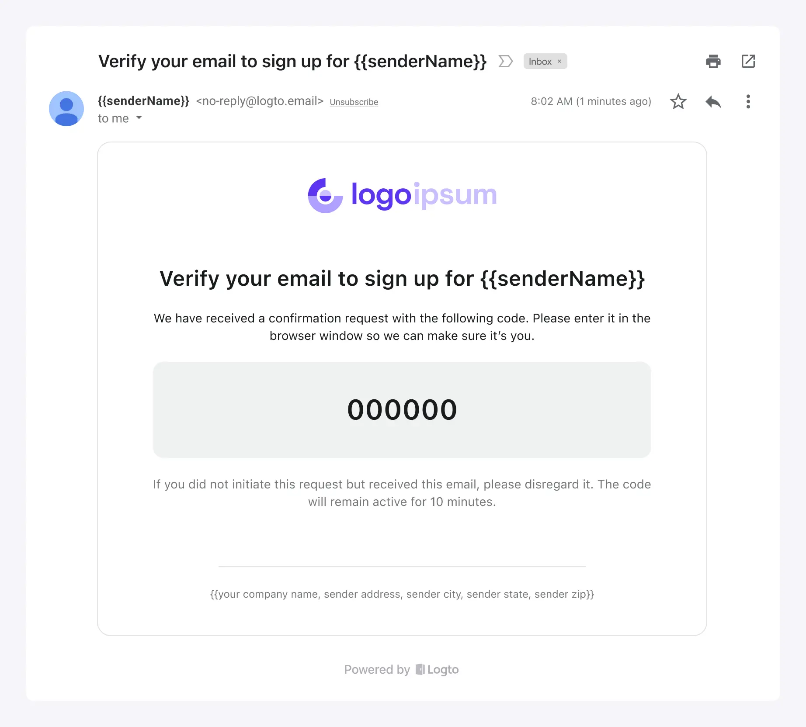

Logto предоставляет встроенные почтовые сервисы для вашего удобства в следующих сценариях:

1. Быстрое изучение или тестирование опыта входа по электронной почте Logto.
2. Использование напрямую для ваших онлайн-продуктов. Это в первую очередь для новых стартапов, которые готовы использовать `logto.email` в качестве домена отправителя электронной почты.

Характеристики почтового сервиса Logto:

- **Бесплатно:** Это полностью бесплатно без каких-либо ограничений на ежедневное использование электронной почты, что экономит ваши расходы.
- **Просто:** Не требуется конфигурация с какими-либо сторонними поставщиками почтовых услуг. Просто настройте основную информацию о бренде для вашего почтового шаблона. Если у вас еще нет своей информации о бренде, вы можете начать использовать его в несколько кликов.
- **Гарантированная доставка:** На основе почтового сервиса Logto вы можете получить стабильный сервис и надежную доставку писем, обеспечивая доступ пользователей к вашему продукту.

Однако, несмотря на удобство, есть некоторые ограничения, о которых следует знать:

1. Письма будут отправляться с фиксированного адреса `no-reply@logto.email`.
2. Вы не можете добавлять ссылки или любой другой пользовательский контент в письма.

В зависимости от ваших развивающихся бизнес-потребностей, вы можете позже выбрать использование других поставщиков почтовых услуг. Мы предлагаем ряд [готовых коннекторов почтовых сервисов](/connectors/email-connectors#popular-email-providers), а также поддерживаем [SMTP](/integrations/smtp), [HTTP](/integrations/http-email) и [Webhook](/developers/webhooks) триггеры для отправки писем, так что вы всегда найдете подходящий способ.

:::note
Встроенный бесплатный почтовый сервис Logto в настоящее время доступен только для пользователей [Cloud](https://cloud.logto.io/). Для пользователей Open-source сервиса у вас есть возможность настроить своего поставщика почтовых услуг для входа по электронной почте.
:::

## Шаги настройки \{#configuration-steps}

Следуйте этим шагам, чтобы настроить почтовый сервис Logto:

1. Перейдите в <CloudLink to="/connectors/passwordless">Connector > Email and SMS connectors</CloudLink>.
2. Чтобы добавить новый Email коннектор, нажмите кнопку "**Set up**" и выберите коннектор "**Logto email service**".
3. После успешного создания коннектора "Logto email service" вы можете настроить основную информацию о бренде, отображаемую в шаблонах писем.
4. После внесения этих изменений не забудьте отправить тестовый шаблон письма на ваш адрес электронной почты перед сохранением изменений.

Варианты настройки:

- **From email:** Электронная почта отправителя установлена на `no-reply@logto.email` и не может быть изменена.
- **Sender name:** Установите название вашего бренда в качестве имени отправителя, чтобы обеспечить узнаваемость пользователем.
- **Company information:** Отображайте название вашей компании, адрес или почтовый индекс, чтобы повысить доверие пользователей и соответствовать требованиям. _Обратите внимание, что URL-адреса не допускаются._
- **App logo:** Загрузите логотип вашего приложения, чтобы ценность бренда приложения могла быть продемонстрирована в письмах, получаемых пользователями.

## Унифицированные почтовые шаблоны \{#unified-email-templates}

Почтовый сервис Logto использует унифицированные почтовые шаблоны, адаптированные для конкретных сценариев аутентификации:

| Использование                    | Сценарий                                                                                                                                                                                                                                                                                                                                                                                                                                          |
| -------------------------------- | ------------------------------------------------------------------------------------------------------------------------------------------------------------------------------------------------------------------------------------------------------------------------------------------------------------------------------------------------------------------------------------------------------------------------------------------------- |
| Регистрация                      | Пользователи создают учетную запись, используя свою электронную почту, и подтверждают ее, вводя код подтверждения, отправленный Logto на их электронную почту.                                                                                                                                                                                                                                                                                    |
| Вход                             | Пользователи входят, используя свою электронную почту, и подтверждают, вводя код подтверждения вместо ввода пароля.                                                                                                                                                                                                                                                                                                                               |
| Забыли пароль                    | Если пользователи забывают свой пароль во время входа, они могут выбрать подтверждение своей личности, используя электронную почту, которую они уже подтвердили с Logto.                                                                                                                                                                                                                                                                          |
| Общий                            | Этот шаблон может использоваться в качестве общего резервного варианта для различных сценариев, включая тестирование конфигураций коннектора и так далее.                                                                                                                                                                                                                                                                                         |
| Приглашение в организацию        | Используйте этот шаблон для отправки пользователям ссылки-приглашения для присоединения к организации.                                                                                                                                                                                                                                                                                                                                            |
| Проверка разрешений пользователя | Во время использования приложения могут быть некоторые операции с высоким уровнем риска или операции с относительно высоким уровнем риска, требующие дополнительной проверки пользователя, такие как банковские переводы, удаление используемых ресурсов и отмена членства. Шаблон `UserPermissionValidation` можно использовать для определения содержания кода подтверждения электронной почты, который пользователи получают в этих ситуациях. |
| Привязка нового идентификатора   | Когда пользователь изменяет свой профиль, он может привязать адрес электронной почты к своей текущей учетной записи. В этом случае шаблон `BindNewIdentifier` можно использовать для настройки содержания письма с подтверждением.                                                                                                                                                                                                                |

Пример почтовых шаблонов для типа использования "Регистрация" с пользовательской информацией о бренде:

Если не предоставлена пользовательская информация о бренде, почтовый шаблон все равно может быть использован с отображением и макетом по умолчанию:

## Часто задаваемые вопросы \{#faqs}

### Можно ли добавить пользовательский CSS или HTML в почтовый сервис Logto? \{#is-it-possible-to-add-custom-css-or-html-to-logto-email-service}

Встроенный почтовый сервис Logto не поддерживает пользовательский CSS или HTML. Вы можете изменить только общие элементы брендинга. Это ограничение введено для поддержания стабильности встроенного почтового сервиса, так как все арендаторы используют один и тот же IP-адрес и адрес отправителя. Для получения более подробной информации, пожалуйста, обратитесь к "[Факторы для улучшения доставки электронной почты](https://blog.logto.io/verification-email-delivery#factors-to-improve-email-delivery)".

Для настройки почтовых шаблонов мы рекомендуем использовать другой почтовый коннектор, такой как AWS Direct Mail, SendGrid, Mailgun, Postmark или SMTP.

