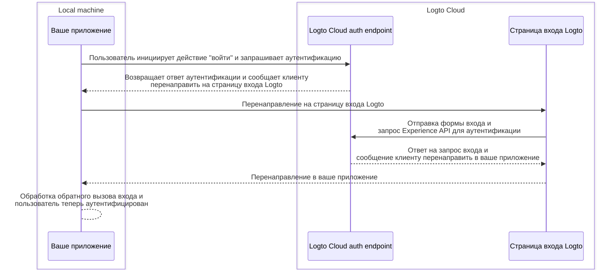
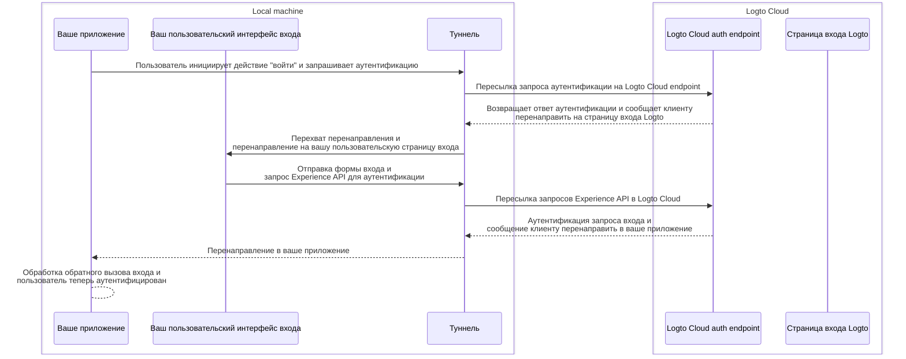

import TabItem from '@theme/TabItem';
import Tabs from '@theme/Tabs';

# Отладка и тестирование вашего пользовательского интерфейса локально

Для пользователей Logto Cloud мы упростили возможность "Принести свой собственный интерфейс" в Logto. Пользователи Cloud теперь могут загружать zip-файл, содержащий пользовательские UI-ресурсы, в <CloudLink to="/sign-in-experience/branding">Консоль > Опыт входа > Брендинг > Принести свой интерфейс</CloudLink> (ознакомьтесь с [страницей Принести свой интерфейс](/customization/bring-your-ui) для получения более подробной информации).

Однако при разработке таких пользовательских UI-страниц пользователи хотят тестировать и отлаживать код локально, прежде чем загружать его в Logto Cloud. Эта команда CLI помогает вам настроить локальный туннель и соединить следующие 3 сущности вместе: ваш Logto cloud auth endpoint, ваше приложение и ваш пользовательский интерфейс входа.

## Зачем мне это нужно? \{#why-do-i-need-this}

По умолчанию, когда вы нажимаете кнопку "войти" в вашем приложении, вы будете перенаправлены на страницу входа, настроенную на Logto endpoint. Успешный процесс входа может быть представлен следующим образом:



Но теперь, поскольку вы разрабатываете свой собственный пользовательский интерфейс входа, вам нужен способ перенаправления на пользовательские страницы входа, работающие на вашем локальном компьютере.
Это требует локального туннельного сервиса для перехвата исходящих запросов из вашего приложения и перенаправления их на ваши пользовательские страницы входа.

Кроме того, вам нужно взаимодействовать с [Experience API Logto](https://openapi.logto.io/group/endpoint-experience) для аутентификации пользователей и управления сессиями.
Этот сервис также поможет перенаправить эти запросы Experience API в Logto Cloud, чтобы избежать проблем с CORS.

Диаграмма последовательности ниже иллюстрирует, как работает успешный процесс "входа" с вашим пользовательским интерфейсом и туннельным сервисом:



С туннельным сервисом вы теперь можете разрабатывать и тестировать ваш пользовательский интерфейс входа локально, без необходимости загружать ресурсы в Logto Cloud каждый раз, когда вы вносите изменения.

## Инструкции \{#instructions}

### Шаг 1: Выполните команду \{#step-1-execute-the-command}

Предположим, ваш Cloud tenant ID — `foobar`, и у вас есть пользовательская страница входа, работающая на вашем локальном dev-сервере по адресу `http://localhost:4000`, тогда вы можете выполнить команду следующим образом:

<Tabs groupId="cmd">

  <TabItem value="cli" label="CLI">

```bash
logto-tunnel -p 9000 --experience-uri http://localhost:4000/ --endpoint https://foobar.logto.app/
```

  </TabItem>
  <TabItem value="npx" label="npx">

```bash
npx @logto/tunnel -p 9000 --experience-uri http://localhost:4000/ --endpoint https://foobar.logto.app/
```

  </TabItem>

</Tabs>

Это также работает, если у вас настроен пользовательский домен в Logto:

<Tabs groupId="cmd">

  <TabItem value="cli" label="CLI">

```bash
logto-tunnel -p 9000 --experience-uri http://localhost:4000/ --endpoint https://your.custom.domain/
```

  </TabItem>
  <TabItem value="npx" label="npx">

```bash
npx @logto/tunnel -p 9000 --experience-uri http://localhost:4000/ --endpoint https://your.custom.domain/
```

  </TabItem>

</Tabs>

Кроме того, команда также поддерживает статические html-ресурсы без необходимости запускать их сначала на dev-сервере. Просто убедитесь, что в указанном вами пути есть `index.html`.

<Tabs groupId="cmd">

  <TabItem value="cli" label="CLI">

```bash
logto-tunnel -p 9000 --experience-path /path/to/your/static/files --endpoint https://foobar.logto.app/
```

  </TabItem>
  <TabItem value="npx" label="npx">

```bash
npx @logto/tunnel -p 9000 --experience-path /path/to/your/static/files --endpoint https://foobar.logto.app/
```

  </TabItem>

</Tabs>

### Шаг 2: Обновите URI endpoint в вашем приложении \{#step-2-update-endpoint-uri-in-your-application}

Наконец, запустите ваше приложение и установите его Logto endpoint на адрес туннельного сервиса `http://localhost:9000/`.

Возьмем в качестве примера приложение на React:

```tsx title=App.tsx
import { LogtoProvider, LogtoConfig } from '@logto/react';

const config: LogtoConfig = {
  // endpoint: 'https://foobar.logto.app/', // оригинальный Logto Cloud endpoint
  endpoint: 'http://localhost:9000/', // адрес туннельного сервиса
  appId: '<your-application-id>',
};

const App = () => (
  <LogtoProvider config={config}>
    <YourAppContent />
  </LogtoProvider>
);
```

Если вы используете социальный вход, вам также нужно обновить URI перенаправления в настройках вашего социального провайдера на адрес туннельного сервиса.

```
http://localhost:9000/callback/<connector-id>
```

Если все настроено правильно, когда вы нажмете кнопку "войти" в вашем приложении, вы должны быть перенаправлены на вашу пользовательскую страницу входа вместо встроенного интерфейса Logto, вместе с действительной сессией (куки), которая позволяет вам дальше взаимодействовать с Experience API Logto.

Удачного кодирования!

## Связанные ресурсы \{#related-resources}

<Url href="https://blog.logto.io/automate-custom-sign-in-ui-deployment-with-github-actions">
  Автоматизация развертывания вашего пользовательского интерфейса входа с помощью GitHub Actions
</Url>
