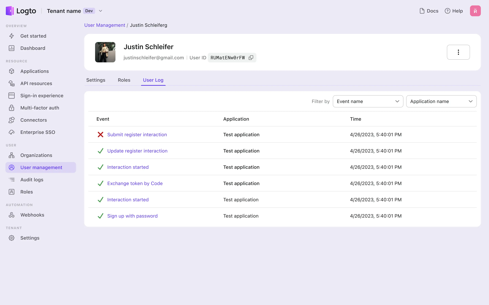

# Журналы аудита

Журнал аудита Logto позволяет легко отслеживать активность пользователей и события. Он предоставляет прочную основу для различных сценариев управления пользователями и проверки состояния системы.

## Просмотр всех журналов \{#view-all-logs}

Перейдите в <CloudLink to="/audit-logs">Консоль > Журналы аудита</CloudLink>. Logto фиксирует и организует события аутентификации в таблицу. Он отслеживает название события, пользователя, приложение и временную метку. Вы можете сузить результаты, отфильтровав их по названию события и названию приложения. Нажатие на конкретное событие предоставит дополнительные детали.

:::warning
Журналы аудита содержат только записи, которые происходят во время процесса аутентификации пользователя, записи операций Management API не фиксируются.
:::

## Фиксация активности пользователей на уровне арендатора \{#capture-user-activity-at-the-tenant-level}

Журналы Logto предлагают подробную информацию, обеспечивая легкость действий и безопасность клиентов. Они фиксируют и записывают следующую информацию:

- Тип события (полный список событий журнала аудита можно найти [здесь](https://github.com/logto-io/logto/blob/master/packages/console/src/consts/logs.ts))
- Задействованное приложение
- IP-адрес
- Задействованный пользователь
- ID журнала
- Временная метка
- User-agent

Поддерживая эти записи событий, организации могут эффективно обнаруживать возможные риски безопасности и оперативно реагировать на них, чтобы предотвратить несанкционированный доступ к системе.

## Проведение детального анализа на уровне пользователя \{#perform-a-detailed-analysis-at-the-user-level}

Администраторы могут проводить детальный анализ журналов, связанных с конкретными пользователями, что облегчает всесторонние расследования конкретных событий. Процесс навигации прост и удобен для пользователя.

Чтобы получить доступ к журналам, специфичным для пользователя, выполните следующие шаги:

1. Перейдите в <CloudLink to="/users">Консоль > Управление пользователями</CloudLink>.
2. Выберите нужного пользователя и перейдите на страницу деталей.
3. Нажмите на "Журналы пользователя". Полученная таблица будет отображать исключительно события журнала, выполненные и инициированные этим конкретным пользователем.

## Часто задаваемые вопросы \{#faqs}

### Я использую Logto с самохостингом, и получение журналов аудита занимает несколько секунд, как я могу улучшить производительность? \{#im-using-self-hosted-logto-and-it-takes-seconds-to-get-the-audit-logs-how-can-i-improve-the-performance}

Пользователям OSS следует добавить cronjob для регулярной очистки устаревших журналов аудита.

