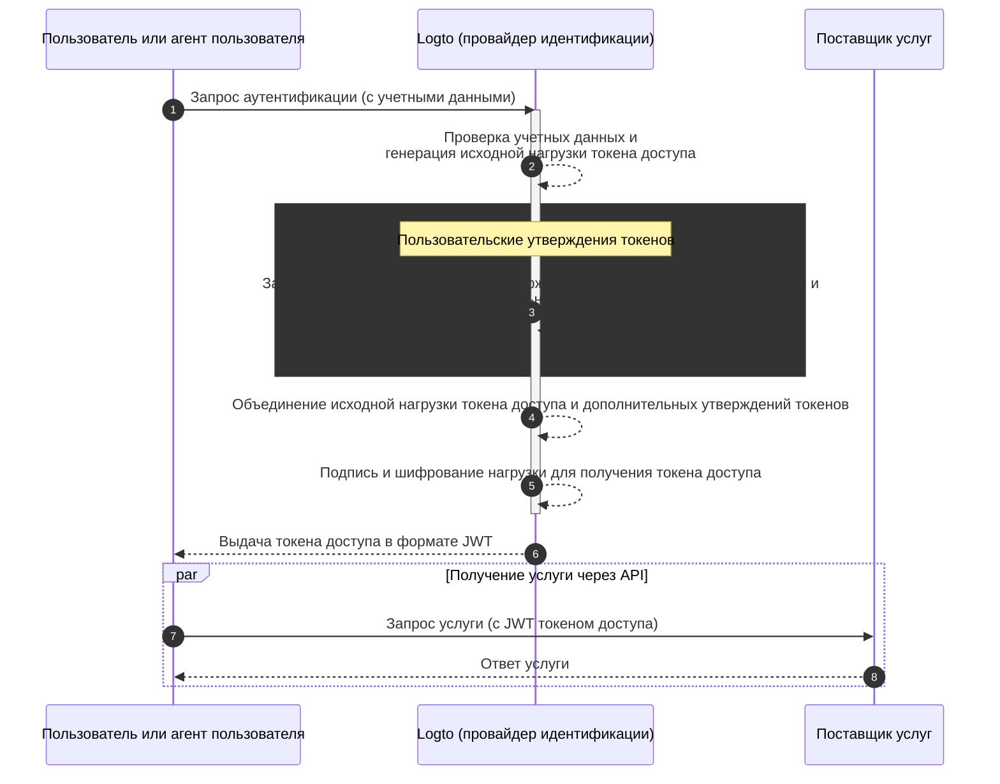

# Пользовательские утверждения токенов

## Введение \{#introduction}

[Токены доступа](https://auth.wiki/access-token) играют критическую роль в процессе аутентификации и авторизации, перенося информацию о личности субъекта и разрешениях, и передаются между [сервером Logto](/concepts/core-service) (служит как auth сервер или провайдер идентификации, IdP), сервером вашего веб-сервиса (поставщик ресурсов) и клиентскими приложениями (клиенты).

[Утверждения токенов](https://auth.wiki/claim) — это пары ключ-значение, которые предоставляют информацию о сущности или самом токене. Утверждения могут включать информацию о пользователе, время истечения токена, разрешения и другие метаданные, которые имеют отношение к процессу аутентификации (ссылка на auth.wiki) и авторизации (ссылка на auth.wiki).

В Logto существуют два типа токенов доступа:

- **JSON Web Token:** [JSON Web Token (JWT)](https://auth.wiki/jwt) — это популярный формат, который кодирует утверждения таким образом, что они безопасны и читаемы клиентами. Общие утверждения, такие как `sub`, `iss`, `aud` и т. д., используются в соответствии с протоколом OAuth 2.0 (см. [эту ссылку](https://datatracker.ietf.org/doc/html/rfc7519#section-4) для получения более подробной информации). JWT токены позволяют потребителям напрямую получать доступ к утверждениям без дополнительных шагов проверки. В Logto токены доступа по умолчанию выдаются в формате JWT, когда клиент инициирует запросы авторизации для конкретных ресурсов или организаций.
- **Непрозрачный токен:** [Непрозрачный токен](http://localhost:3000/concepts/opaque-token) не является самодостаточным и всегда требует дополнительного шага проверки через конечную точку [инспекции токена](https://auth.wiki/token-introspection). Несмотря на их непрозрачный формат, непрозрачные токены могут помочь получить утверждения и быть безопасно переданы между сторонами. Утверждения токенов безопасно хранятся на сервере Logto и доступны клиентским приложениям через конечную точку инспекции токена. Токены доступа выдаются в непрозрачном формате, когда в запросе авторизации не указан конкретный ресурс или организация. Эти токены в основном используются для доступа к конечной точке OIDC `userinfo` и другим общим целям.

Во многих случаях стандартные утверждения недостаточны для удовлетворения специфических потребностей ваших приложений, будь то использование JWT или непрозрачных токенов. Для решения этой проблемы Logto предоставляет возможность добавлять пользовательские утверждения в токены доступа. С этой функцией вы можете включать дополнительную информацию для вашей бизнес-логики, все это безопасно передается в токенах и доступно через инспекцию в случае непрозрачных токенов.

## Как работают пользовательские утверждения токенов? \{#how-do-custom-token-claims-work}

Logto позволяет вставлять пользовательские утверждения в `токен доступа` через функцию обратного вызова `getCustomJwtClaims`. Вы можете предоставить свою реализацию функции `getCustomJwtClaims`, чтобы вернуть объект пользовательских утверждений. Возвращаемое значение будет объединено с исходной нагрузкой токена и подписано для генерации окончательного токена доступа.

:::warning
Встроенные утверждения токенов Logto НЕ могут быть переопределены или изменены. Пользовательские утверждения будут добавлены в токен как дополнительные утверждения. Если какие-либо пользовательские утверждения конфликтуют с встроенными утверждениями, эти пользовательские утверждения будут проигнорированы.
:::

## Связанные ресурсы \{#related-resources}

<Url href="https://blog.logto.io/glance-on-custom-jwt-access-token-claims">
  Добавьте пользовательские утверждения для JWT токенов доступа с Logto, чтобы усилить вашу
  авторизацию
</Url>
