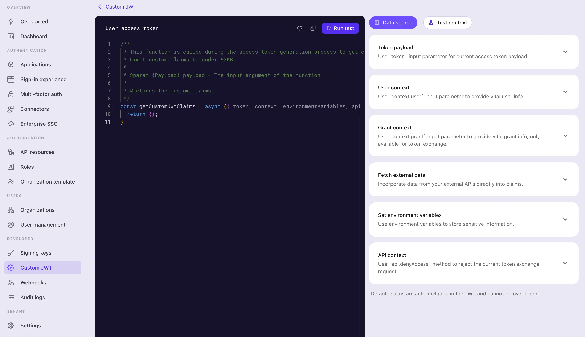

# Создание скрипта пользовательских утверждений токена

Чтобы [добавить пользовательские утверждения](/developers/custom-token-claims) в [токен доступа](https://auth.wiki/access-token), вам нужно предоставить скрипт, который возвращает объект, содержащий эти утверждения. Скрипт должен быть написан как функция `JavaScript`, возвращающая объект с пользовательскими утверждениями.

1. Перейдите в <CloudLink to="/customize-jwt">Консоль > Пользовательский JWT</CloudLink>.
2. Существуют два разных типа токенов доступа, для которых вы можете настроить утверждения токена доступа:

   - **Токен доступа пользователя**: Токен доступа, выданный для конечных пользователей. Например, для веб-приложений или мобильных приложений.
   - **Токен доступа машина-машина**: Токен доступа, выданный для сервисов или приложений. Например, для [приложений машина-машина](/quick-starts/m2m).

   Разные типы токенов доступа могут иметь разные контексты полезной нагрузки токена. Вы можете настроить утверждения токена для каждого типа токена доступа отдельно.

   Выберите любой тип токена доступа, для которого вы хотите настроить утверждения токена, и нажмите кнопку **Добавить пользовательские утверждения**, чтобы создать новый скрипт.

:::note
Функция пользовательских утверждений токена доступна только для:

- пользователей [Logto OSS](/logto-oss)
- арендаторов Logto Cloud с средой разработки (development environment) [настройки арендатора Logto Cloud](/logto-cloud/tenant-settings#development)
- платных арендаторов Logto Cloud с производственной средой (включая [Pro арендаторов и корпоративных арендаторов](https://logto.io/pricing))
  :::

## Реализация функции `getCustomJwtClaims()` \{#implement-getcustomjwtclaims-function}

На странице деталей **Пользовательский JWT** вы можете найти редактор скриптов для написания вашего скрипта пользовательских утверждений токена. Скрипт должен быть функцией `JavaScript`, возвращающей объект пользовательских утверждений.



## Шаг 1: Редактирование скрипта \{#step-1-edit-the-script}

Используйте редактор кода слева, чтобы изменить скрипт. Для начала вам предоставляется функция `getCustomJwtClaims` с пустым объектом в качестве возвращаемого значения. Вы можете изменить функцию, чтобы она возвращала объект ваших собственных пользовательских утверждений.

```jsx
const getCustomJwtClaims = async ({ token, context, environmentVariables }) => {
  return {};
};
```

Этот редактор использует сервер языка JavaScript для предоставления базовой подсветки синтаксиса, автозавершения кода и проверки ошибок. Входные параметры хорошо типизированы и документированы в стиле jsDoc. Вы можете использовать IntelliSense редактора, чтобы правильно получить доступ к свойствам входного объекта. Подробные определения параметров вы найдете справа на странице.

:::note
Эта функция будет экспортирована как модуль. Убедитесь, что имя функции остается `getCustomJwtClaims`, чтобы модуль мог правильно экспортировать функцию.
:::

## Шаг 2: Входные параметры \{#step-2-input-parameters}

Функция `getCustomJwtClaims` принимает объект в качестве входного параметра. Входной объект содержит следующие свойства:

### token \{#token}

Объект полезной нагрузки токена. Этот объект содержит оригинальные утверждения токена и метаданные, к которым вам может понадобиться доступ в скрипте.

Вы можете найти подробное определение типа объекта полезной нагрузки токена и объекта данных пользователя справа на странице. IntelliSense редактора также поможет вам правильно получить доступ к этим свойствам входного объекта.

- Объект данных токена доступа пользователя
  | Свойство | Описание | Тип |
  | -------------------- | ------------------------------------------------ | ------------- |
  | `jti` | Уникальный идентификатор JWT | `string` |
  | `aud` | Аудитория токена | `string` |
  | `scope` | Области действия токена | `string` |
  | `clientId` | Идентификатор клиента токена | `string` |
  | `accountId` | Идентификатор пользователя токена | `string` |
  | `expiresWithSession` | Истекает ли токен вместе с сессией | `boolean` |
  | `grantId` | Идентификатор текущего запроса аутентификации токена | `string` |
  | `gty` | Тип запроса токена | `string` |
  | `kind` | Вид токена | `AccessToken` |
- Объект данных токена доступа машина-машина
  | Свойство | Описание | Тип |
  | ---------- | -------------------------- | ------------------- |
  | `jti` | Уникальный идентификатор JWT | `string` |
  | `aud` | Аудитория токена | `string` |
  | `scope` | Области действия токена | `string` |
  | `clientId` | Идентификатор клиента токена | `string` |
  | `kind` | Вид токена | `ClientCredentials` |

### context (Доступно только для токена доступа пользователя) \{#context-only-available-for-user-access-token}

Объект контекста содержит данные пользователя и данные запроса, относящиеся к текущему процессу авторизации.

- **Объект данных пользователя**
  Для токена доступа пользователя Logto предоставляет дополнительный контекст данных пользователя для доступа. Объект данных пользователя содержит все данные профиля пользователя и данные членства в организации, которые могут понадобиться для настройки пользовательских утверждений. Пожалуйста, ознакомьтесь с [Пользователи](/user-management/user-data) и [Организации](/organizations/organization-data) для получения более подробной информации.
- **Объект данных запроса**
  Для токена доступа пользователя, выданного путем обмена токеном имперсонации, Logto предоставляет дополнительный контекст данных запроса для доступа. Объект данных запроса содержит пользовательский контекст из токена субъекта. Пожалуйста, ознакомьтесь с [Имперсонация](/developers/user-impersonation) для получения более подробной информации.

### environmentVariables \{#environmentvariables}

Используйте раздел **Установить переменные окружения** справа, чтобы настроить переменные окружения для вашего скрипта. Вы можете использовать эти переменные для хранения конфиденциальной информации или данных конфигурации, которые вы не хотите жестко кодировать в скрипте, например, ключи API, секреты или URL-адреса.

Все переменные окружения, которые вы здесь установите, будут доступны в скрипте. Используйте объект `environmentVariables` во входном параметре, чтобы получить доступ к этим переменным.

### api \{#api}

Объект `api` предоставляет набор утилит, которые вы можете использовать в своем скрипте для дополнительного контроля доступа в процессе выдачи токенов. Объект `api` содержит следующие функции:

```jsx
api.denyAccess(message?: string): void
```

Функция `api.denyAccess()` позволяет вам отказать в процессе выдачи токена с пользовательским сообщением. Вы можете использовать эту функцию для обеспечения дополнительной проверки доступа в процессе выдачи токенов.

## Шаг 3: Получение внешних данных \{#step-3-fetch-external-data}

Вы можете использовать встроенную функцию `fetch` в Node для получения внешних данных в вашем скрипте. Функция `fetch` является функцией на основе обещаний, которая позволяет вам делать HTTP-запросы к внешним API.

```jsx
const getCustomJwtClaims = async ({ environmentVariables }) => {
  const response = await fetch('https://api.example.com/data', {
    headers: {
      Authorization: `Bearer ${environmentVariables.API_KEY}`,
    },
  });

  const data = await response.json();

  return {
    data,
  };
};
```

:::note
Имейте в виду, что любое получение внешних данных может вызвать задержку в процессе выдачи токенов. Убедитесь, что внешний API надежен и достаточно быстр, чтобы соответствовать вашим требованиям.

Кроме того:

- Обрабатывайте ошибки и тайм-ауты в вашем скрипте, чтобы избежать блокировки процесса выдачи токенов.
- Используйте правильные заголовки авторизации, чтобы защитить ваш внешний API от несанкционированного доступа.
  :::

## Шаг 4: Тестирование скрипта \{#step-4-test-the-script}

Убедитесь, что вы протестировали ваш скрипт перед его сохранением. Нажмите на вкладку **Тестовый контекст** справа на странице, чтобы изменить макет полезной нагрузки токена и контекст данных пользователя для тестирования.

Нажмите на **Запустить тест** в правом верхнем углу редактора, чтобы запустить скрипт с макетными данными. Результат выполнения скрипта будет отображен в панели **Результат теста**.


:::note
Результат теста — это вывод функции `getCustomJwtClaims` с макетными данными, которые вы установили («дополнительные утверждения токена», полученные после завершения шага 3 в [диаграмме последовательности](/developers/custom-token-claims/#how-do-custom-token-claims-work)). Реальная полезная нагрузка токена и контекст данных пользователя будут отличаться, когда скрипт будет выполнен в процессе выдачи токенов.
:::

Нажмите на кнопку **Создать**, чтобы сохранить скрипт. Скрипт пользовательских утверждений токена будет сохранен и применен в процессе выдачи токенов доступа.
