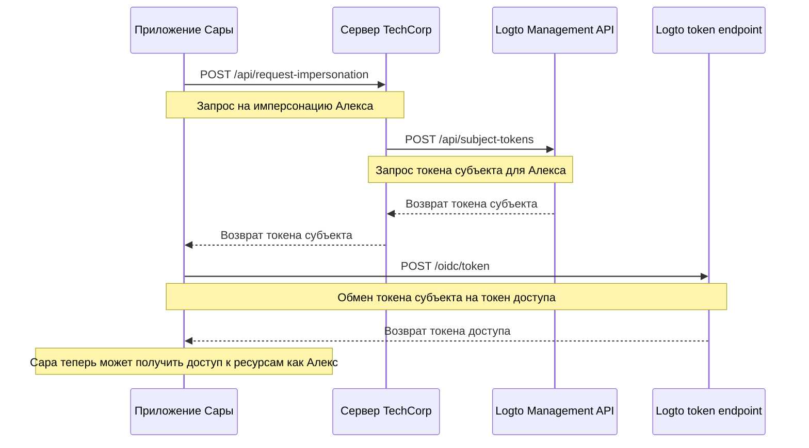

# Имперсонация пользователя

Представьте, что Сара, инженер поддержки в TechCorp, получает срочный запрос от Алекса, клиента, который не может получить доступ к критически важному ресурсу. Чтобы эффективно диагностировать и решить проблему, Саре нужно увидеть именно то, что видит Алекс в системе. Здесь на помощь приходит функция имперсонации пользователя в Logto.

Имперсонация пользователя позволяет авторизованным пользователям, таким как Сара, временно действовать от имени других пользователей, таких как Алекс, в системе. Эта мощная функция незаменима для устранения неполадок, предоставления поддержки клиентам и выполнения административных задач.

## Как это работает? \{#how-it-works}



Процесс имперсонации включает три основных шага:

1. Сара запрашивает имперсонацию через сервер TechCorp
2. Сервер TechCorp получает токен субъекта от Logto Management API
3. Приложение Сары обменивает этот токен субъекта на токен доступа

Давайте рассмотрим, как Сара может использовать эту функцию, чтобы помочь Алексу.

### Шаг 1: Запрос имперсонации \{#step-1-requesting-impersonation}

Сначала приложение поддержки Сары должно запросить имперсонацию у сервера TechCorp.

**Запрос (приложение Сары к серверу TechCorp)**

```bash
POST /api/request-impersonation HTTP/1.1
Host: api.techcorp.com
Authorization: Bearer <Sarah's_access_token>
Content-Type: application/json

{
  "userId": "alex123",
  "reason": "Investigating resource access issue",
  "ticketId": "TECH-1234"
}
```

В этом API сервер должен выполнить надлежащие проверки авторизации, чтобы убедиться, что у Сары есть необходимые разрешения для имперсонации Алекса.

### Шаг 2: Получение токена субъекта \{#step-2-obtaining-a-subject-token}

Сервер TechCorp, проверив запрос Сары, затем вызовет [Management API](/integrate-logto/interact-with-management-api) Logto, чтобы получить токен субъекта.

**Запрос (сервер TechCorp к Logto Management API)**

```bash
POST /api/subject-tokens HTTP/1.1
Host: techcorp.logto.app
Authorization: Bearer <TechCorp_m2m_access_token>
Content-Type: application/json

{
  "userId": "alex123",
  "context": {
    "ticketId": "TECH-1234",
    "reason": "Resource access issue",
    "supportEngineerId": "sarah789"
  }
}
```

**Ответ (Logto к серверу TechCorp)**

```json
{
  "subjectToken": "sub_7h32jf8sK3j2",
  "expiresIn": 600
}
```

Сервер TechCorp должен затем вернуть этот токен субъекта приложению Сары.

**Ответ (сервер TechCorp к приложению Сары)**

```json
{
  "subjectToken": "sub_7h32jf8sK3j2",
  "expiresIn": 600
}
```

### Шаг 3: Обмен токена субъекта на токен доступа \{#step-3-exchanging-the-subject-token-for-an-access-token}

Теперь приложение Сары обменивает этот токен субъекта на токен доступа, представляющий Алекса, указывая ресурс, где будет использоваться токен.

**Запрос (приложение Сары к Logto token endpoint)**

```bash
POST /oidc/token HTTP/1.1
Host: techcorp.logto.app
Content-Type: application/x-www-form-urlencoded

grant_type=urn:ietf:params:oauth:grant-type:token-exchange
&client_id=techcorp_support_app
&scope=resource:read
&subject_token=alx_7h32jf8sK3j2
&subject_token_type=urn:ietf:params:oauth:token-type:access_token
&resource=https://api.techcorp.com/customer-data
```

**Ответ (Logto к приложению Сары)**

```json
{
  "access_token": "eyJhbG...<truncated>",
  "issued_token_type": "urn:ietf:params:oauth:token-type:access_token",
  "token_type": "Bearer",
  "expires_in": 3600,
  "scope": "resource:read"
}
```

Возвращенный `access_token` будет связан с указанным ресурсом, гарантируя, что он может быть использован только с API данных клиентов TechCorp.

**Примечание**: Для традиционных веб-приложений включите `client_id` и `client_secret` в заголовок запроса токена, чтобы избежать ошибки 401 invalid_client.

Вот пример для Node.js:

```json
Authorization: `Basic ${Buffer.from(`${client_id}:${client_secret}`, 'utf8').toString('base64')}`
```

## Пример использования \{#example-usage}

Вот как Сара может использовать это в приложении поддержки на Node.js:

```jsx
interface ImpersonationResponse {
  subjectToken: string;
  expiresIn: number;
}

interface TokenExchangeResponse {
  access_token: string;
  issued_token_type: string;
  token_type: string;
  expires_in: number;
  scope: string;
}

async function impersonateUser(
  userId: string,
  clientId: string,
  ticketId: string,
  resource: string
): Promise<string> {
  try {
    // Шаг 1 и 2: Запрос имперсонации и получение токена субъекта
    const impersonationResponse = await fetch(
      'https://api.techcorp.com/api/request-impersonation',
      {
        method: 'POST',
        headers: {
          Authorization: "Bearer <Sarah's_access_token>",
          'Content-Type': 'application/json',
        },
        body: JSON.stringify({
          userId,
          reason: 'Investigating resource access issue',
          ticketId,
        }),
      }
    );

    if (!impersonationResponse.ok) {
      throw new Error(`HTTP error occurred. Status: ${impersonationResponse.status}`);
    }

    const { subjectToken } = (await impersonationResponse.json()) as ImpersonationResponse;

    // Шаг 3: Обмен токена субъекта на токен доступа
    const tokenExchangeBody = new URLSearchParams({
      grant_type: 'urn:ietf:params:oauth:grant-type:token-exchange',
      client_id: clientId,
      scope: 'openid profile resource.read',
      subject_token: subjectToken,
      subject_token_type: 'urn:ietf:params:oauth:token-type:access_token',
      resource: resource,
    });

    const tokenExchangeResponse = await fetch('https://techcorp.logto.app/oidc/token', {
      method: 'POST',
      headers: { 'Content-Type': 'application/x-www-form-urlencoded' },
      body: tokenExchangeBody,
    });

    if (!tokenExchangeResponse.ok) {
      throw new Error(`HTTP error! status: ${tokenExchangeResponse.status}`);
    }

    const tokenData = (await tokenExchangeResponse.json()) as TokenExchangeResponse;
    return tokenData.access_token;
  } catch (error) {
    console.error('Impersonation failed:', error);
    throw error;
  }
}

// Сара использует эту функцию для имперсонации Алекса
async function performImpersonation(): Promise<void> {
  try {
    const accessToken = await impersonateUser(
      'alex123',
      'techcorp_support_app',
      'TECH-1234',
      'https://api.techcorp.com/customer-data'
    );
    console.log('Токен доступа для имперсонации Алекса:', accessToken);
  } catch (error) {
    console.error('Не удалось выполнить имперсонацию:', error);
  }
}

// Выполнение имперсонации
void performImpersonation()
```

:::note

1. Токен субъекта имеет короткий срок действия и предназначен для одноразового использования.
2. Токен доступа для имперсонации не сопровождается [токеном обновления](https://auth.wiki/refresh-token). Саре нужно будет повторить этот процесс, если токен истечет до того, как она решит проблему Алекса.
3. Сервер TechCorp должен реализовать надлежащие проверки авторизации, чтобы гарантировать, что только авторизованный персонал поддержки, такой как Сара, может запрашивать имперсонацию.

:::

## Утверждение `act` \{#act-claim}

При использовании потока обмена токенами для имперсонации, выданный токен доступа может включать дополнительное утверждение `act` (actor). Это утверждение представляет личность "действующего лица" - в нашем примере, Сары, которая выполняет имперсонацию.

Чтобы включить утверждение `act`, приложение Сары должно предоставить `actor_token` в запросе обмена токенами. Этот токен должен быть действительным токеном доступа для Сары с областью `openid`. Вот как его включить в запрос обмена токенами:

```bash
POST /oidc/token HTTP/1.1
Host: techcorp.logto.app
Content-Type: application/x-www-form-urlencoded

grant_type=urn:ietf:params:oauth:grant-type:token-exchange
&client_id=techcorp_support_app
&scope=resource:read
&subject_token=alx_7h32jf8sK3j2
&subject_token_type=urn:ietf:params:oauth:token-type:access_token
&actor_token=sarah_access_token
&actor_token_type=urn:ietf:params:oauth:token-type:access_token
&resource=https://api.techcorp.com/customer-data
```

Если `actor_token` предоставлен, результирующий токен доступа будет содержать утверждение `act` следующим образом:

```json
{
  "aud": "https://api.techcorp.com",
  "iss": "https://techcorp.logto.app",
  "exp": 1443904177,
  "sub": "alex123",
  "act": {
    "sub": "sarah789"
  }
}
```

Это утверждение `act` четко указывает, что Сара (sarah789) действует от имени Алекса (alex123). Утверждение `act` может быть полезным для аудита и отслеживания действий по имперсонации.

## Настройка утверждений токена \{#customizing-token-claims}

Logto позволяет [настраивать утверждения токена](/developers/custom-token-claims) для токенов имперсонации. Это может быть полезно для добавления дополнительного контекста или метаданных в процесс имперсонации, таких как причина имперсонации или связанный запрос поддержки.

Когда сервер TechCorp запрашивает токен субъекта у Logto Management API, он может включить объект `context`:

```json
{
  "userId": "alex123",
  "context": {
    "ticketId": "TECH-1234",
    "reason": "Resource access issue",
    "supportEngineerId": "sarah789"
  }
}
```

Этот [контекст](/developers/custom-token-claims/create-script#context-only-available-for-user-access-token) затем может быть использован в функции `getCustomJwtClaims()` для добавления специфических утверждений в конечный токен доступа. Вот пример того, как это может быть реализовано:

```tsx
const getCustomJwtClaims = async ({ token, context, environmentVariables }) => {
  if (context.grant?.type === 'urn:ietf:params:oauth:grant-type:token-exchange') {
    const { ticketId, reason, supportEngineerId } = context.grant.subjectTokenContext;
    return {
      impersonation_context: {
        ticket_id: ticketId,
        reason: reason,
        support_engineer: supportEngineerId,
      },
    };
  }
  return {};
};
```

Результирующий токен доступа, который получает Сара, может выглядеть следующим образом:

```json
{
  "sub": "alex123",
  "aud": "https://api.techcorp.com/customer-data",
  "impersonation_context": {
    "ticket_id": "TECH-1234",
    "reason": "Resource access issue",
    "support_engineer": "sarah789"
  }
  // ... другие стандартные утверждения
}
```

Настраивая утверждения токена доступа таким образом, TechCorp может включить ценную информацию о контексте имперсонации, что облегчает аудит и понимание действий по имперсонации в их системе.

:::note
Будьте осторожны при добавлении пользовательских утверждений в ваши токены. Избегайте включения конфиденциальной информации, которая может представлять угрозу безопасности, если токен будет перехвачен или утечет. JWT подписаны, но не зашифрованы, поэтому утверждения видны любому, у кого есть доступ к токену.
:::
