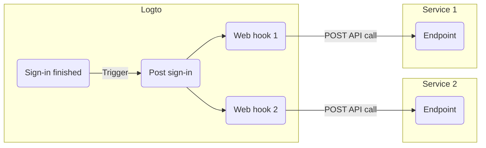

# Webhooks

Logto [Webhook](https://auth.wiki/webhook) предоставляет уведомления в реальном времени для различных событий, включая изменения в [учетной записи пользователя](/user-management/user-data), [роли](/authorization/role-based-access-control#roles), [разрешении](/authorization/role-based-access-control#permissionsscopes), [организации](/organizations/organization-data), [роли организации](/authorization/organization-template#organization-role), [разрешении организации](/authorization/organization-template#organization-permission) и [взаимодействии с пользователем](/end-user-flows).

Когда событие срабатывает, Logto отправляет HTTP-запрос на указанный вами URL-адрес конечной точки, содержащий подробную информацию о событии, такую как ID пользователя, имя пользователя, электронная почта и другие соответствующие детали (для получения дополнительной информации о данных, включенных в полезную нагрузку и заголовок, обратитесь к [Webhook request](/developers/webhooks/webhooks-request)). Ваше приложение может обработать этот запрос и предпринять индивидуальные действия, такие как отправка электронной почты или обновление данных в базе данных.

Мы постоянно добавляем больше событий на основе потребностей пользователей. Если у вас есть конкретные требования для вашего бизнеса, пожалуйста, дайте нам знать.

## Почему использовать Webhook? \{#why-use-webhook}

Webhooks предлагают связь в реальном времени между приложениями, устраняя необходимость в опросе и обеспечивая немедленные обновления данных. Они упрощают интеграцию приложений и автоматизацию рабочих процессов без сложного кода или проприетарных API.

Вот несколько примеров распространенных случаев использования Webhook для CIAM:

- **Отправка электронных писем:** Настройте Webhook для отправки приветственного письма новым пользователям при регистрации или уведомления администраторов, когда пользователь входит с нового устройства или из нового местоположения.
- **Отправка уведомлений:** Настройте Webhook для запуска виртуального помощника с вашей CRM-системой для предоставления поддержки клиентам в реальном времени, когда пользователи регистрируются.
- **Выполнение дополнительных API вызовов**: Настройте Webhook для проверки доступа пользователя, проверяя его домен электронной почты или IP-адрес, а затем используйте Logto Management API для назначения соответствующих ролей с разрешениями на ресурсы.
- **Синхронизация данных:** Настройте Webhook для обновления приложения о таких изменениях, как приостановка или удаление учетной записи пользователя.
- **Создание отчетов**: Настройте Webhook для получения данных о активности входа пользователей и используйте их для создания отчетов о вовлеченности пользователей или шаблонах использования.

## Термины \{#terms}

| Элемент                                                                                                                                                                                                   | Описание                                                                                                                                                                                                                 |
| --------------------------------------------------------------------------------------------------------------------------------------------------------------------------------------------------------- | ------------------------------------------------------------------------------------------------------------------------------------------------------------------------------------------------------------------------ |
| Событие                                                                                                                                                                                                   | Когда выполняется конкретное действие, оно вызывает событие hook с определенным типом. Например, Logto сгенерирует событие PostRegister, когда пользователь завершит процесс регистрации и создаст новую учетную запись. |
| Hook                                                                                                                                                                                                      | Одно или серия действий, которые привязываются к конкретному событию. Действие может быть вызовом API, выполнением фрагментов кода и т. д.                                                                               |
| Webhook                                                                                                                                                                                                   | Подтип hook, который указывает на вызов API с полезной нагрузкой события.                                                                                                                                                |
| Например, если разработчик хочет отправить уведомление, когда пользователь входит через новое устройство, он может добавить webhook, который вызывает его API службы безопасности для события PostSignIn. |

Вот пример включения двух веб-хуков для события `PostSignIn` в Logto:

## Часто задаваемые вопросы \{#faqs}

### Поддерживает ли Logto синхронизированные webhooks? \{#does-logto-support-synced-webhooks}

Хотя синхронизированные webhooks сделали бы процесс входа пользователя более плавным, мы пока их не поддерживаем (но будем в будущем). Поэтому сценарии, которые зависят от синхронизированных webhooks, в настоящее время требуют различных обходных путей. Если у вас есть вопросы, не стесняйтесь обращаться к нам.

### Как справиться с изменением разрешений пользователя? \{#how-to-deal-with-user-permission-change}

Смотрите руководство [Управление изменением разрешений пользователя](/authorization/role-based-access-control/protect-api-resources-with-rbac/#optional-handle-user-permission-change).

### Как отладить тайм-аут webhook? \{#how-to-debug-webhook-timeout}

Для конечной точки, принимающей Webhooks, она должна как можно быстрее возвращать ответ 2xx, чтобы сообщить Logto, что Webhook был успешно получен. Поскольку у разных пользователей значительно различается логика обработки Webhooks, чрезмерно сложные задачи могут занять несколько секунд, что приведет к тайм-ауту Webhook Logto. Лучшая практика — поддерживать собственную очередь событий; при получении Webhook Logto вставьте событие в очередь и верните ответ 2xx в Logto. Затем позвольте вашему собственному рабочему процессору обрабатывать задачи в очереди шаг за шагом. Если рабочий процессор сталкивается с ошибкой, обработайте ее на своем сервере.

### Могу ли я получить IP-адрес клиента из webhooks `PostSignIn`? \{#can-i-get-the-client-ip-address-from-postsignin-webhooks}

Да, вы можете получить IP-адрес, пользовательские агенты и т. д. в полезной нагрузке Webhook. Если вам нужна информация, которая в настоящее время не поддерживается, вы можете создать запросы на функции в GitHub issues или связаться с нами.

## Связанные ресурсы \{#related-resources}

<Url href="https://blog.logto.io/webhooks-vs-polling">Webhooks vs. polling</Url>
