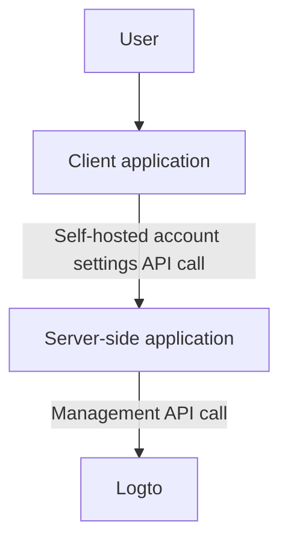
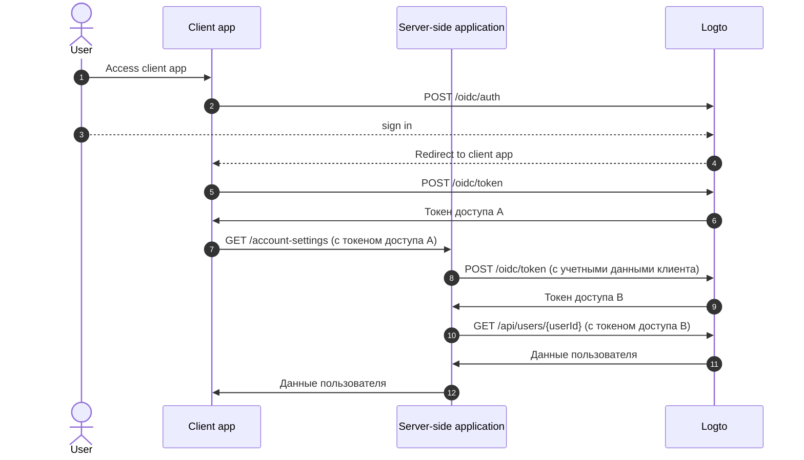
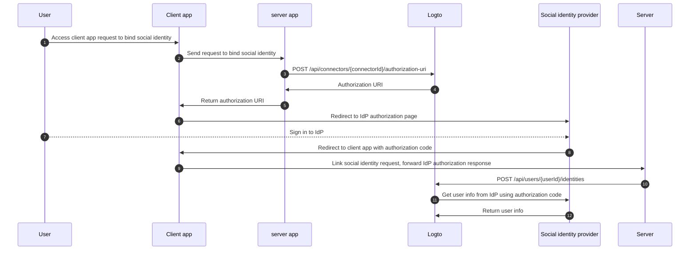

# Настройки аккаунта через Management API

## Интеграции \{#integrations}

Logto предоставляет различные Management API для управления учетными записями пользователей. Вы можете использовать эти API для создания страницы настроек аккаунта самообслуживания для конечных пользователей.

### Архитектура \{#architecture}

1. **Пользователь**: Аутентифицированный конечный пользователь, которому необходимо получить доступ и управлять настройками своего аккаунта.
2. **Клиентское приложение**: Ваше клиентское приложение, которое предоставляет страницу настроек аккаунта пользователю.
3. **Серверное приложение**: Серверное приложение, которое предоставляет API настроек аккаунта клиенту. Взаимодействует с Management API Logto.
4. **Logto**: Logto как служба аутентификации и авторизации. Предоставляет Management API для управления учетными записями пользователей.

### Диаграмма последовательности \{#sequence-diagram}

1. Пользователь получает доступ к клиентскому приложению.
2. Клиентское приложение отправляет запрос аутентификации в Logto и перенаправляет пользователя на страницу входа Logto.
3. Пользователь входит в Logto.
4. Аутентифицированный пользователь перенаправляется обратно в клиентское приложение с кодом авторизации.
5. Клиентское приложение запрашивает токен доступа у Logto для доступа к API настроек аккаунта самообслуживания.
6. Logto предоставляет токен доступа клиентскому приложению.
7. Клиентское приложение отправляет запрос настроек аккаунта в серверное приложение с токеном доступа пользователя.
8. Серверное приложение проверяет личность и разрешения запрашивающего из токена доступа пользователя. Затем запрашивает токен доступа Management API у Logto.
9. Logto предоставляет токен доступа Management API серверному приложению.
10. Серверное приложение запрашивает данные пользователя у Logto, используя токен доступа Management API.
11. Logto проверяет личность сервера и разрешения Management API и возвращает данные пользователя.
12. Серверное приложение обрабатывает данные пользователя на основе разрешений запрашивающего и возвращает детали учетной записи пользователя клиентскому приложению.

### Интеграция Management API в серверное приложение \{#integrate-management-api-to-server-side-application}

Ознакомьтесь с разделом [Management API](/integrate-logto/interact-with-management-api/), чтобы узнать, как интегрировать Management API с серверными приложениями.

## API управления пользователями \{#user-management-apis}

### Схема данных пользователя \{#user-data-schema}

Ознакомьтесь с разделом [данные пользователя и пользовательские данные](/user-management/user-data/), чтобы узнать больше о схеме данных пользователя в Logto.

### API управления профилем и идентификаторами пользователя \{#user-profile-and-identifiers-management-apis}

Профиль и идентификаторы пользователя являются важными для управления пользователями. Вы можете использовать следующие API для управления профилями и идентификаторами пользователей.

| метод | путь                                                                                                     | описание                                         |
| ----- | -------------------------------------------------------------------------------------------------------- | ------------------------------------------------ |
| GET   | [/api/users/\{userId\}](https://openapi.logto.io/operation/operation-getuser)                            | Получить детали пользователя по ID.              |
| PATCH | [/api/users/\{userId\}](https://openapi.logto.io/operation/operation-updateuser)                         | Обновить детали пользователя.                    |
| PATCH | [/api/users/\{userId\}/profile](https://openapi.logto.io/operation/operation-updateuserprofile)          | Обновить поля профиля пользователя по ID.        |
| GET   | [/api/users/\{userId\}/custom-data](https://openapi.logto.io/operation/operation-listusercustomdata)     | Получить пользовательские данные по ID.          |
| PATCH | [/api/users/\{userId\}/custom-data](https://openapi.logto.io/operation/operation-updateusercustomdata)   | Обновить пользовательские данные по ID.          |
| PATCH | [/api/users/\{userId\}/is-suspended](https://openapi.logto.io/operation/operation-updateuserissuspended) | Обновить статус приостановки пользователя по ID. |

### Проверка электронной почты и номера телефона \{#email-and-phone-number-verification}

В системе Logto как адреса электронной почты, так и номера телефонов могут служить идентификаторами пользователей, поэтому их проверка важна. Для поддержки этого мы предоставляем набор API для проверки кода, чтобы помочь проверить предоставленный адрес электронной почты или номер телефона.

:::note
Убедитесь, что вы проверили адрес электронной почты или номер телефона перед обновлением профиля пользователя с новым адресом электронной почты или номером телефона.
:::

| метод | путь                                                                                                               | описание                                                         |
| ----- | ------------------------------------------------------------------------------------------------------------------ | ---------------------------------------------------------------- |
| POST  | [/api/verification/verification-codes](https://openapi.logto.io/operation/operation-createverificationcode)        | Отправить код проверки электронной почты или номера телефона.    |
| POST  | [/api/verification/verification-codes/verify](https://openapi.logto.io/operation/operation-verifyverificationcode) | Проверить электронную почту или номер телефона по коду проверки. |

### Управление паролем пользователя \{#user-password-management}

| метод | путь                                                                                                     | описание                                        |
| ----- | -------------------------------------------------------------------------------------------------------- | ----------------------------------------------- |
| POST  | [/api/users/\{userId\}/password/verify](https://openapi.logto.io/operation/operation-verifyuserpassword) | Проверить текущий пароль пользователя по ID.    |
| PATCH | [/api/users/\{userId\}/password](https://openapi.logto.io/operation/operation-updateuserpassword)        | Обновить пароль пользователя по ID.             |
| GET   | [/api/users/\{userId\}/has-password](https://openapi.logto.io/operation/operation-getuserhaspassword)    | Проверить, есть ли у пользователя пароль по ID. |

:::note
Убедитесь, что вы проверили текущий пароль пользователя перед обновлением пароля пользователя.
:::

### Управление социальными идентификаторами пользователя \{#user-social-identities-management}

| метод  | путь                                                                                                                              | описание                                                                                                                                        |
| ------ | --------------------------------------------------------------------------------------------------------------------------------- | ----------------------------------------------------------------------------------------------------------------------------------------------- |
| GET    | [/api/users/\{userId\}](https://openapi.logto.io/operation/operation-getuser)                                                     | Получить детали пользователя по ID. Социальные идентификаторы можно найти в поле `identities`.                                                  |
| POST   | [/api/users/\{userId\}/identities](https://openapi.logto.io/operation/operation-createuseridentity)                               | Привязать аутентифицированный социальный идентификатор к пользователю по ID.                                                                    |
| DELETE | [/api/users/\{userId\}/identities](https://openapi.logto.io/operation/operation-deleteuseridentity)                               | Отвязать социальный идентификатор от пользователя по ID.                                                                                        |
| PUT    | [/api/users/\{userId\}/identities](https://openapi.logto.io/operation/operation-replaceuseridentity)                              | Напрямую обновить социальный идентификатор, связанный с пользователем по ID.                                                                    |
| POST   | [/api/connectors/\{connectorId\}/authorization-uri](https://openapi.logto.io/operation/operation-createconnectorauthorizationuri) | Получить URI авторизации для провайдера социальных идентификаторов. Используйте этот URI для начала нового соединения социальной идентификации. |

1. Пользователь получает доступ к клиентскому приложению и запрашивает привязку социальной идентичности.
2. Клиентское приложение отправляет запрос на сервер для привязки социальной идентичности.
3. Сервер отправляет запрос в Logto для получения URI авторизации для провайдера социальной идентичности. Вам нужно предоставить свой собственный параметр `state` и `redirect_uri` в запросе. Убедитесь, что вы зарегистрировали `redirect_uri` у провайдера социальной идентичности.
4. Logto возвращает URI авторизации на сервер.
5. Сервер возвращает URI авторизации клиентскому приложению.
6. Клиентское приложение перенаправляет пользователя на URI авторизации IdP.
7. Пользователь входит в IdP.
8. IdP перенаправляет пользователя обратно в клиентское приложение, используя `redirect_uri` с кодом авторизации.
9. Клиентское приложение проверяет `state` и пересылает ответ авторизации IdP на сервер.
10. Сервер отправляет запрос в Logto для привязки социальной идентичности к пользователю.
11. Logto получает информацию о пользователе от IdP, используя код авторизации.
12. IdP возвращает информацию о пользователе в Logto, и Logto связывает социальную идентичность с пользователем.

:::note
Есть несколько ограничений, которые следует учитывать при привязке новых социальных идентификаторов к пользователю:

- Management API не имеет контекста сессии, любой социальный коннектор, который требует активной сессии для безопасного поддержания состояния социальной аутентификации, не может быть связан через Management API. Неподдерживаемые коннекторы включают apple, стандартный OIDC и стандартный OAuth 2.0 коннектор.
- По той же причине Logto не может проверить параметр `state` в ответе авторизации. Убедитесь, что вы сохраняете параметр `state` в вашем клиентском приложении и проверяете его, когда получаете ответ авторизации.
- Вам нужно зарегистрировать `redirect_uri` у провайдера социальной идентичности заранее. В противном случае социальный IdP не перенаправит пользователя обратно в ваше клиентское приложение. Ваш социальный IdP должен принимать более одного обратного `redirect_uri`, один для входа пользователя, один для вашей собственной страницы привязки профиля.

:::

### Управление корпоративными идентификаторами пользователя \{#user-enterprise-identities-management}

| метод | путь                                                                                                    | описание                                                                                                                                                                                                  |
| ----- | ------------------------------------------------------------------------------------------------------- | --------------------------------------------------------------------------------------------------------------------------------------------------------------------------------------------------------- |
| GET   | [/api/users/\{userId\}?includeSsoIdentities=true](https://openapi.logto.io/operation/operation-getuser) | Получить детали пользователя по ID. Корпоративные идентификаторы можно найти в поле `ssoIdentities`. Добавьте параметр запроса `includeSsoIdentities=true` к API деталей пользователя, чтобы включить их. |

В настоящее время Management API не поддерживает привязку или отвязку корпоративных идентификаторов к пользователю. Вы можете только отображать корпоративные идентификаторы, связанные с пользователем.

### Личный токен доступа \{#personal-access-token}

| метод  | путь                                                                                                                                 | описание                                              |
| ------ | ------------------------------------------------------------------------------------------------------------------------------------ | ----------------------------------------------------- |
| GET    | [/api/users/\{userId\}/personal-access-tokens](https://openapi.logto.io/operation/operation-listuserpersonalaccesstokens)            | Получить все личные токены доступа для пользователя.  |
| POST   | [/api/users/\{userId\}/personal-access-tokens](https://openapi.logto.io/operation/operation-createuserpersonalaccesstoken)           | Добавить новый личный токен доступа для пользователя. |
| DELETE | [/api/users/\{userId\}/personal-access-tokens/\{name\}](https://openapi.logto.io/operation/operation-deleteuserpersonalaccesstoken)  | Удалить токен для пользователя по имени.              |
| PATCH  | [/api/users/\{userId\s}/personal-access-tokens/\{name\}](https://openapi.logto.io/operation/operation-updateuserpersonalaccesstoken) | Обновить токен для пользователя по имени.             |

Личные токены доступа предоставляют безопасный способ для пользователей предоставлять [токен доступа](https://auth.wiki/access-token) без использования своих учетных данных и интерактивного входа. Узнайте больше о [использовании личных токенов доступа](/user-management/personal-access-token).

### Управление настройками MFA пользователя \{#user-mfa-settings-management}

| метод  | путь                                                                                                                                 | описание                                   |
| ------ | ------------------------------------------------------------------------------------------------------------------------------------ | ------------------------------------------ |
| GET    | [/api/users/\{userId\}/mfa-verifications](https://openapi.logto.io/operation/operation-listusermfaverifications)                     | Получить настройки MFA пользователя по ID. |
| POST   | [/api/users/\{userId\}/mfa-verifications](https://openapi.logto.io/operation/operation-createusermfaverification)                    | Настроить проверку MFA пользователя по ID. |
| DELETE | [/api/users/\{userId\}/mfa-verifications/\{verificationId\}](https://openapi.logto.io/operation/operation-deleteusermfaverification) | Удалить проверку MFA пользователя по ID.   |

### Удаление учетной записи пользователя \{#user-account-deletion}

| метод  | путь                                                                             | описание                    |
| ------ | -------------------------------------------------------------------------------- | --------------------------- |
| DELETE | [/api/users/\{userId\}](https://openapi.logto.io/operation/operation-deleteuser) | Удалить пользователя по ID. |
