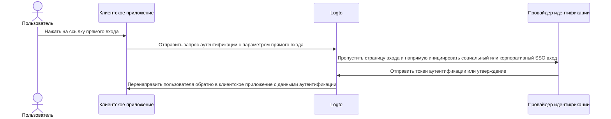
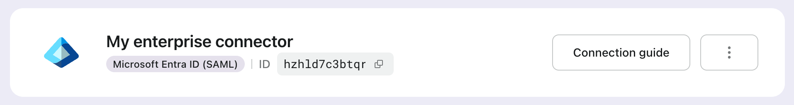

# Прямой вход

Прямой вход — это специфический для Logto [параметр аутентификации](/end-user-flows/authentication-parameters), который позволяет вам напрямую инициировать социальный вход или корпоративный единый вход (SSO), обходя стандартную универсальную страницу входа Logto.

Эта функция особенно полезна, если у вас есть кастомная страница входа или точка входа IdP, встроенная на вашем веб-сайте (см. случаи использования). Используя прямой вход, вы можете перенаправить пользователей непосредственно на страницу входа IdP.



## Социальный вход \{#social-sign-in}

Передайте параметр `direct_sign_in` со значением `social:<idp-name>`, чтобы напрямую инициировать процесс социального входа.

### Где найти имя коннектора IdP \{#where-to-find-the-connector-idp-name}

1. Перейдите в <CloudLink to="/connectors/social">Консоль > Коннекторы > Социальные коннекторы</CloudLink>
2. Нажмите на [социальный коннектор](/connectors/social-connectors), который вы хотите использовать.
3. Найдите имя провайдера идентификации в верхней части страницы настроек коннектора.


### Пример \{#example}

Создайте свой собственный URL запроса аутентификации с параметром `direct_sign_in`:

```sh
curl --location \
  --request GET 'https://[tenant-id].logto.app/oidc/auth?client_id=1234567890&...&direct_sign_in=social:google'
```

В поддерживаемых Logto SDK вы можете установить параметр `directSignIn`, вызывая метод `signIn`:

```javascript
const authResult = await logto.signIn({
  redirectUri: 'https://your-app.com/callback',
  directSignIn: 'social:google',
});
```

## Корпоративный единый вход (SSO) \{#enterprise-sso}

Передайте параметр `direct_sign_in` со значением `sso:<connector-id>`, чтобы напрямую инициировать процесс корпоративного SSO входа.

### Где найти ID коннектора корпоративного SSO \{#where-to-find-the-enterprise-sso-connector-id}

1. Перейдите в <CloudLink to="/enterprise-sso">Консоль > Корпоративный SSO</CloudLink>
2. Нажмите на [корпоративный коннектор](/connectors/enterprise-connectors), который вы хотите использовать.
3. Найдите ID коннектора в верхней части страницы настроек коннектора.



### Пример \{#example-1}

Создайте свой собственный URL запроса аутентификации с параметром `direct_sign_in`:

```sh
curl --location \
  --request GET 'https://[tenant-id].logto.app/oidc/auth?client_id=1234567890&...&direct_sign_in=sso:1234567890'
```

В поддерживаемых Logto SDK вы можете установить параметр `directSignIn`, вызывая метод `signIn`:

```javascript
logtoClient.signIn({
  redirectUri: 'https://your-app.com/callback',
  directSignIn: 'sso:1234567890',
});
```

## Возврат на страницу входа \{#fallback-to-the-sign-in-page}

Если процесс прямого входа не удается, например, коннектор не найден или не включен, пользователь будет перенаправлен на стандартную страницу входа.

:::note
Мы постепенно добавляем поддержку параметра direct_sign_in во все Logto SDK. Если вы не видите его в своем SDK, пожалуйста, откройте запрос или свяжитесь с нами.
:::

## Часто задаваемые вопросы \{#faqs}

<details>
  <summary>

### Является ли прямой вход тем же самым, что и аутентификация API? \{#is-direct-sign-in-the-same-as-api-authentication}

</summary>

Нет, прямой вход — это параметр пользовательского потока, который позволяет вам пропустить стандартную страницу входа Logto и перенаправить пользователей непосредственно на страницу входа социального или корпоративного SSO провайдера. В отличие от аутентификации на основе API, пользователь все равно должен сначала быть перенаправлен на конечную точку аутентификации Logto для инициирования процесса входа.

</details>
