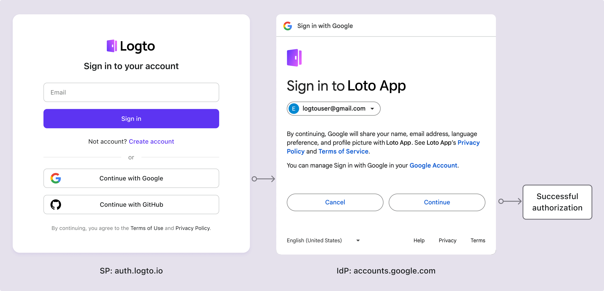

# Экран согласия

## Что такое экран согласия? \{#what-is-consent-screen}

Представьте, что вы регистрируетесь в Logto, используя свой аккаунт Google. Когда вы нажимаете кнопку "Войти через Google", вас перенаправляют на страницу входа Google. После ввода учетных данных Google вам будет предложено предоставить разрешение Logto на доступ к информации вашего аккаунта Google. Это и есть экран согласия пользователя.

Эта страница называется **экраном согласия** или **страницей согласия**. Это стандартный [OIDC / OAuth 2.0 поток](/integrate-logto/third-party-applications/oidc-oauth-third-party-applications), который позволяет пользователям предоставлять разрешения [сторонним приложениям](/integrate-logto/third-party-applications) для доступа к их данным от их имени. Основная цель — информировать пользователей о сборе, обработке и использовании их персональных данных и запрашивать их явное согласие на эти действия.

На экране согласия пользователям обычно предоставляется [информация](/integrate-logto/third-party-applications/oidc-oauth-third-party-applications/consent-screen-branding#customize-the-branding-information) о типах данных, которые будут собираться, как они будут использоваться и будут ли они передаваться третьим сторонам. Эта информация важна для прозрачности, позволяя пользователям принимать обоснованные решения о своей конфиденциальности и безопасности данных.

Страницы согласия особенно важны в контексте нормативных актов о конфиденциальности, таких как Общий регламент по защите данных ([GDPR](https://gdpr-info.eu/art-4-gdpr/)) в Европейском Союзе или Закон о конфиденциальности потребителей Калифорнии ([CCPA](https://oag.ca.gov/privacy/ccpa)) в Соединенных Штатах, которые требуют от организаций получения четкого и явного согласия от пользователей перед обработкой их персональной информации.

## Когда пользователь видит экран согласия в Logto? \{#when-does-user-see-the-consent-screen-in-logto}

Как упоминалось ранее, экран согласия появляется, когда пользователи входят в Logto, используя стороннего провайдера идентификации (IdP), такого как Google, Facebook или Apple. В этой настройке Logto выступает в качестве поставщика услуг (SP), запрашивая доступ к информации пользователя у IdP. Экран согласия обычно отображается, когда [SP](https://auth.wiki/service-provider) и [IdP](https://auth.wiki/identity-provider) являются отдельными организациями, требующими авторизации пользователя для облегчения обмена данными.

Аналогично, в Logto, когда Logto функционирует как IdP, экран согласия отображается, когда пользователи входят в [**OIDC / OAuth стороннее приложение**](/integrate-logto/third-party-applications/oidc-oauth-third-party-applications), интегрированное с Logto. Этот экран информирует пользователей о данных, которые запрашивает приложение, и запрашивает их разрешение на продолжение. Пользователи могут просмотреть запрашиваемые разрешения и решить, предоставлять ли авторизацию приложению.

## Как настроить экран согласия? \{#how-to-configure-the-consent-screen}

Поток согласия Logto позволяет вам авторизовать входы от сторонних приложений. Вы можете настроить брендинг и запросы разрешений для каждого OIDC стороннего приложения.

Узнайте больше о настройке [стороннего приложения](/integrate-logto/third-party-applications/) и конфигурации [экрана согласия](/integrate-logto/third-party-applications/oidc-oauth-third-party-applications/consent-screen-branding/) в Logto.

## Связанные ресурсы \{#related-resources}

<Url href="https://www.youtube.com/watch?v=sW-C7SRt9OM">
  Превратите свой сервис в безопасный OIDC IdP с экраном согласия.
</Url>
<Url href="https://blog.logto.io/user-consent-screen">Введение в экран согласия пользователя.</Url>

<Url href="https://blog.logto.io/introducing-oidc-prompt">
  OIDC Prompt 101: Простое руководство для разработчиков
</Url>
