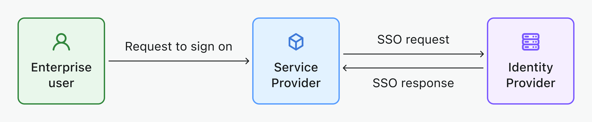

# Корпоративный единый вход (SSO)

[Единый вход (SSO)](https://auth.wiki/single-sign-on) позволяет пользователям входить в несколько приложений с одним набором учетных данных. Это упрощает процесс аутентификации для корпоративных пользователей, особенно для современных платформ SaaS для рабочей силы.

Logto улучшает опыт SSO, предоставляя широкий спектр корпоративных SSO коннекторов, которые вы можете легко настроить и интегрировать с вашими приложениями, например, [Google Workspace](/integrations/google-workspace), [Microsoft Azure AD](/integrations/entra-id-saml), [Okta](/integrations/okta) и другие.

## Основные компоненты корпоративного SSO \{#key-components-of-enterprise-sso}

- **Провайдер идентификации (IdP)**: Сервис, который проверяет идентичности пользователей и управляет их учетными данными для входа. После подтверждения идентичности пользователя IdP генерирует токены аутентификации или утверждения и позволяет пользователю получить доступ к различным приложениям или сервисам без необходимости повторного входа. По сути, это основная система для управления идентичностями и разрешениями сотрудников в вашей компании. Примеры: Okta, Azure AD, Google Workspace, LastPass, OneLogin, Ping Identity, Cyberark и т. д. [Узнайте больше о IdP](https://auth.wiki/identity-provider).
- **Провайдер услуг (SP)**: Система или приложение, которое требует аутентификации пользователя и полагается на Провайдера идентификации (IdP) для аутентификации. SP получает токены аутентификации или утверждения от IdP, предоставляя доступ к своим ресурсам без необходимости в отдельных учетных данных для входа. Примеры: Slack, Shopify, Dropbox, Figma, Notion и т. д., а также ваш сервис. [Узнайте больше о SP](https://auth.wiki/service-provider).
- **Корпоративная идентичность**: Обычно определяется использованием корпоративного домена электронной почты для входа. Этот корпоративный аккаунт электронной почты в конечном итоге принадлежит компании.

## Поддерживаемый рабочий процесс SSO \{#supported-sso-workflow}

- [**IdP-инициированный SSO**](/end-user-flows/enterprise-sso/idp-initiated-sso): В IdP-инициированном SSO Провайдер идентификации (IdP) в основном контролирует процесс единого входа. Этот процесс начинается, когда пользователь входит на платформу IdP, такую как корпоративный портал или централизованная панель идентификации. После аутентификации IdP генерирует токен аутентификации или утверждение, которое затем используется для беспрепятственного предоставления пользователю доступа к нескольким подключенным сервисам или приложениям (SP) без необходимости дополнительных входов.
  
- [**SP-инициированный SSO**](/end-user-flows/enterprise-sso/sp-initiated-sso): В SP-инициированном SSO Провайдер услуг (SP) берет на себя инициативу в запуске и управлении процессом единого входа, часто предпочитаемом в B2B сценариях. Этот сценарий происходит, когда пользователь пытается получить доступ к определенному сервису или приложению (SP) и перенаправляется к своему IdP для аутентификации. После успешного входа в IdP токен аутентификации отправляется обратно в SP, предоставляя пользователю доступ. Logto поддерживает SP-инициированный SSO для ваших B2B сервисов.
  

## Поддерживаемые протоколы SSO \{#supported-sso-protocols}

- [**SAML**](/integrations/saml-sso): [Security Assertion Markup Language (SAML)](https://auth.wiki/saml) — это основанный на XML открытый стандарт для обмена данными аутентификации и авторизации между IdP и SP. Этот протокол особенно хорошо справляется с обработкой сложных требований безопасности на уровне предприятия.
- [**OIDC**](/integrations/oidc-sso): [OpenID Connect (OIDC)](https://auth.wiki/openid-connect) — это простой уровень идентификации, построенный поверх протокола OAuth 2.0. Он использует JSON / REST для коммуникации, что делает его более легковесным и лучше подходящим для современных архитектур приложений, включая мобильные и одностраничные приложения (SPAs).

## Часто задаваемые вопросы \{#faqs}

  

### Как добавить кнопки коннекторов SSO и напрямую войти с провайдером SSO на моем сайте? \{#how-to-add-sso-connector-buttons-and-directly-sign-in-with-sso-provider-on-my-website}

Logto позволяет вам добавлять кнопки социального входа на ваш сайт и запускать процесс входа SSO напрямую без отображения формы входа по умолчанию. Ознакомьтесь с нашим руководством [Прямой вход](/end-user-flows/authentication-parameters/direct-sign-in/) для получения подробных инструкций.

## Связанные ресурсы \{#related-resources}

<Url href="https://www.youtube.com/watch?v=-mD8Sfab7sI&t=12s"> Опыт корпоративного SSO</Url>

<Url href="https://blog.logto.io/idp-vs-sp-initiated-sso">
  IdP-инициированный SSO против SP-инициированного SSO
</Url>

<Url href="https://blog.logto.io/enterprise-sso">
  Корпоративный SSO: что это такое, как это работает и почему это важно
</Url>

<Url href="https://blog.logto.io/single-sign-on">Искусство единого входа</Url>
