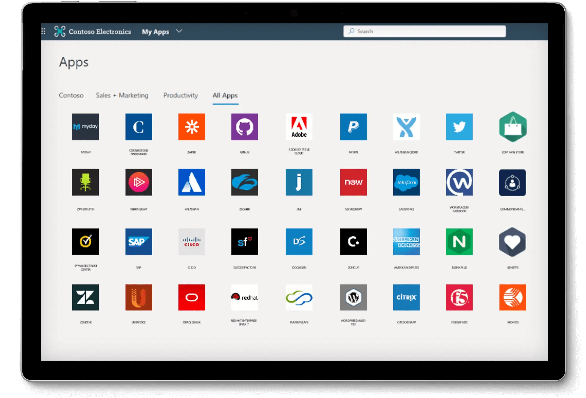

import Availability from '@components/Availability';

<Availability cloud="comingSoon" oss={false} />

# IdP-initiated SSO (только SAML)

IdP-initiated SSO — это процесс единого входа, в котором провайдер идентификации (IdP) в основном контролирует поток аутентификации. Этот процесс начинается, когда пользователь входит в платформу IdP, такую как корпоративный портал или централизованная панель идентификации. После аутентификации IdP генерирует SAML утверждение и направляет пользователя к поставщику услуг (SP) для доступа к приложению или сервису.



## Риски и соображения \{#risks-and-considerations}

IdP-initiated SSO может вводить несколько уязвимостей безопасности, о которых организации должны знать. Поскольку процесс аутентификации инициируется IdP без прямого запроса от пользователя, он может быть подвержен различным атакам, включая [Межсайтовую подделку запроса](https://blog.logto.io/csrf) (CSRF).

Это отсутствие аутентификации, инициированной пользователем, может привести к несанкционированному доступу, если не будут приняты надлежащие меры безопасности. Кроме того, зависимость от одной точки аутентификации увеличивает риск нарушения безопасности, так как компрометация IdP может подвергнуть опасности все подключенные приложения.

Поэтому настоятельно рекомендуется использовать SP-initiated SSO, который обеспечивает более безопасный и контролируемый поток аутентификации, гарантируя, что пользователи явно запрашивают доступ к сервисам.

## Подключение IdP-initiated SSO к приложениям Logto OIDC \{#connect-idp-initiated-sso-with-logto-oidc-applications}

Logto как провайдер OpenID Connect (OIDC) не поддерживает IdP-initiated SSO. Однако вы можете настроить Logto как SP для поддержки IdP-initiated SSO с вашим корпоративным IdP, используя SAML. Эта настройка позволяет использовать возможности аутентификации Logto, сохраняя при этом контроль IdP над потоком аутентификации.

:::note
По умолчанию эта функция не включена в Logto. Если вам нужно включить IdP-initiated SSO для вашего арендатора, пожалуйста, свяжитесь с нашей [службой поддержки](https://logto.io/contact?src=docs.sso).
:::

### Предварительные условия \{#prerequisites}

Перед настройкой IdP-initiated SSO вам нужно сначала создать SAML коннектор. Перейдите в <CloudLink to="/enterprise-sso">Консоль > Корпоративный SSO</CloudLink> и следуйте пошаговому руководству по настройке [SAML](/integrations/saml-sso/) коннектора с вашим IdP.

После настройки SAML коннектора вы можете включить метод входа SSO в разделе <CloudLink to="/sign-in-experience">Опыт входа</CloudLink> и протестировать поток SP-initiated SSO, чтобы убедиться, что конфигурация правильная. Убедитесь, что SP-initiated SSO работает как ожидалось, прежде чем продолжить с IdP-initiated SSO.

### Включение IdP-initiated SSO \{#enable-idp-initiated-sso}

После того как функция IdP-initiated SSO будет включена для вашего арендатора, вы должны увидеть дополнительную вкладку на странице настроек вашего SAML коннектора, называемую **IdP-initiated SSO**. Включите переключатель **IdP-initiated SSO**, чтобы активировать функцию для коннектора.

### Выбор SP приложения \{#select-the-sp-application}

В отличие от SP-initiated SSO, где поток аутентификации начинается с SP, IdP-initiated SSO требует клиентского SP приложения для перенаправления пользователей после процесса аутентификации. Вы можете выбрать SP приложение из списка зарегистрированных приложений в выпадающем списке **Default application**.

Только приложения **Traditional Web App** и **Single Page App** поддерживаются для IdP-initiated SSO. Убедитесь, что вы выбрали соответствующий тип приложения в зависимости от вашего случая использования.

:::note
На стороне вашего IdP оставьте параметр `RelayState` **ПУСТЫМ**, чтобы поток IdP-initiated SSO работал правильно. Logto будет обрабатывать перенаправление на основе выбранного по умолчанию SP приложения.
:::

## Настройка потока аутентификации IdP-initiated \{#configure-idp-initiated-authentication-flow}

Для подключения IdP-initiated SAML SSO с OIDC, Logto предоставляет два варианта конфигурации для обработки запроса аутентификации.

### Вариант A: Перенаправление на приложение по умолчанию SP (Рекомендуется) \{#option-a-redirect-to-the-default-sp-application-recommended}

Когда IdP инициирует поток SSO и отправляет SAML утверждение в Logto, будет создана сессия утверждения IdP-initiated SSO. Logto перенаправит пользователя на приложение по умолчанию SP для инициирования стандартного запроса аутентификации OIDC на стороне клиента.


Чтобы настроить этот вариант, выберите карточку **Перенаправление на клиент для аутентификации, инициированной SP** на вкладке **IdP-initiated SSO** настроек SAML коннектора.


1. Укажите **URL перенаправления клиента**, чтобы перенаправить пользователя на приложение по умолчанию SP после потока IdP-initiated SSO. Logto перенаправит пользователя на этот URL с добавленным параметром запроса `?ssoConnectorId={connectorId}`. Клиентское приложение должно обработать перенаправление и инициировать запрос аутентификации OIDC. (Мы рекомендуем использовать выделенный маршрут или страницу в вашем клиентском приложении для обработки запроса аутентификации IdP-initiated SSO.)

2. Обработайте запрос аутентификации OIDC на стороне клиента, используя параметр запроса `ssoConnectorId` для идентификации SAML коннектора, который инициировал поток аутентификации IdP-initiated SSO.

3. Передайте параметр аутентификации [прямой вход](/end-user-flows/authentication-parameters/direct-sign-in/) в запросе на вход в Logto, чтобы завершить поток аутентификации SSO.

```typescript
// Пример на React
import { Prompt, useLogto } from '@logto/react';
import { useEffect } from 'react';
import { useNavigate, useSearchParams } from 'react-router-dom';

const SsoDirectSignIn = () => {
  const { signIn } = useLogto();
  const [searchParams] = useSearchParams();

  useEffect(() => {
    const ssoConnectorId = searchParams.get('ssoConnectorId');
    if (ssoConnectorId) {
      void signIn({
        redirectUri,
        prompt: Prompt.Login,
        directSignIn: {
          method: 'sso',
          target: ssoConnectorId,
        },
      });
    }
  }, [searchParams, signIn]);
};
```

- `redirectUri`: `redirect_uri` для перенаправления пользователя после завершения потока аутентификации OIDC.
- `prompt=login`: Заставляет пользователя войти, используя идентификацию IdP-initiated SSO.
- `directSignIn=sso:{connectorId}`: Указывает метод прямого входа как `sso` и целевой ID SAML коннектора. Этот параметр напрямую запускает поток аутентификации SSO без отображения страницы входа. Пользователь будет автоматически аутентифицирован, используя сохраненную сессию утверждения IdP-initiated SSO, если ID коннектора совпадает и сессия действительна.

Этот метод гарантирует, что поток аутентификации безопасен и соответствует стандартному протоколу OIDC, сохраняя при этом контроль IdP над процессом аутентификации. Клиентское приложение может воспользоваться сессией утверждения IdP-initiated SSO для аутентификации пользователя без дополнительных шагов входа, сохраняя поток аутентификации безопасным и контролируемым. Клиентское приложение все еще может проверить параметры `state` и `PKCE`, чтобы убедиться, что запрос аутентификации безопасен.

:::note
Этот метод доступен как для приложений **Traditional Web App**, так и для **Single Page App**. И он рекомендуется для всех случаев использования.
:::

### Вариант B: Прямая аутентификация пользователя с IdP-initiated SSO \{#option-b-directly-authenticate-the-user-with-idp-initiated-sso}

В некоторых случаях SP может не иметь возможности обработать обратный вызов IdP-initiated SSO и инициировать запрос аутентификации OIDC. В этом случае Logto предоставляет альтернативный вариант для прямой аутентификации пользователя с сессией утверждения IdP-initiated SSO.

Этот вариант считается менее безопасным и не рекомендуется. Поток аутентификации обходит стандартный протокол OIDC. Поскольку запрос аутентификации инициируется IdP, клиентское приложение может не иметь возможности безопасно проверить запрос аутентификации. Например, клиентское приложение не может проверить параметры `state` и `PKCE`, чтобы убедиться, что запрос аутентификации безопасен.

:::warning
Этот метод недоступен для приложений **Single Page App**, так как он требует, чтобы клиентское приложение обрабатывало запрос аутентификации безопасно, используя параметр `PKCE`. Если вам нужно реализовать IdP-initiated SSO для SPA приложения, пожалуйста, используйте вышеуказанный вариант.
:::


Чтобы настроить этот вариант, выберите опцию **Прямой вход с использованием IdP-initiated SSO** на вкладке **IdP-initiated SSO** настроек SAML коннектора.


1. Выберите **URI перенаправления после входа**, чтобы перенаправить пользователя обратно в клиентское приложение после успешной аутентификации. Этот URL будет использоваться как `redirect_uri` в запросе аутентификации OIDC. URI должен быть одним из разрешенных URI перенаправления, зарегистрированных в клиентском приложении.

   :::note
   Настоятельно рекомендуется использовать выделенный **URI перенаправления** для IdP-initiated SSO. Учитывая, что запрос аутентификации является незапрашиваемым, клиентское приложение должно управлять ответом независимо, отдельно от стандартного потока аутентификации, инициированного SP.
   :::

2. Настройте параметры запроса авторизации при необходимости, используя редактор json **Дополнительные параметры аутентификации** (следуя типу `Map<string,string>`).

   Например, по умолчанию Logto запрашивает только области `openid` и `profile`. Вы можете добавить дополнительные области или параметры в запрос аутентификации.

   ```json
   {
     "scope": "email offline_access"
   }
   ```

   - добавьте дополнительную область `email`, чтобы запросить адрес электронной почты пользователя.
   - добавьте область `offline_access`, чтобы запросить токен обновления.

   Мы также рекомендуем вам предоставить пользовательский параметр `state`, чтобы безопасно проверить ответ аутентификации.

   ```json
   {
     "state": "custom-state-value"
   }
   ```

   Клиентское приложение должно проверить параметр `state` в ответе с кодом авторизации, чтобы убедиться, что запрос аутентификации действителен.
