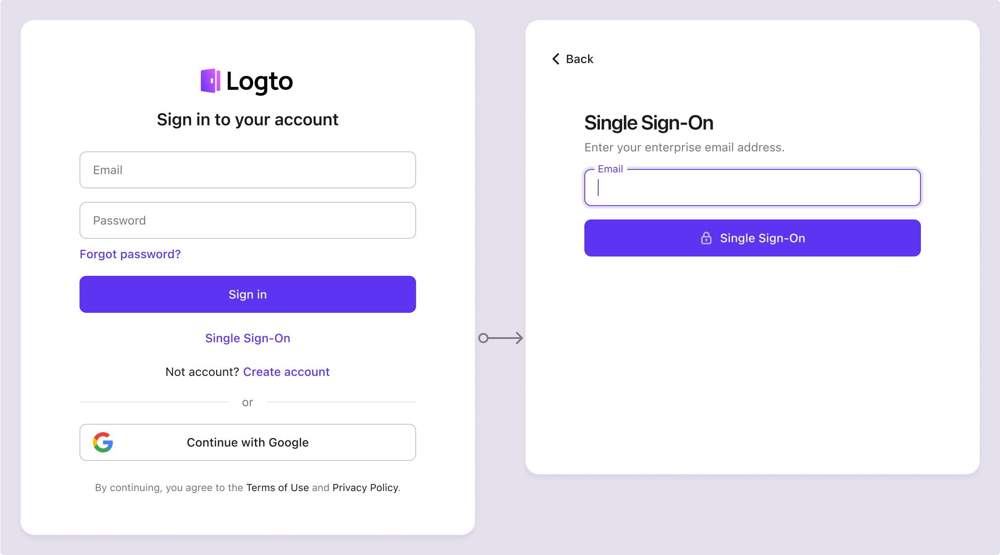

# SP-инициированный SSO

SP-инициированный SSO, метод по умолчанию и более безопасный, чем [IdP-инициированный SSO](/end-user-flows/enterprise-sso/idp-initiated-sso), позволяет корпоративным пользователям инициировать процесс входа через SSO со страницы входа Logto. Logto поддерживает как [SSO с подсказкой по домену электронной почты](#sp-initiated-sso-experience), так и [параметр прямого входа для SSO](/end-user-flows/authentication-parameters/direct-sign-in#enterprise-sso).

## Настройка SP-инициированного SSO \{#set-up-sp-initiated-sso}

1. **Включите корпоративный SSO** в вашей системе идентификации

   Чтобы активировать корпоративный SSO, перейдите в <CloudLink to="/sign-in-experience/sign-up-and-sign-in">Консоль > Опыт входа > Регистрация и вход</CloudLink> и включите настройку "Включить корпоративный SSO". После включения на вашей странице входа появится кнопка "Единый вход". Корпоративные пользователи с доменами электронной почты, поддерживающими SSO, смогут получить доступ к вашим услугам через своих корпоративных провайдеров идентификации.

2. **Создайте корпоративные коннекторы** для разных клиентов

   Далее вам нужно интегрировать каждого корпоративного провайдера идентификации для ваших клиентов. Подобно социальному входу, создайте новый корпоративный коннектор в Logto и настройте необходимые параметры. Перейдите в <CloudLink to="/enterprise-sso">Консоль > Корпоративный SSO</CloudLink>, нажмите кнопку "Добавить корпоративный коннектор" и следуйте инструкциям по настройке коннектора. Обратитесь к [настройке корпоративного SSO коннектора](/connectors/enterprise-connectors/).

3. **Настройте домены электронной почты** для корпоративного коннектора

   Корпоративные SSO идентичности обычно распознаются по домену электронной почты компании. На вкладке SSO Experience на странице деталей каждого корпоративного коннектора вы можете указать связанные домены электронной почты.

   Пользователи с указанными доменами электронной почты будут ограничены входом исключительно через этот корпоративный SSO коннектор, в то время как другие методы входа, такие как проверка по электронной почте, аутентификация по электронной почте и паролю или социальный вход, будут отключены для этих пользователей. Коннектор SSO будет виден только пользователям с указанными доменами электронной почты.

   :::note
   Публичные домены электронной почты (например, gmail.com, yahoo.com) не могут быть связаны с корпоративным коннектором.
   :::

## Опыт SP-инициированного SSO \{#sp-initiated-sso-experience}

SSO активируется, когда пользователи пытаются войти, используя корпоративный домен электронной почты, настроенный для SSO. Этот процесс обходит стандартные методы проверки, такие как пароли.

1. **Кнопка единого входа**:

   Когда метод входа через корпоративный SSO включен, на странице входа появляется кнопка "Единый вход" в качестве альтернативного варианта входа. Нажав на эту ссылку, пользователи должны ввести свой корпоративный адрес электронной почты, чтобы инициировать процесс SSO.

   - Один коннектор: Если с доменом электронной почты пользователя связан только один корпоративный SSO коннектор, пользователь перенаправляется непосредственно на страницу входа IdP.
   - Несколько коннекторов: Если с доменом электронной почты пользователя связано несколько корпоративных SSO коннекторов, пользователь сначала выбирает желаемый IdP из списка, прежде чем быть перенаправленным на страницу входа IdP.

   

2. **Универсальный вход по электронной почте**:

   В универсальной форме входа по идентификатору (с включенным методом входа по электронной почте) обнаружение домена электронной почты для корпоративного SSO включено по умолчанию. Когда пользователи вводят свой адрес электронной почты, Logto автоматически определяет, связан ли с этим доменом корпоративный SSO коннектор. Если совпадение найдено, форма входа по умолчанию обновляется: кнопка "Войти" изменяется на кнопку "Единый вход", ограничивая пользователя входом через корпоративный SSO коннектор(ы).

   

## Часто задаваемые вопросы \{#faqs}

  

### Могу ли я использовать название / домен организации вместо домена электронной почты для перенаправления на IdP? \{#can-i-use-organization-namedomain-instead-of-email-domain-to-redirect-to-the-idp}

В настоящее время предустановленный опыт входа Logto поддерживает только **SSO с подсказкой по домену электронной почты**, а не **SSO с подсказкой по домену организации**.

Вы можете создать пользовательскую страницу маршрутизации на стороне клиента, используя параметры аутентификации с `directSignIn:'sso:{connectorId}`. Эта страница будет перенаправлять крупных корпоративных клиентов на соответствующий IdP на основе их домена организации. Узнайте больше о [параметре прямого входа](/end-user-flows/authentication-parameters/direct-sign-in/).

  

### Могу ли я отобразить кнопку конкретного корпоративного коннектора на странице входа? \{#can-i-display-a-specific-enterprise-connector-button-on-the-sign-in-page}

Разные корпоративные клиенты используют разных провайдеров идентификации для управления своими сотрудниками и запрашивают разные области (OIDC) или атрибуты (SAML). Поэтому не рекомендуется отображать кнопку корпоративного коннектора, предназначенную для конкретного клиента, на общей странице входа.

Однако, если вы разрабатываете продукт для B2E и хотите показать кнопку для конкретного корпоративного клиента, вы можете создать пользовательскую страницу входа и использовать `directSignIn:sso` для правильной маршрутизации кнопки. Узнайте больше о [параметре прямого входа](/end-user-flows/authentication-parameters/direct-sign-in/).

### Как включить вход и регистрацию только через SSO? \{#how-to-enable-sso-only-sign-in-and-registration}

Чтобы включить вход и регистрацию только через SSO, выполните следующие шаги:

1. Настройте в <CloudLink to="/sign-in-experience/sign-up-and-sign-in">Консоль > Опыт входа > Регистрация и вход</CloudLink>
   - Регистрация: Не применимо
   - Вход: Нет
   - Социальный вход: Нет
   - Корпоративный SSO: Включен
   - Регистрация пользователей: Отключена
2. Вручную добавьте пользователей, введя их корпоративный адрес электронной почты в <CloudLink to="/users">Консоль > Управление пользователями</CloudLink> или импортируйте через [Management API](https://openapi.logto.io/operation/operation-createuser).
3. Когда пользователи впервые входят через SSO, Logto [автоматически связывает](/end-user-flows/enterprise-sso/enterprise-sso-identity#enterprise-sso-account-linking) их существующий адрес электронной почты с их SSO аккаунтом.

