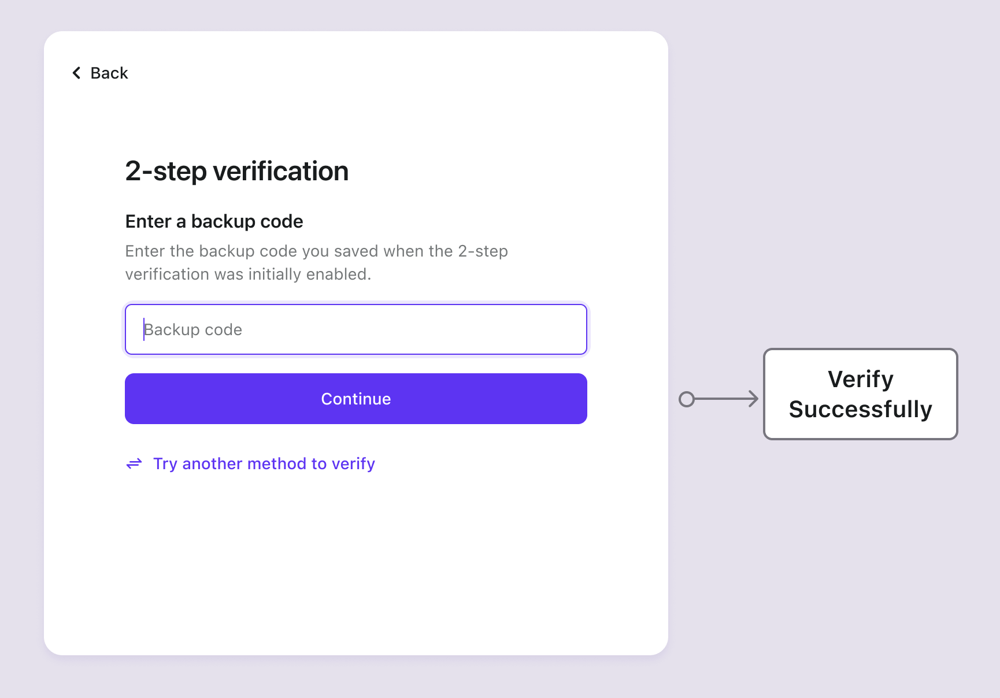

# Резервные коды

## Концепции \{#concepts}

Резервные коды, также известные как коды восстановления, представляют собой одноразовые коды для многофакторной аутентификации (MFA), которые служат резервным вариантом в случае недоступности основных факторов аутентификации пользователя (например, приложения-аутентификатора или аппаратного токена).

Их потеря может привести к проблемам с восстановлением аккаунта. Поэтому рекомендуется настроить дополнительный основной фактор перед включением резервных кодов, придавая ему приоритет.

Logto автоматически генерирует 10 резервных кодов для пользователей после того, как они настроят дополнительный фактор. Каждый код можно использовать только один раз. Пользователям рекомендуется сгенерировать новый набор кодов в настройках учетной записи пользователя (доступных через [Management API](/integrate-logto/interact-with-management-api/)) до того, как все существующие коды будут использованы.

## Потоки аутентификации \{#authentication-flows}

- **Потоки настройки резервных кодов**

- **Поток проверки резервных кодов**

