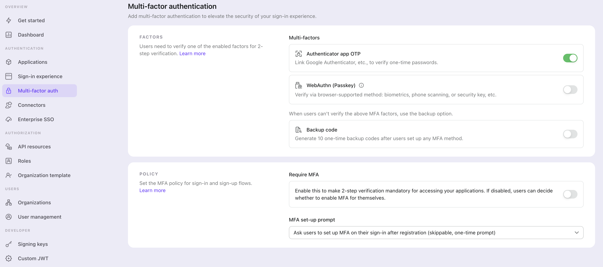
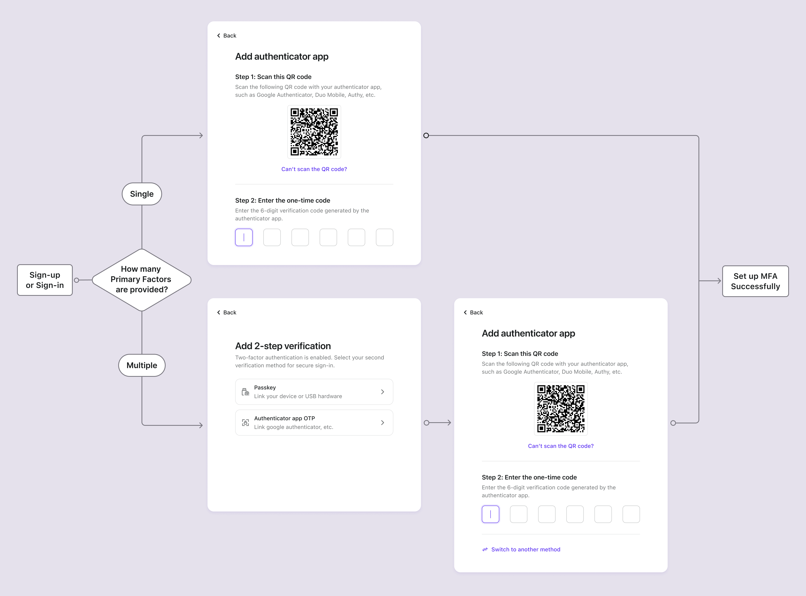
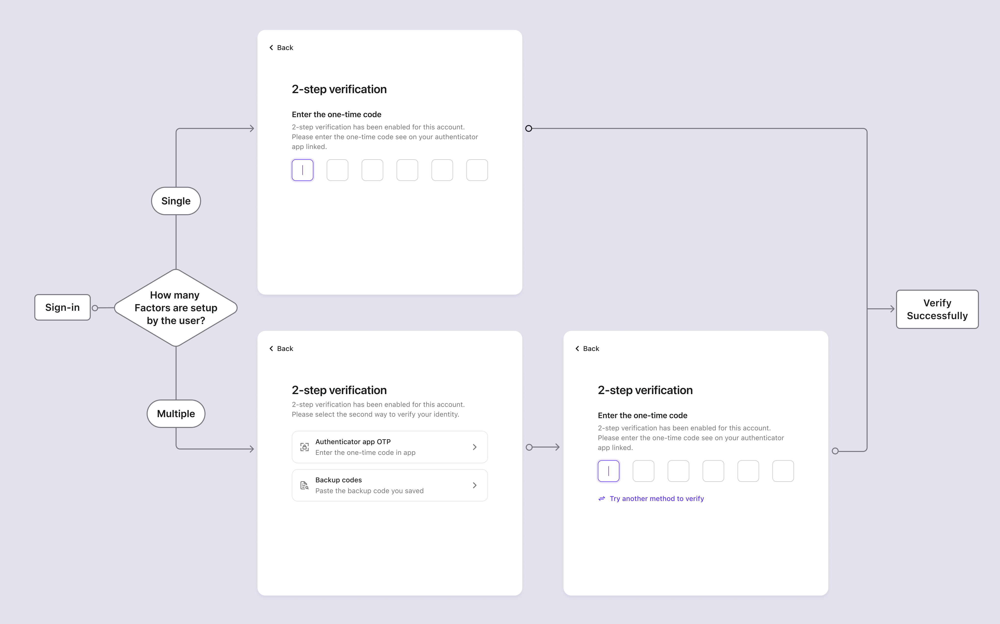

# Настройка MFA

## Настройка параметров MFA в Logto \{#configure-mfa-settings-in-logto}

Следуйте этим шагам, чтобы включить MFA в процессе входа пользователей в Logto:

1. Перейдите по адресу: <CloudLink to="/mfa">Console > Multi-factor auth</CloudLink>.
2. Включите поддерживаемые факторы проверки для ваших пользователей.
   1. Основные факторы:
      - [OTP приложения-аутентификатора](/end-user-flows/mfa/authenticator-app-otp): Наиболее распространенный и широко принятый метод. Используйте одноразовый пароль на основе времени (TOTP), сгенерированный приложением-аутентификатором, таким как Google Authenticator или Authy.
      - [Ключи доступа (WebAuthn)](/end-user-flows/mfa/webauthn): Высокозащищенный вариант, подходящий для веб-продуктов, поддерживающих биометрию устройства или ключи безопасности и т. д., обеспечивающий надежную защиту.
   2. Резервные факторы:
      - [Резервные коды](/end-user-flows/mfa/backup-codes): Это служит резервным вариантом, когда пользователи не могут подтвердить ни один из основных факторов, упомянутых выше. Включение этой опции снижает трение для успешного доступа пользователей.
3. Выберите, хотите ли вы включить **Требовать MFA**:
   - **Включить**: Пользователи будут приглашены настроить MFA во время процесса входа, который нельзя пропустить. Если пользователь не настроит MFA или удалит свои настройки MFA, он будет заблокирован в своем аккаунте, пока не настроит MFA снова.
   - **Отключить**: Пользователи могут пропустить процесс настройки MFA во время потока регистрации. Они могут настроить MFA позже через вашу страницу настроек учетной записи самообслуживания. [Узнайте больше](/end-user-flows/account-settings/) о реализации страницы настроек учетной записи пользователя. И продолжайте выбирать политику для запроса настройки MFA:
     - **Не спрашивать пользователей о настройке MFA**: Пользователи не будут приглашены настроить MFA во время входа.
     - **Спрашивать пользователей о настройке MFA во время регистрации**: Новые пользователи будут приглашены настроить MFA во время регистрации, а существующие пользователи увидят запрос при следующем входе. Пользователи могут пропустить этот шаг, и он больше не появится.
     - **Спрашивать пользователей о настройке MFA при их входе после регистрации**: Новые пользователи будут приглашены настроить MFA при втором входе после регистрации, а существующие пользователи увидят запрос при следующем входе. Пользователи могут пропустить этот шаг, и он больше не появится.

:::note
Для продуктов с многопользовательской архитектурой, поддерживающих [Организации](/organizations), в большинстве случаев вам не нужно требовать MFA для всех пользователей. Вместо этого MFA может быть включена на основе каждой организации, что позволяет вам адаптировать требования в зависимости от потребностей каждого клиента. Чтобы начать, обратитесь к [Требование MFA для членов организации](/organizations/organization-management#require-mfa-for-organization-members).
:::

## Поток пользователя MFA \{#mfa-user-flow}

### Поток настройки MFA \{#mfa-set-up-flow}

После включения MFA пользователи будут приглашены настроить MFA во время процесса входа и регистрации. Пользователи могут выбрать пропуск этого процесса настройки, если и только если включена политика «MFA, управляемая пользователем».

1. **Посетите страницу входа или регистрации**: Пользователь переходит на страницу входа или регистрации.
2. **Завершите вход или регистрацию**: Пользователь завершает процесс проверки личности в рамках потока входа или регистрации.
3. **Настройка основного фактора MFA**: Пользователь будет приглашен настроить свой основной фактор MFA (либо OTP приложения-аутентификатора, либо WebAuthn). Если включено несколько основных факторов, они могут выбрать предпочитаемый вариант. Если включена политика «MFA, управляемая пользователем», они также могут пропустить этот шаг, выбрав кнопку "Пропустить".
4. **Настройка резервного фактора MFA**: Если включены **Резервные коды**, пользователь будет приглашен настроить резервные коды после успешной настройки основного фактора аутентификации. Автоматически сгенерированные резервные коды будут отображены пользователю, который может их скачать и безопасно сохранить. Пользователь должен вручную подтвердить резервные коды, чтобы завершить процесс настройки MFA.

### Поток проверки MFA \{#mfa-verification-flow}

Пользователи, которые настроили MFA, будут приглашены подтвердить свою личность, используя настроенные факторы MFA во время входа. Фактор проверки будет зависеть от конфигурации MFA в Logto и настроек пользователя.

- Если пользователь настроил только один фактор, он будет проверять его напрямую.
- Если пользователь настроил несколько факторов как 2FA, ему нужно будет выбрать один для проверки.
- Если все включенные основные факторы недоступны пользователю, и резервный код включен, он может использовать одноразовый резервный код для подтверждения своей личности.

