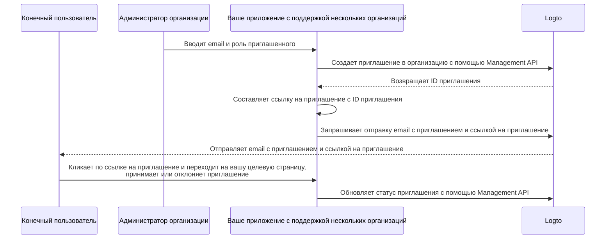

# Приглашение членов организации

Как приложение с поддержкой нескольких организаций, одной из распространенных задач является приглашение членов в вашу организацию. В этом руководстве мы проведем вас через шаги и технические детали для реализации этой функции в вашем приложении.

## Обзор процесса \{#flow-overview}

Общий процесс иллюстрируется на диаграмме ниже:



## Создание ролей организации \{#create-organization-roles}

Перед приглашением членов в вашу организацию, вам нужно создать роли организации. Ознакомьтесь с руководством [Настройка шаблона организации](/authorization/organization-template/configure-organization-template) для получения подробных инструкций.

В этом руководстве мы создадим две типичные роли организации: `admin` и `member`.

Роль `admin` имеет полный доступ ко всем ресурсам в организации, в то время как роль `member` имеет ограниченный доступ. Например, каждая роль может иметь следующий набор разрешений:

- Роль `admin`:
  - `read:data` - Доступ на чтение ко всем ресурсам данных организации.
  - `write:data` - Доступ на запись ко всем ресурсам данных организации.
  - `delete:data` - Доступ на удаление ко всем ресурсам данных организации.
  - `invite:member` - Приглашение членов в организацию.
  - `manage:member` - Управление членами в организации.
  - `delete:member` - Удаление членов из организации.
- Роль `member`:
  - `read:data` - Доступ на чтение ко всем ресурсам данных организации.
  - `write:data` - Доступ на запись ко всем ресурсам данных организации.
  - `invite:member` - Приглашение членов в организацию.

Это можно легко сделать в [Logto Console](https://cloud.logto.io/). Вы также можете использовать [Logto Management API](https://openapi.logto.io/operation/operation-createorganizationrole) для программного создания ролей организации.

## Настройка вашего email-коннектора \{#configure-your-email-connector}

Поскольку приглашения отправляются по email, убедитесь, что ваш [email-коннектор](/connectors/email-connectors) правильно настроен. Чтобы отправлять приглашения, вам нужно настроить новый тип использования [email-шаблона](/connectors/email-connectors/email-templates#email-template-types) - `OrganizationInvitation`.

Пример email-шаблона для типа использования `OrganizationInvitation` показан ниже:

```json
{
  "subject": "Добро пожаловать в мою организацию",
  "content": "<p>Присоединяйтесь к моей организации по этой <a href=\"{{link}}\" target=\"_blank\">ссылке</a>.</p>",
  "usageType": "OrganizationInvitation",
  "type": "text/html"
}
```

Заполнитель `{{link}}` в содержимом email будет заменен на фактическую ссылку на приглашение при отправке email. В этом руководстве, предположим, что это будет `https://your-app.com/invitation/accept/{your-invitation-id}`.

:::note

Встроенная "Logto email service" в Logto Cloud в настоящее время не поддерживает тип использования `OrganizationInvitation`. Вместо этого вам нужно настроить ваш email-коннектор (например, Sendgrid) и установить шаблон `OrganizationInvitation`.

:::

## Обработка приглашений с помощью Logto Management API \{#handle-invitations-with-logto-management-api}

:::note

Если вы еще не настроили Logto Management API, ознакомьтесь с [Взаимодействие с Management API](/integrate-logto/interact-with-management-api) для получения подробной информации.

:::

Мы предоставили набор Management API, связанных с приглашениями, в функции организаций. С помощью этих API вы можете:

- `POST /api/organization-invitations` создать приглашение в организацию с назначенной ролью организации.
- `POST /api/organization-invitations/{id}/message` отправить приглашение в организацию приглашенному по email.
  Примечание: Этот API поддерживает свойство `link`, вы можете составить вашу ссылку на приглашение на основе ID приглашения. Например:

  ```json
  {
    "link": "https://your-app.com/invitation/accept/{your-invitation-id}"
  }
  ```

  Соответственно, вам нужно реализовать целевую страницу, когда ваш приглашенный перейдет по ссылке на приглашение в ваше приложение.

- `GET /api/organization-invitations` и `GET /api/organization-invitations/{id}` получить все ваши приглашения или конкретное по ID.
  На вашей целевой странице используйте эти API для отображения всех приглашений или деталей приглашения, которое пользователь получил.
- `PUT /api/organization-invitations/{id}/status` принять или отклонить приглашение, обновив статус приглашения.
  Используйте этот API для обработки ответа пользователя на приглашение.

Обратите внимание, что все перечисленные выше API требуют действительного "токена организации". [Ознакомьтесь с этим руководством](/authorization/organization-template/protect-organization-resources#step-2-fetch-organization-token), чтобы узнать, как получить токен организации.

## Использование управления доступом на основе ролей (RBAC) для управления разрешениями пользователей \{#use-organization-role-based-access-control-rbac-to-manage-user-permissions}

С вышеуказанными настройками вы можете отправлять приглашения по email, и приглашенные могут присоединиться к организации с назначенной ролью.

Пользователи с разными ролями в организации будут иметь разные области действия (разрешения) в своих токенах организации. Таким образом, как ваше клиентское приложение, так и серверные службы должны проверять эти области действия, чтобы определить видимые функции и разрешенные действия.

## Обработка обновлений областей действия в токенах организации \{#handle-scope-updates-in-organization-tokens}

:::note

Убедитесь, что вы интегрировали организацию с вашим приложением. Ознакомьтесь с [руководством по интеграции](/authorization/organization-template/protect-organization-resources) для получения подробной информации.

:::

Управление обновлениями областей действия в токенах организации включает:

### Отзыв существующих областей действия \{#revoking-existing-scopes}

Например, понижение администратора до не-администратора должно удалить области действия у пользователя. В таком случае вы можете просто очистить кешированный токен организации и получить новый с токеном обновления. Уменьшенные области действия будут немедленно отражены в вновь выданном токене организации.

### Предоставление новых областей действия \{#granting-new-scopes}

Это можно разделить на два сценария:

#### Предоставление новых областей действия, уже определенных в вашей системе аутентификации \{#grant-new-scopes-that-already-defined-in-your-auth-system}

Аналогично отзыву областей действия, если вновь предоставленная область действия уже зарегистрирована на сервере аутентификации, вы можете просто выдать новый токен организации, и новые области действия будут немедленно отражены.

#### Предоставление новых областей действия, недавно введенных в вашу систему аутентификации \{#grant-new-scopes-that-are-newly-introduced-your-auth-system}

В этом случае вам нужно инициировать процесс повторного входа или повторного согласия, чтобы обновить токен организации пользователя. Например, вызов метода `signIn` в Logto SDK.

Узнайте больше о [выдаче токена организации](/authorization/organization-template/protect-organization-resources/#fetch-the-organization-token).

### Реализация проверки разрешений в реальном времени и обновление токена организации \{#implement-real-time-permission-check-and-update-organization-token}

Logto предоставляет Management API для получения разрешений пользователя в организации в реальном времени.

- `GET /api/organizations/{id}/users/{userId}/scopes` ([API ссылки](https://openapi.logto.io/operation/operation-listorganizationuserscopes))

Вы можете сравнить области действия в токене организации пользователя с разрешениями в реальном времени, чтобы определить, был ли пользователь повышен или понижен.

- Если понижен, вы можете просто очистить кешированный токен организации, и SDK автоматически выдаст новый с обновленными областями действия.

  ```ts
  const { clearAccessToken } = useLogto();

  ...
  // Если полученные в реальном времени области действия имеют меньше областей, чем области действия токена организации
  await clearAccessToken();
  ```

  Это не требует процесса повторного входа или повторного согласия. Новые токены организации будут автоматически выданы Logto SDK.

- Если новая область действия введена в вашу систему аутентификации, инициируйте процесс повторного входа или повторного согласия, чтобы обновить токен организации пользователя. Возьмем, например, React SDK:

  ```ts
  const { clearAllTokens, signIn } = useLogto();

  ...
  // Если полученные в реальном времени области действия имеют больше назначенных областей, чем области действия токена организации
  await clearAllTokens();
  signIn({
    redirectUri: '<your-sign-in-redirect-uri>',
    prompt: 'consent',
  });
  ```

  Приведенный выше код инициирует переход на экран согласия и автоматически перенаправит обратно в ваше приложение с обновленными областями действия в токене организации пользователя.

## Связанные ресурсы \{#related-resources}

<Url href="https://blog.logto.io/implement-user-collaboration-in-your-app">
  Как мы реализуем сотрудничество пользователей в многопользовательском приложении
</Url>
