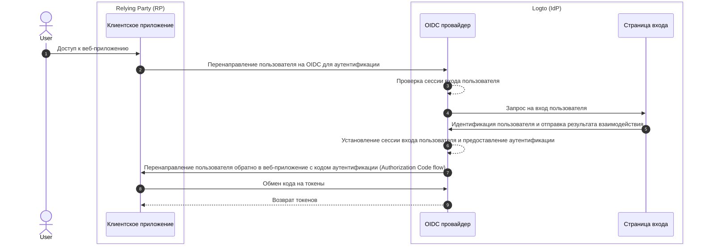

# Выход из системы

Процесс выхода из системы в Logto (как провайдере идентификации на основе OIDC) является многогранной концепцией из-за участия как централизованной сессии входа, управляемой Logto, так и распределенного статуса аутентификации, управляемого клиентскими приложениями.

## Сессия входа \{#sign-in-session}

Чтобы лучше понять процесс выхода из системы, важно сначала понять, как управляются сессии входа пользователей и их статус аутентификации в Logto.



1. Пользователь получает доступ к веб-приложению (RP).
2. Клиентское приложение перенаправляет пользователя в Logto (IdP) для [аутентификации](https://auth.wiki/authentication).
3. OIDC провайдер проверяет статус сессии входа пользователя. Если сессия не существует или истекла, пользователю предлагается войти в систему.
4. Пользователь взаимодействует со страницей входа для аутентификации.
5. После успешного входа Logto создает новую сессию для пользователя и перенаправляет обратно в клиентское приложение с кодом авторизации.
6. OIDC провайдер создает новую сессию входа и предоставляет аутентификацию для пользователя.
7. OIDC провайдер перенаправляет пользователя обратно в клиент с кодом аутентификации ([Authorization Code flow](https://auth.wiki/authorization-code-flow)).
8. Клиент получает код аутентификации и обменивает его на токены для доступа к информации о пользователе.
9. Предоставление токенов клиентскому приложению.

## Компоненты \{#components}

### Централизованная сессия входа, управляемая Logto \{#centralized-sign-in-session-managed-by-logto}

В приведенном выше потоке централизованная сессия входа управляется Logto. Сессия создается, когда пользователь успешно входит в систему, и уничтожается, когда пользователь выходит из системы. Сессия также уничтожается, когда срок действия сессии пользователя истекает.

Сессия входа Logto управляется с помощью файлов cookie сессии. Файл cookie сессии устанавливается, когда пользователь входит в систему. Все запросы на аутентификацию проверяются на основе файла cookie сессии. Если файл cookie сессии присутствует и действителен, пользователь будет автоматически аутентифицирован и напрямую перенаправлен в клиентское приложение с кодом авторизации. В противном случае пользователю будет предложено войти в систему.

1. Общий файл cookie сессии Logto
   Для пользователя, который входит в несколько клиентских приложений из одного и того же пользовательского агента (например, браузера), будет установлен общий файл cookie сессии под доменом Logto. Это означает, что пользователю нужно войти в систему только один раз и автоматически аутентифицироваться для других клиентских приложений.

   ```mermaid
    flowchart TD
    subgraph User [Пользовательский агент A]
      U[Пользователь]

      subgraph Layer1 [Домен клиента A]
        A[Клиентское приложение A]
      end

      subgraph Layer1 [Домен клиента B]
        B[Клиентское приложение B]
      end

      subgraph Layer2 [Домен Logto]
          C{{Сессия входа Logto?}}
          D[Страница входа]
      end
    end

    U --> |Вход| A
    A --> |Перенаправление в Logto| C
    U --> |Вход| B
    B --> |Перенаправление в Logto| C
    C --> |Нет| D
    D --> |Создание сессии| C
   ```

2. Изолированный файл cookie сессии Logto
   Для пользователя, который входит в разные клиентские приложения с разных устройств или браузеров, будут установлены изолированные файлы cookie сессии под доменом Logto. Это означает, что пользователю нужно входить в каждое клиентское приложение отдельно.

   ```mermaid
    flowchart TD
    U[Пользователь]

    subgraph DeviceA [Пользовательский агент A]
      subgraph Layer1 [Домен клиента A]
        A[Клиентское приложение A]
      end

      subgraph Layer2 [Домен Logto]
          C{{Сессия входа Logto?}}
          D[Страница входа]
      end
    end

    subgraph DeviceB [Пользовательский агент B]
      subgraph Layer3 [Домен клиента B]
        B[Клиентское приложение B]
      end

      subgraph Layer4 [Домен Logto]
          E{{Сессия входа Logto?}}
          F[Страница входа]
      end
    end

    U --> |Вход| A
    A --> |Перенаправление в Logto| C
    U --> |Вход| B
    B --> |Перенаправление в Logto| E
    C --> |Нет| D
    E --> |Нет| F
    D --> |Создание сессии| C
    F --> |Создание сессии| E
   ```

## Распределенный статус аутентификации, управляемый клиентскими приложениями \{#distributed-authentication-status-managed-by-the-client-applications}

Каждое клиентское приложение поддерживает свой собственный статус аутентификации. Будь то нативное, SPA или веб-приложение, все они имеют свои собственные способы управления статусом аутентификации пользователя.

После успешного входа клиентское приложение может получить [ID токен](https://auth.wiki/id-token) и [токен доступа](https://auth.wiki/access-token). Клиентское приложение может использовать ID токен для определения личности пользователя и токен доступа для доступа к ресурсам пользователя. Статус аутентификации пользователя представлен временем истечения срока действия токена доступа.

- Нативные и SPA приложения:
  Клиентское приложение должно безопасно хранить и управлять этими токенами, чтобы поддерживать статус аутентификации пользователя. Например, хранить токены в локальном хранилище или хранилище сессий и очищать токены при выходе пользователя из системы.
- Веб-приложения:
  Веб-приложения, такие как те, что построены с использованием фреймворков, таких как Next.js, часто управляют своей собственной сессией для вошедших пользователей наряду с токенами, выданными Logto. После того как пользователь входит в систему и веб-приложение получает токены от Logto, оно может хранить токены на стороне клиента, как и SPA приложения, или хранить токены на стороне сервера и управлять сессией с помощью файлов cookie или других механизмов.

## Механизмы выхода из системы \{#sign-out-mechanisms}

### Очистка токенов и локальной сессии на стороне клиента \{#clear-tokens-and-local-session-at-the-client-side}

На стороне клиента простой выход из системы включает очистку локальной сессии и удаление токенов (ID токен, токен доступа, токен обновления) из локального хранилища или хранилища сессий. Это приводит к выходу из системы только на стороне клиента, в то время как централизованная сессия остается нетронутой. Пользователи, которые выходят из системы таким образом, все еще могут получить доступ к другим приложениям под той же сессией сервера авторизации до тех пор, пока централизованная сессия не истечет или не будет активно уничтожена.

### Очистка сессии входа в Logto \{#clear-sign-in-session-at-logto}

Чтобы явно выйти из системы и очистить сессию в Logto, клиентское приложение должно перенаправить пользователя на **конечную точку завершения сессии** Logto.

Например, `https://{your-logto-domain}/oidc/session/end`

**Конечная точка завершения сессии** является стандартной OIDC конечной точкой, которая позволяет клиентскому приложению уведомить сервер авторизации о том, что пользователь вышел из системы. Конечная точка очистит централизованную сессию входа в Logto.

После очистки сессии любые последующие запросы на авторизацию потребуют от пользователя снова войти в систему.

Если предоставлен **URI перенаправления после выхода**, пользователь будет перенаправлен на указанный URI после очистки сессии. В противном случае пользователь будет перенаправлен на страницу по умолчанию после выхода, размещенную Logto.

## Федеративный выход: Back-channel logout \{#federated-sign-out-back-channel-logout}

Для более согласованного управления выходом из системы Logto поддерживает [back-channel logout](https://openid.net/specs/openid-connect-backchannel-1_0-final.html). Back-channel logout — это механизм, который позволяет Logto уведомлять все клиентские приложения под одной и той же сессией входа, когда пользователь выходит из системы.

Это особенно полезно в сценариях, когда пользователь выходит из одного клиентского приложения и ожидает выхода из всех других клиентских приложений под той же сессией входа Logto.

Чтобы включить back-channel logout для ваших клиентских приложений, перейдите на страницу деталей приложения в панели управления Logto и зарегистрируйте URI для back-channel logout. Logto отправит токен выхода на все зарегистрированные URI, когда пользователь инициирует запрос на выход из любого клиентского приложения.

Если вашему клиентскому приложению требуется, чтобы сессия входа была включена в токен выхода, включите настройки `Is session required` в конфигурации back-channel logout. В токен выхода будет включено утверждение `sid` для идентификации сессии входа пользователя в Logto.

1. Пользователь инициирует запрос на выход из одного клиентского приложения.
2. Logto получает запрос на завершение сессии, генерирует токен выхода и отправляет токен выхода на все зарегистрированные URI для back-channel logout.
3. Каждое клиентское приложение получает токен выхода и выполняет действия по выходу из системы.

Действия по выходу из системы для каждого клиентского приложения при получении токена выхода:

- Проверка токена выхода.
- Очистка локальной сессии и удаление токенов из локального хранилища или хранилища сессий.

## Методы выхода в Logto SDKs \{#sign-out-methods-in-logto-sdks}

Если вы интегрируете Logto с вашим клиентским приложением, используя SDK Logto:

- Для SPA и веб-приложений метод `client.signOut()` очистит локальное хранилище токенов и перенаправит пользователя на конечную точку завершения сессии Logto. Вы можете указать **URI перенаправления после выхода**, чтобы перенаправить пользователя после очистки сессии.
- Для нативных приложений (включая гибридные приложения, такие как **React Native** и **Flutter**) очищается только локальное хранилище токенов. Это связано с тем, что в нативных приложениях мы используем веб-просмотр без сессий для обработки процесса входа. Файлы cookie сессии не сохраняются в нативном браузере, поэтому нет необходимости очищать сессию входа в Logto. Каждый запрос на аутентификацию является автономным запросом, который не несет никаких файлов cookie сессии.

:::note
Для нативных приложений, которые не поддерживают веб-просмотр без сессий или не распознают настройки `emphasized` (Android приложение, использующее **React Native** или **Flutter** SDK), вы можете заставить пользователя снова войти в систему, передав параметр `prompt=login` в запросе на авторизацию.
:::

## Часто задаваемые вопросы \{#faqs}

<details>
  <summary>

### Я не получаю уведомления о back-channel logout. \{#im-not-receiving-the-back-channel-logout-notifications}

</summary>

- Убедитесь, что URI для back-channel logout правильно зарегистрирован в панели управления Logto.
- Убедитесь, что ваше клиентское приложение имеет действительную активную сессию входа и это та же сессия, которая инициировала запрос на выход.

</details>

## Связанные ресурсы \{#related-resources}

<Url href="https://blog.logto.io/oidc-back-channel-logout/">
  Понимание OIDC back-channel logout.
</Url>
