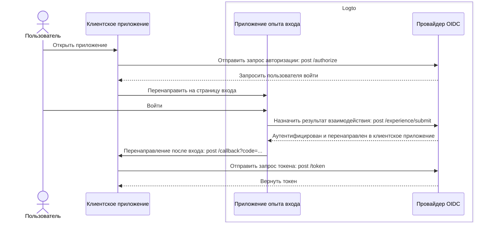
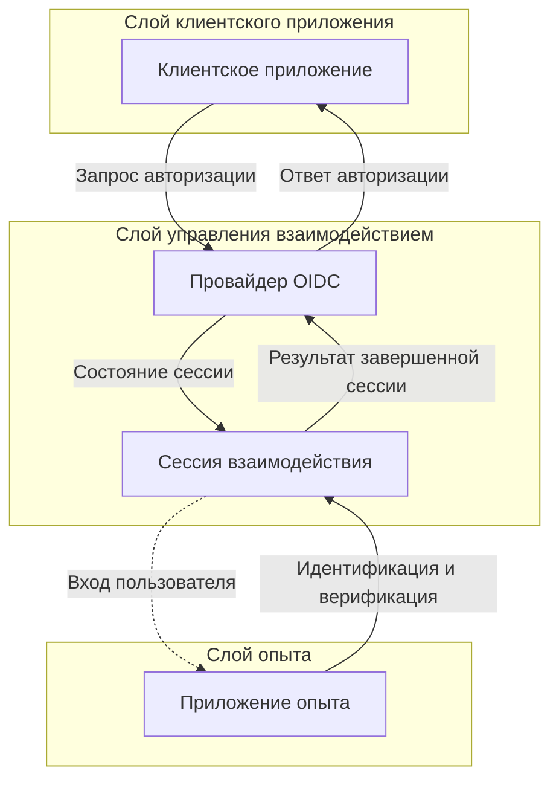

# Регистрация и вход

Регистрация и вход — это основной процесс взаимодействия для конечных пользователей, чтобы аутентифицировать и авторизовать доступ к клиентским приложениям. Как централизованная платформа CIAM на основе OIDC, Logto предоставляет универсальный опыт входа для пользователей в различных клиентских приложениях и платформах.

## Пользовательский поток \{#user-flow}

В типичном потоке аутентификации OIDC пользователь начинает с открытия клиентского приложения. Клиентское приложение отправляет [запрос авторизации](https://auth.wiki/authorization-request) провайдеру Logto OIDC. Если у пользователя нет активной сессии, Logto перенаправит пользователя на страницу опыта входа, размещенную Logto. Пользователь взаимодействует со страницей опыта Logto и проходит аутентификацию, предоставляя необходимые учетные данные. После успешной аутентификации Logto перенаправит пользователя обратно в клиентское приложение с [кодом авторизации](https://auth.wiki/authorization-code-flow#how-does-authorization-code-flow-work). Затем клиентское приложение отправляет [запрос токена](https://auth.wiki/token-request) провайдеру Logto OIDC с кодом авторизации для получения токенов.

## Взаимодействие с пользователем \{#user-interaction}

**Сессия взаимодействия** создается для каждого взаимодействия пользователя, когда клиентское приложение инициирует запрос авторизации. Эта сессия централизует статус взаимодействия пользователя в различных клиентских приложениях, позволяя Logto предоставлять целостный опыт входа. Когда пользователи переключаются между клиентскими приложениями, сессия взаимодействия остается неизменной, поддерживая статус аутентификации пользователя и уменьшая необходимость повторных входов на разных платформах. После установления **сессии взаимодействия** пользователь получает запрос на вход в Logto.

**Приложение опыта** в Logto — это специализированное размещенное приложение, которое облегчает процесс входа. Когда пользователям необходимо пройти аутентификацию, они направляются в **приложение опыта**, где завершают свой вход и взаимодействуют с Logto. **Приложение опыта** использует активную сессию взаимодействия для отслеживания и поддержки прогресса взаимодействия пользователя.

Для поддержки и управления этим пользовательским путешествием Logto предоставляет набор основанных на сессиях **Experience API**. Эти API позволяют **приложению опыта** обрабатывать широкий спектр методов идентификации и проверки пользователей, обновляя и получая доступ к статусу сессии взаимодействия в реальном времени.

После того как пользователь выполнит все требования по проверке и верификации, сессия взаимодействия завершается отправкой результата провайдеру OIDC, где пользователь полностью аутентифицирован и дал согласие, завершая безопасный процесс входа.

## Настройка опыта входа \{#sign-in-experience-customization}

Logto предоставляет гибкий и настраиваемый пользовательский опыт для различных бизнес-требований, включая кастомное оформление, пользовательский интерфейс и потоки взаимодействия с пользователем. **Приложение опыта** может быть адаптировано для соответствия требованиям брендинга и безопасности клиентского приложения.

Продолжайте изучать больше о [настройке](/end-user-flows/sign-up-and-sign-in/sign-up) и [кастомизации](/customization) опыта входа в Logto.

## Часто задаваемые вопросы \{#faqs}

  

### Метод или брендинг опыта входа для каждого приложения \{#per-app-sign-in-experience-method-or-branding}

Для приложений, которые требуют различных опытов входа или брендинга, Logto также поддерживает
кастомизацию для каждого приложения. Ознакомьтесь с [настройками приложения](/customization/match-your-brand/#app-specific-branding) для получения более подробной информации.

  

### Ограничение домена электронной почты / IP-адреса / региона \{#limit-email-domain--ip-address--region}

Для управления доступом на основе атрибутов, например, ограничения входа на основе домена электронной почты, IP-адреса или региона, вы можете использовать функцию [Пользовательские утверждения токена](/developers/custom-token-claims/) в Logto, чтобы
отклонять или разрешать запросы авторизации на основе атрибутов пользователя.

  

### Безголовый API для входа и регистрации \{#headless-api-for-sign-in-and-sign-up}

В настоящее время Logto не предоставляет безголовый API для входа и регистрации. Однако вы можете использовать [Свой пользовательский интерфейс](/customization/bring-your-ui/) для кастомизации опыта входа и
регистрации.

## Связанные ресурсы \{#related-resources}

<Url href="https://blog.logto.io/deprecated-ropc-grant-type">
  Почему вам следует отказаться от типа предоставления Resource Owner Password Credentials (ROPC)
</Url>

<Url href="https://blog.logto.io/implicit-flow-is-dead">
  Почему вам следует использовать поток кода авторизации вместо неявного потока?
</Url>

<Url href="https://blog.logto.io/token-based-authentication-vs-session-based-authentication">
  Сравнение аутентификации на основе токенов и аутентификации на основе сессий
</Url>
