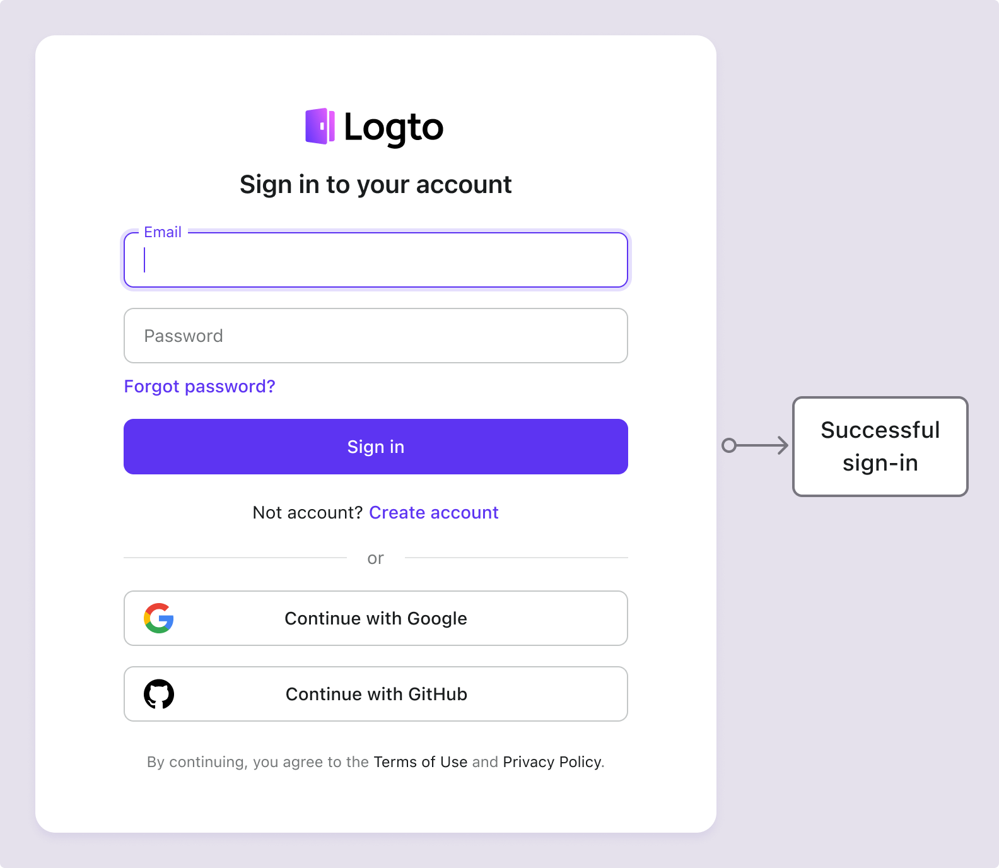
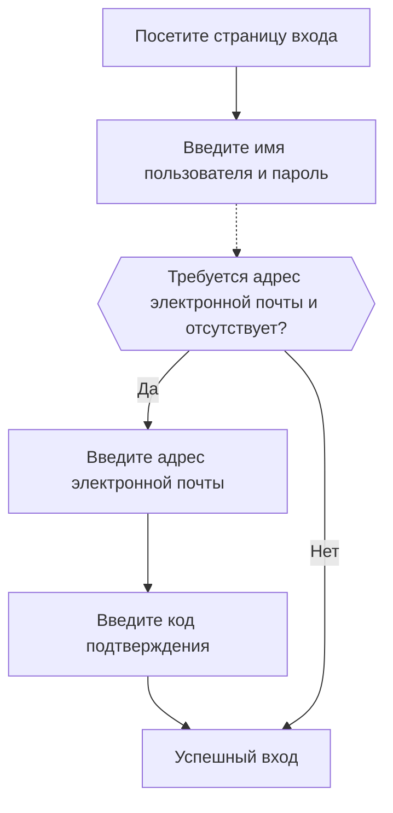

# Вход по электронной почте / телефону / имени пользователя

## Настройка потока входа по идентификатору \{#configure-the-identifier-sign-in-flow}

Как уже упоминалось, различные типы идентификаторов могут быть собраны у пользователей в процессе [регистрации](/end-user-flows/sign-up-and-sign-in/sign-up) или [прямого создания учетной записи в Logto](/user-management/manage-users#add-users). Кроме того, пользователи могут вводить и заполнять дополнительную информацию по мере изучения и использования продукта. Эти идентификаторы могут использоваться для уникальной идентификации пользователей в системе Logto и позволяют им аутентифицироваться и входить в приложения, интегрированные с Logto.

Независимо от того, выберете ли вы использовать предварительно созданную страницу входа, размещенную Logto, или планируете [создать свой собственный пользовательский интерфейс входа](/customization#custom-ui), вам нужно будет настроить доступные методы входа и параметры проверки для ваших конечных пользователей.

## Настройка идентификатора и параметров аутентификации \{#set-up-the-identifier-and-authentication-settings}

### 1. Установите поддерживаемые идентификаторы входа \{#1-set-the-supported-sign-in-identifiers}

Вы можете добавить несколько поддерживаемых идентификаторов из выпадающего списка в качестве включенных методов входа для конечных пользователей. Доступные варианты:

- **Имя пользователя**
- **Адрес электронной почты**
- **Номер телефона**

Изменение порядка идентификаторов изменит порядок их отображения на странице входа. Первый идентификатор будет основным методом входа для пользователей.

### 2. Установите параметры аутентификации \{#2-set-the-authentication-settings}

Для каждого идентификатора входа вам нужно будет настроить как минимум один эффективный фактор проверки для подтверждения личности пользователя. Вы можете выбрать два фактора:

- **Пароль**: Доступен для всех типов идентификаторов входа. После включения пользователи должны предоставить пароль для завершения процесса входа.
- **Код подтверждения**: Доступен только для идентификаторов **Адрес электронной почты** и **Номер телефона**. После включения пользователи должны ввести код подтверждения, отправленный на их электронную почту или номер телефона, чтобы завершить процесс входа.

Если оба фактора включены, пользователи могут выбрать любой метод для завершения процесса входа. Вы также можете изменить порядок факторов, чтобы изменить порядок их отображения на странице входа. Первый фактор будет использоваться в качестве основного метода проверки для пользователей, а второй будет отображаться как альтернативная ссылка.

## Пользовательский опыт потока входа по идентификатору \{#identifier-sign-in-flow-user-experience}

Опыт входа адаптируется в зависимости от выбранного идентификатора и доступных факторов аутентификации.

- **Умный ввод для нескольких идентификаторов:**
  Если включено более одного метода входа по идентификатору, встроенная страница входа Logto автоматически определит тип введенного пользователем идентификатора и отобразит соответствующие параметры проверки. Например, если включены оба идентификатора **Адрес электронной почты** и **Номер телефона**, страница входа автоматически определит тип введенного пользователем идентификатора и отобразит соответствующие параметры проверки. Она переключается на формат номера телефона с кодом региона, если цифры вводятся подряд, или на формат электронной почты, когда используется символ «@».
- **Включенные факторы проверки:**
  - **Только пароль:** Поля для идентификатора и пароля будут отображаться на первом экране.
  - **Только код подтверждения:** Поле для идентификатора появляется на первом экране, за которым следует поле для кода подтверждения на втором экране.
  - **Пароль и код подтверждения:** Поле для идентификатора вводится сначала на первом экране, за которым следуют шаги для ввода пароля или кода подтверждения на втором экране в зависимости от порядка проверки. Предоставляется ссылка для переключения, чтобы пользователи могли переключаться между двумя методами проверки.

### Примеры \{#examples}

  

### Пример 1: Адрес электронной почты с проверкой пароля \{#example-1-email-address-with-password-verification}

Добавьте **Адрес электронной почты** в качестве идентификатора входа и включите фактор **Пароль** для проверки.

  

### Пример 2: Электронная почта / телефон с проверкой пароля (основной) и кодом подтверждения (альтернативный) \{#example-2-emailphone-with-passwordprimary-and-verification-code-alternative-verification-enabled}

Добавьте оба идентификатора **Адрес электронной почты** и **Номер телефона** в качестве идентификаторов входа.
Включите факторы **Пароль** и **Код подтверждения** для обоих идентификаторов.

## Сбор дополнительного профиля пользователя при входе \{#collect-additional-user-profile-on-sign-in}

В потоке входа Logto может быть запущен процесс заполнения профиля, если настройки идентификатора регистрации обновлены. Это гарантирует, что все пользователи, включая существующих, предоставят любые новые требуемые идентификаторы.

Когда разработчик добавляет новый идентификатор (например, адрес электронной почты), он становится обязательным для всех пользователей. Если возвращающийся пользователь входит с существующим идентификатором (например, именем пользователя), ему будет предложено предоставить и подтвердить новый идентификатор, если он отсутствует в его профиле. Только после завершения этого шага они смогут получить доступ к приложению, обеспечивая плавный и последовательный переход к обновленным требованиям.

Разбивка процесса:

1. **Имя пользователя** ранее было установлено как идентификатор регистрации с автоматически включенной настройкой **Создайте свой пароль**.
2. **Адрес электронной почты** позже устанавливается как идентификатор регистрации. Идентификатор **Адрес электронной почты** автоматически добавляется как включенный вариант входа.
3. Возвращающийся пользователь входит с своим именем пользователя и паролем.
4. Пользователю предлагается предоставить и подтвердить адрес электронной почты после его первоначального шага входа.

Тот же процесс применяется и к настройкам регистрации **Создайте свой пароль**. Если настройки **Создайте свой пароль** вновь включены в потоке регистрации, фактор **Пароль** будет автоматически включен для всех выбранных вами идентификаторов входа. Всем возвращающимся пользователям без пароля будет предложено создать его в процессе входа.

:::note
Примечание: Для пользовательских потоков входа обратитесь к функции [Принесите свой интерфейс](/customization/bring-your-ui/).
:::

## Часто задаваемые вопросы \{#faqs}

  

### Самостоятельный опыт входа (встроенный вход) \{#self-hosted-sign-in-experience-embedded-sign-in}

Logto в настоящее время не поддерживает безголовый API для входа и регистрации. Однако вы можете использовать нашу функцию [Принесите свой интерфейс](/customization/bring-your-ui/), чтобы загрузить свою пользовательскую форму входа в Logto. Мы также поддерживаем несколько параметров входа, которые вы можете использовать для предварительного заполнения формы входа идентификатором пользователя, собранным из вашего приложения, или для прямого входа с помощью стороннего социального или корпоративного провайдера SSO. Узнайте больше в разделе [Параметры аутентификации](/end-user-flows/authentication-parameters/).

## Связанные ресурсы \{#related-resources}

<Url href="https://www.youtube.com/watch?v=64rBXpWbScc">
  Опыт регистрации и входа по электронной почте
</Url>

<Url href="https://www.youtube.com/watch?v=chQxCJX6e6w">
  Опыт регистрации и входа по имени пользователя
</Url>
