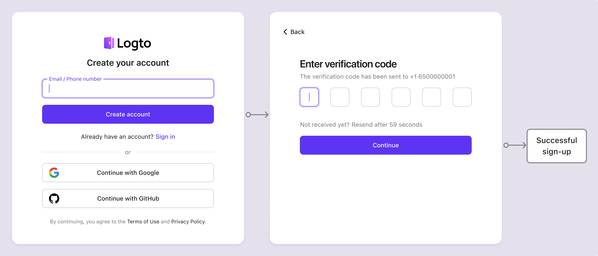

# Регистрация по электронной почте / телефону / имени пользователя

Регистрация пользователя — это первый шаг для взаимодействия пользователей с вашим приложением. Logto поддерживает различные методы регистрации, включая имя пользователя и пароль, проверку электронной почты или номера телефона, [социальную регистрацию](/end-user-flows/sign-up-and-sign-in/social-sign-in) и [корпоративный единый вход (SSO)](/end-user-flows/enterprise-sso). Вы можете настроить методы регистрации, которые наилучшим образом соответствуют требованиям вашего приложения.

Посетите <CloudLink to="/sign-in-experience/sign-up-and-sign-in">Консоль > Опыт входа > Регистрация и вход</CloudLink>, чтобы начать настройку процесса регистрации по идентификатору.

## Настройка идентификатора регистрации \{#set-up-the-sign-up-identifier}

Чтобы успешно создать новую учетную запись пользователя в Logto, пользователи должны предоставить **идентификатор**, который уникально идентифицирует их в системе Logto. На первом этапе установите **идентификатор**, который необходимо собрать у пользователей в процессе регистрации. Доступные варианты:

- **Имя пользователя**: Уникальное [имя пользователя](/user-management/user-data#username), которое пользователь может использовать для входа в приложение.
- **Адрес электронной почты**: Действительный [адрес электронной почты](/user-management/user-data#primary_email), который пользователь может использовать для входа в приложение.
- **Номер телефона**: Действительный [номер телефона](/user-management/user-data#primary_phone), который пользователь может использовать для входа в приложение.
- **Адрес электронной почты или номер телефона**: Позволяет пользователям зарегистрироваться с использованием либо действительного адреса электронной почты, либо номера телефона.
- **Не применимо**: Идентификатор регистрации не включен. Это относится к методам регистрации только через [социальные сети](/end-user-flows/sign-up-and-sign-in/social-sign-in) или только через [корпоративный SSO](/end-user-flows/enterprise-sso).

Все идентификаторы, собранные в процессе регистрации, должны быть уникальными для пользователей в рамках одного арендатора. Они будут храниться в [профиле пользователя](/user-management/user-data#user-profile) и могут использоваться для входа в приложения, интегрированные с Logto.

## Настройка параметров проверки регистрации \{#set-up-the-sign-up-verification-settings}

Чтобы обеспечить безопасность процесса регистрации и будущего входа пользователей, вам также необходимо настроить параметры проверки для идентификаторов, которые вы собираете в процессе регистрации. Доступные настройки:

- **Создайте свой пароль:** Требуйте от пользователей создания пароля во время регистрации, который соответствует политике паролей, настроенной в параметрах вашего опыта входа. Этот пароль вместе с идентификатором пользователя служит их учетными данными для входа в приложение. Если вы установили **Имя пользователя** в качестве идентификатора регистрации, это требование автоматически включается, так как **Имя пользователя** может использоваться только с паролем для эффективной проверки личности пользователя. [Политика паролей](/end-user-flows/sign-up-and-sign-in/reset-password#set-up-password-policy) может быть настроена в соответствии с вашими требованиями безопасности.
- **Проверка при регистрации**: Требуйте от пользователей проверки их адреса электронной почты или номера телефона во время регистрации. В настоящее время Logto принимает только проверенные адреса электронной почты и номера телефонов в качестве идентификаторов. Эта настройка автоматически включается, когда **Адрес электронной почты** или **Номер телефона** используется в качестве идентификатора регистрации. Пользователи должны подтвердить владение, введя код подтверждения, отправленный на их адрес электронной почты или номер телефона в процессе регистрации.

| Идентификатор                        | Создание пароля пользователя | Проверка при регистрации |
| ------------------------------------ | ---------------------------- | ------------------------ |
| Имя пользователя                     | Обязательно                  | Н/Д                      |
| Адрес электронной почты              | Необязательно                | Обязательно              |
| Номер телефона                       | Необязательно                | Обязательно              |
| Электронная почта или номер телефона | Необязательно                | Обязательно              |
| Не применимо                         | Н/Д                          | Н/Д                      |

## Примеры потоков регистрации \{#sign-up-flow-examples}

  

### Тип 1: Имя пользователя с созданием пароля \{#type-1-username-with-password-creation}

Выберите **Имя пользователя** в качестве идентификатора регистрации. Создание пароля принудительно включено.

  

### Тип 2: Адрес электронной почты или номер телефона с потоком проверки \{#type-2-email-address-or-phone-number-with-verification-flow}

Выберите **Адрес электронной почты или номер телефона** в качестве идентификатора регистрации. **Проверка при регистрации** принудительно включена.

  

### Тип 3: Адрес электронной почты с проверкой и созданием пароля \{#type-3-email-address-with-verification-and-password-creation}

Выберите **Адрес электронной почты** в качестве идентификатора регистрации. **Проверка при регистрации** принудительно включена. Включите **Создайте свой пароль**, чтобы требовать от пользователей создания пароля во время регистрации. (То же самое относится к потоку регистрации по номеру телефона)

## Регистрация через социальные сети или корпоративный SSO \{#sign-up-with-social-or-enterprise-sso}

В дополнение к этим традиционным методам регистрации по идентификатору, Logto также поддерживает регистрацию без пароля через провайдеров идентификации социальных сетей и корпоративного SSO, что делает процесс онбординга более плавным и удобным для пользователей.

После того как [социальный коннектор](/connectors/social-connectors) или [коннектор корпоративного SSO](/connectors/enterprise-connectors) настроен и включен в Logto, пользователи могут легко зарегистрироваться, используя свою существующую социальную или корпоративную идентичность, предоставленную коннектором. Методы регистрации через социальные сети и корпоративный SSO позволяют пользователям обходить дополнительные шаги, такие как создание пароля или проверка адреса электронной почты или номера телефона. Logto автоматически синхронизирует информацию пользователя через их проверенную социальную или корпоративную идентичность и сохраняет ее в профиле пользователя.

Ознакомьтесь с разделами [социальный вход](/end-user-flows/sign-up-and-sign-in/social-sign-in/) и [корпоративный SSO](/end-user-flows/enterprise-sso/), чтобы узнать больше о процессе регистрации с помощью социальных и корпоративных SSO коннекторов.

:::note
Примечание: Для создания пользовательских потоков регистрации обратитесь к функции [Принесите свой интерфейс](/customization/bring-your-ui/).
:::

## Часто задаваемые вопросы \{#faqs}

  

### Сбор дополнительной информации о пользователе при регистрации \{#collect-additional-user-information-on-sign-up}

  
Чтобы собрать дополнительную информацию о профиле пользователя (например, полное имя, дату рождения, название компании) во время регистрации, у вас есть два варианта:

- **Самостоятельно размещенные потоки онбординга**: Перенаправляйте пользователей на ваш собственный поток онбординга после успешной регистрации для настройки сбора данных.
- **Принесите свой интерфейс**: Настройте свой собственный поток регистрации, используя нашу функцию принесите свой интерфейс с API настроек профиля пользователя (скоро будет доступно).

  

### Пользователи, созданные администратором / Приглашенные пользователи \{#admin-created-users--invited-users}

Узнайте, как реализовать [поток регистрации только по приглашению.](/end-user-flows/sign-up-and-sign-in/disable-user-registration/#implement-an-invitation-only-sign-up-flow)

  

### Встроенные формы регистрации на вашем сайте \{#embedded-sign-up-forms-on-your-website}

  
Logto в настоящее время не поддерживает безголовый API для входа и регистрации. Вы можете использовать функцию [Принесите свой интерфейс](/customization/bring-your-ui/), чтобы загрузить свою собственную форму регистрации в Logto или использовать параметры входа, чтобы передать информацию о пользователе в Logto с вашего сайта. Узнайте больше о заполнении идентификатора пользователя в разделе [Параметры аутентификации](/end-user-flows/authentication-parameters/).

  

### Отправка приветственных писем новым пользователям \{#sending-welcome-emails-to-new-users}

Подпишитесь на событие вебхука `User.Created`, чтобы отправлять приветственные письма новым пользователям. Узнайте больше о [событиях вебхуков](/developers/webhooks/webhooks-events/#data-mutation-hook-events).

  

### Пропуск проверки электронной почты при регистрации \{#skip-email-verification-on-sign-up}

В настоящее время Logto поддерживает только проверенные адреса электронной почты и номера телефонов в качестве идентификаторов. Процесс проверки необходим для обеспечения безопасности и владения идентификатором пользователя.
Поддержка непроверенных адресов электронной почты или номеров телефонов находится в нашем [дорожном плане](https://logto.productlane.com/roadmap). Следите за обновлениями!

## Связанные ресурсы \{#related-resources}

<Url href="https://www.youtube.com/watch?v=64rBXpWbScc">
  Опыт регистрации и входа по электронной почте
</Url>

<Url href="https://www.youtube.com/watch?v=chQxCJX6e6w">
  Опыт регистрации и входа по имени пользователя
</Url>
