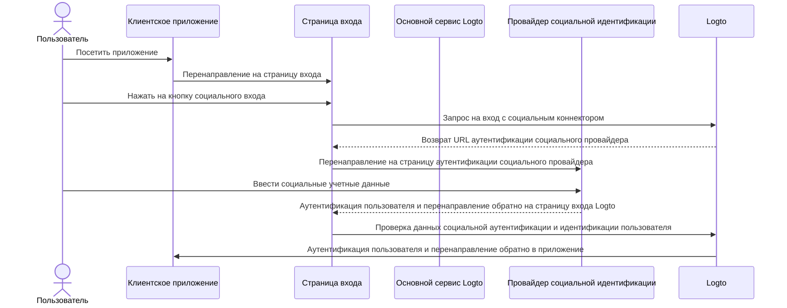
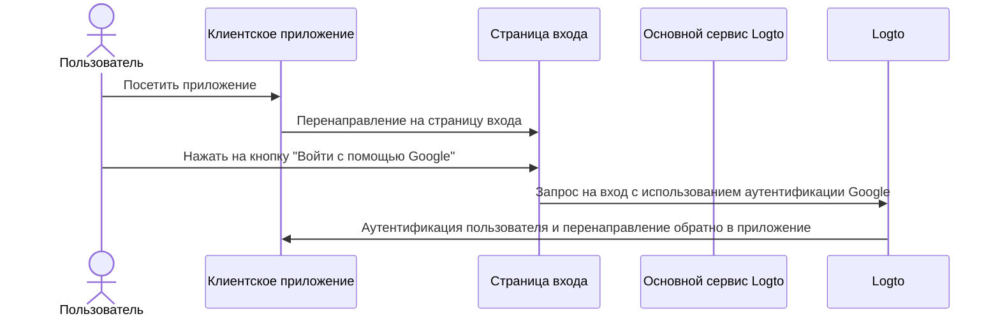
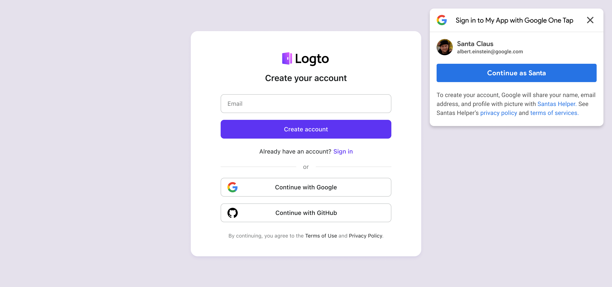
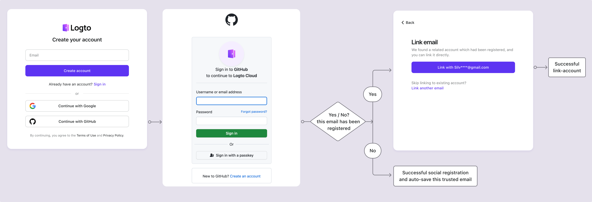

# Социальный вход

Социальный вход — это широко используемый метод аутентификации, который позволяет пользователям входить и регистрироваться, используя свои существующие учетные записи в социальных сетях, таких как Google, Facebook, Twitter и LinkedIn.

Преимущества социального входа:

- **Упрощенный процесс регистрации**: Социальный вход позволяет пользователям регистрироваться или входить одним кликом, без необходимости создавать новую учетную запись или запоминать еще один пароль. Это снижает трение и повышает вовлеченность пользователей.
- **Повышенное доверие и безопасность**: Используя проверенные, надежные платформы, такие как Google или Facebook, пользователи чувствуют себя более уверенно в вашем приложении.
- **Обогащение данных пользователей**: Социальный вход позволяет собирать дополнительную информацию о профиле из социальной платформы, такую как имя, адрес электронной почты, изображение профиля и многое другое.

## Реализация социального входа \{#implement-social-sign-in}

1. **Настройте ваши социальные коннекторы**:<br/>
   Перейдите в <CloudLink to="/connectors/social">Консоль > Коннекторы > Социальные коннекторы</CloudLink>. Нажмите кнопку «Добавить социальный коннектор» и найдите социальный коннектор, который вы хотите добавить (например, Google или Github). Обратитесь к нашей документации для получения подробных инструкций по добавлению [социального коннектора](/connectors/social-connectors/).
2. **Добавьте кнопки социального входа**:<br/>
   По умолчанию ваш недавно добавленный социальный коннектор не будет виден на странице входа для конечных пользователей. Чтобы добавить кнопки социального входа на страницу входа, вам нужно включить социальный коннектор в настройках опыта входа.

   Перейдите в <CloudLink to="/sign-in-experience/sign-up-and-sign-in">Консоль > Опыт входа > Регистрация и вход</CloudLink>. Нажмите кнопку «Добавить социальный коннектор», чтобы интегрировать кнопки социального входа на ваши страницы регистрации и входа. Используйте перетаскивание, чтобы изменить их порядок на пользовательском интерфейсе.

3. **Настройте параметры связывания учетных записей**:<br/>
   Для новых пользователей, регистрирующихся с [социальными идентификациями](/user-management/user-data#social-identities), Logto позволяет связывать их социальную учетную запись с существующей учетной записью электронной почты или номера телефона в системе Logto. По умолчанию, связанная [страница связывания учетных записей](#account-linking) отображается пользователям во время социальной регистрации, позволяя им связать свою социальную учетную запись с существующей учетной записью или создать новую.

   Чтобы упростить этот процесс, вы можете включить опцию **Автоматическое связывание учетных записей** в настройках опыта входа. Это автоматически свяжет социальную учетную запись с существующей учетной записью, если адрес электронной почты или номер телефона совпадают.

4. **Сохраните изменения**: <br/>
   Внимательно проверьте свои изменения и сохраните их, чтобы применить конфигурацию.

## Пользовательский опыт социального входа \{#user-experience-of-social-sign-in}

С социальным входом процессы регистрации и входа в Logto упрощены для пользователей.



1. **Вход с помощью социальной сети**: Пользователь нажимает на кнопку социального входа, отображаемую на странице входа.
2. **Перенаправление**: Пользователь перенаправляется на страницу аутентификации провайдера социальной идентификации.
3. **Социальная аутентификация**: Пользователь вводит свои социальные учетные данные и проходит аутентификацию у социального провайдера. Если пользователь уже вошел в социального провайдера, он может быть автоматически аутентифицирован. Если обнаружены несколько сеансов входа, пользователю может быть предложено выбрать правильную учетную запись (например, несколько учетных записей Google).
   :::note
   Параметры «prompt» Google могут быть установлены в коннекторе Google, что позволяет вам настроить пользовательский опыт выбора учетной записи и экрана согласия для входа в Google.
   :::
4. **Возврат в Logto**: После успешной аутентификации социальный провайдер перенаправляет пользователя обратно на страницу входа Logto с данными аутентификации.
5. **Проверка социальной идентификации**: Logto проверяет данные социальной аутентификации и идентификацию пользователя. Если учетная запись пользователя, связанная с социальной идентификацией, не существует, будет создана новая учетная запись.
6. **Аутентификация пользователя**: Logto аутентифицирует пользователя и перенаправляет его обратно в клиентское приложение для завершения процесса аутентификации.

### Google One-tap \{#google-one-tap}

Logto также поддерживает метод входа [Google One-tap](https://developers.google.com/identity/gsi/web/guides/features) для коннектора Google, позволяя пользователям входить одним кликом. Эта функция еще больше упрощает процесс входа, устраняя необходимость перенаправления пользователей на страницу аутентификации Google.

Чтобы включить вход Google One-tap, следуйте инструкциям в настройках [коннектора Google](/integrations/google). После включения пользователи увидят всплывающее окно «Войти с помощью Google», когда пользователь попадет на страницу входа. Когда они нажмут на него, они будут автоматически аутентифицированы с помощью своей учетной записи Google и перенаправлены обратно в приложение.





## Связывание учетных записей \{#account-linking}

Как упоминалось выше, Logto позволяет пользователям связывать свои социальные учетные записи с существующими учетными записями электронной почты или номера телефона в системе Logto. Этот процесс важен для поддержания единой учетной записи пользователя через различные методы аутентификации и провайдеров идентификации.

- **Создание новой учетной записи**:
  Когда пользователь входит с [социальной идентификацией](/user-management/user-data#social-identities), которая не существует в системе Logto, и предоставленный адрес электронной почты или номер телефона не совпадает с какой-либо существующей учетной записью пользователя, в Logto будет создана новая учетная запись напрямую.
- **Связывание с существующей учетной записью**:
  Если адрес электронной почты или номер телефона, предоставленный социальной идентификацией, уже связан с существующей учетной записью в Logto, мы предлагаем гибкий процесс связывания учетных записей.

  - **Автоматическое связывание учетных записей**: Если в настройках вашего <CloudLink to="/sign-in-experience/sign-up-and-sign-in">Опыта входа</CloudLink> включена опция «Автоматическое связывание учетных записей», Logto автоматически свяжет социальную учетную запись с существующей учетной записью на основе совпадающего адреса электронной почты или номера телефона. Пользователи не будут запрашиваться на связывание учетных записей и будут мгновенно входить в свою существующую учетную запись. Социальная учетная запись будет связана, что позволит пользователю в будущем входить с использованием любого из методов.
  - **Ручное связывание учетных записей**: Если опция «Автоматическое связывание учетных записей» отключена, пользователи будут запрашиваться на связывание своей социальной учетной записи с существующей учетной записью во время процесса входа. Они могут выбрать связывание учетных записей или создание новой.

    

    ```mermaid
    flowchart TD
    A[Аутентификация с социальной идентификацией] --> B{{Социальная идентификация существует в Logto?}}
    B -- Да --> C[Вход с существующей учетной записью]
    B -- Нет --> D{{Адрес электронной почты / телефон совпадает с существующей учетной записью?}}
    D -- Да --> E{{Включено автоматическое связывание учетных записей?}}
    E -- Да --> G[Связывание социальной идентификации с существующей учетной записью]
    G --> C
    D -- Нет --> H[Создание новой учетной записи и вход]
    E -- Нет --> I{{Связать социальную учетную запись?}}
    I -- Да --> G
    I -- Нет --> H
    ```

:::note
Если связанная учетная запись обнаружена во время процесса социальной регистрации с адресом электронной почты или номером телефона, который совпадает с существующей учетной записью, и пользователь выбирает не связывать учетные записи, адрес электронной почты или номер телефона не будут синхронизированы с новой учетной записью в Logto. Это гарантирует, что адрес электронной почты и номер телефона остаются уникальными для всех учетных записей пользователей.

Если адрес электронной почты или номер телефона является обязательным идентификатором регистрации, пользователю будет предложено предоставить другой адрес электронной почты или номер телефона во время процесса регистрации. См. [Сбор дополнительного профиля пользователя](#collect-additional-user-profile-data) для получения более подробной информации.
:::

## Сбор дополнительного профиля пользователя \{#collect-additional-user-profile-data}

Во время процесса социальной регистрации, в зависимости от настроек обязательного идентификатора регистрации (**адрес электронной почты**, **номер телефона** и **имя пользователя**), которые вы настроили, пользователям может быть предложено предоставить дополнительную проверенную информацию для завершения процесса регистрации или входа после аутентификации у социального провайдера.

Например, **Адрес электронной почты** установлен как идентификатор регистрации:

1. **Регистрация с социальной идентификацией, которая предоставляет проверенный адрес электронной почты**

   Если проверенный адрес электронной почты предоставлен социальной идентификацией, пользователь будет автоматически зарегистрирован с социальной идентификацией, и адрес электронной почты будет синхронизирован с профилем пользователя.

2. **Регистрация с социальной идентификацией, которая не предоставляет проверенный адрес электронной почты**

   Если социальная идентификация не предоставляет проверенный адрес электронной почты, пользователю будет предложено предоставить адрес электронной почты во время процесса регистрации. Пользователь должен подтвердить адрес электронной почты, введя код подтверждения, отправленный на предоставленный адрес электронной почты.

   ```mermaid
   flowchart TD
      A[Аутентификация с социальной идентификацией] --> B{{Требуется адрес электронной почты и отсутствует?}}
      B -- Да --> C[Введите адрес электронной почты]
      C --> D[Введите код подтверждения]
      D --> E[Успешная регистрация]
      B -- Нет --> E
   ```

3. **Регистрация с социальной идентификацией, которая предоставляет зарегистрированный адрес электронной почты**

   Если социальная идентификация предоставляет адрес электронной почты, который уже зарегистрирован в системе Logto, пользователю будет предложено связать социальную учетную запись с существующей учетной записью или создать новую учетную запись. Если пользователь выбирает создание новой учетной записи, ему будет предложено предоставить новый адрес электронной почты и подтвердить его.

   ```mermaid
      flowchart TD
       A[Аутентификация с социальной идентификацией] --> B{{Адрес электронной почты совпадает с существующей учетной записью?}}
       B -- Да --> C{{Связать социальную учетную запись?}}
       C -- Да --> D[Связывание социальной идентификации с существующей учетной записью]
       D --> E[Успешный вход]
       C -- Нет --> F[Введите новый адрес электронной почты]
       F --> G[Введите код подтверждения]
       G --> E
       B -- Нет --> E
   ```

## Часто задаваемые вопросы \{#faqs}

<details>
  <summary>

### Как добавить кнопки социального входа и напрямую войти с помощью социальной сети на моем сайте? \{#how-to-add-social-login-buttons-and-directly-sign-in-with-social-on-my-website}

</summary>

Logto позволяет вам добавлять кнопки социального входа на ваш сайт и инициировать процесс социального входа напрямую, не показывая форму входа по умолчанию. Ознакомьтесь с нашим руководством [Прямой вход](/end-user-flows/authentication-parameters/direct-sign-in/) для получения подробных инструкций.

</details>

<details>
  <summary>

### Почему мои адреса электронной почты или номера телефонов не заполняются после регистрации с помощью социальной сети? \{#why-my-emails-or-phone-numbers-are-not-populated-after-signing-up-with-social}

</summary>

В Logto адрес электронной почты и номер телефона могут использоваться в качестве идентификатора входа для уникальной идентификации пользователей. Только проверенные адреса электронной почты и номера телефонов принимаются в качестве идентификаторов. Если социальная идентификация не предоставляет утверждение `email_verified` или `phone_number_verified`, адрес электронной почты или номер телефона не будут синхронизированы с профилем пользователя. Вы все еще можете найти их в данных социальных идентификаций в профиле пользователя.

Поддержка непроверенных адресов электронной почты или номеров телефонов в качестве профиля пользователя будет доступна в ближайшее время.

</details>

## Связанные ресурсы \{#related-resources}

<Url href="https://www.youtube.com/watch?v=sv60N9eW8Ew">Опыт социального входа</Url>

<Url href="https://blog.logto.io/maximize-google-sign-in-conversions">
  Максимизация конверсий входа через Google с помощью 6 настроек
</Url>
