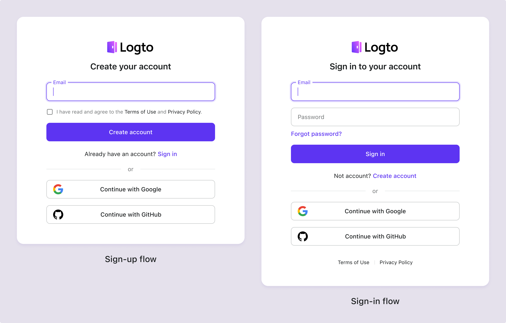
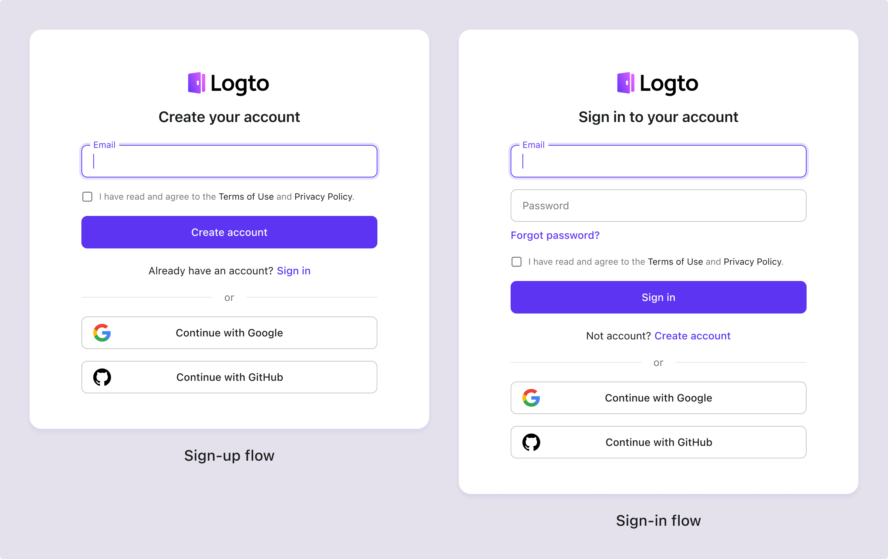

# Условия и конфиденциальность

Чтобы ваш продукт оставался открытым и прозрачным, добавьте ссылки на Условия использования и Политику конфиденциальности на страницы входа и регистрации. Это позволит вам соответствовать требованиям соблюдения, специфичным для вашей отрасли.

## Настройка условий и конфиденциальности \{#configure-terms--privacy}

1. Перейдите в <CloudLink to="/sign-in-experience/content">Консоль > Опыт входа > Контент</CloudLink>.
2. Добавьте внешние ссылки на ваши «Условия использования» и «Политику конфиденциальности».
3. Установите политику для «Согласия с условиями» в зависимости от ваших потребностей в соблюдении требований для конкретных регионов или отраслей.

:::note
Если значение пустое, вам не нужно управлять соглашениями об условиях и конфиденциальности в потоках входа Logto. Вы можете решить эти вопросы после того, как пользователь войдет в ваше приложение.
:::

## Пользовательский опыт согласия с условиями \{#user-experience-for-agreeing-to-terms}

Logto предоставляет несколько предустановленных потоков для обработки пользовательского опыта согласия с условиями в зависимости от ваших различных требований к соблюдению:

### Вариант 1: Автоматическое согласие с условиями при продолжении входа / регистрации \{#option-1-agree-to-terms-automatically-on-continue-sign-insign-up}

Эта политика обеспечивает наиболее плавный пользовательский опыт, автоматически соглашаясь с условиями, когда пользователь продолжает процесс входа или регистрации.
Пользователю не будет предложено явно согласиться с условиями.

### Вариант 2: Согласие с условиями только при регистрации \{#opetion-2-agree-to-terms-on-sign-up-only}

Эта политика требует от новых пользователей вручную согласиться с **Условиями и Политиками конфиденциальности**. Согласно [GDPR](https://gdpr-info.eu/art-4-gdpr/) ЕС и [CCPA](https://oag.ca.gov/privacy/ccpa) Калифорнии, компании должны получить информированное согласие от пользователей перед сбором личной информации.

Когда пользователи впервые используют социальную регистрацию (например, Google или GitHub), всплывающее окно предложит им согласиться с **Условиями и Политиками конфиденциальности** после перенаправления в Logto. Это согласие не требуется для последующих социальных входов.

### Вариант 3: Согласие с условиями при входе и регистрации \{#option-3-agree-to-terms-on-sign-in-and-sign-up}

Эта политика требует от пользователей согласия с **Условиями и Политиками конфиденциальности** каждый раз, когда они входят или регистрируются. Эта политика подходит для приложений, которые требуют от пользователей согласия с условиями каждый раз при входе. Пользователи должны поставить галочку, чтобы согласиться с условиями перед продолжением. Этот подход соответствует китайскому PIPL и бразильскому LGPD.

