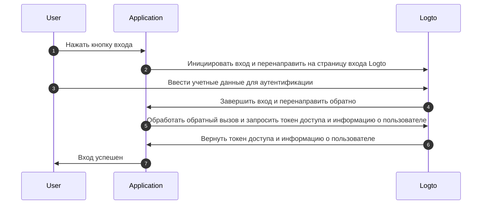
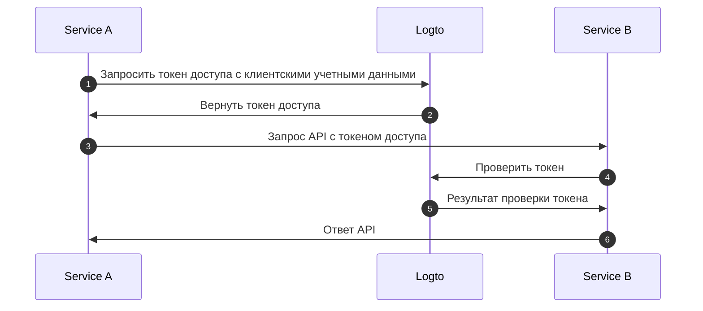
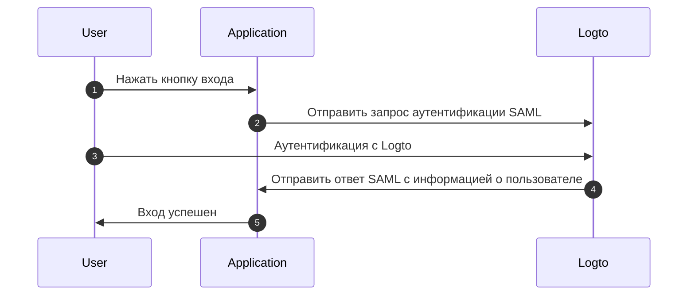

# Понимание потока аутентификации OIDC

Logto построен на стандартах [OAuth 2.0](https://auth.wiki/oauth-2.0) и [OpenID Connect (OIDC)](https://auth.wiki/openid-connect). Понимание этих стандартов аутентификации сделает процесс интеграции более плавным и простым.

### Поток аутентификации пользователя \{#user-authentication-flow}

Вот что происходит, когда пользователь входит в систему с Logto:

В этом потоке несколько ключевых концепций важны для процесса интеграции:

- `Application`: Это представляет ваше приложение в Logto. Вы создадите конфигурацию приложения в Logto Console, чтобы установить связь между вашим фактическим приложением и сервисами Logto. Узнайте больше о [Application](/integrate-logto/application-data-structure/#introduction).
- `Redirect URI`: После завершения аутентификации на странице входа Logto, Logto перенаправляет пользователей обратно в ваше приложение через этот URI. Вам нужно будет настроить Redirect URI в настройках вашего приложения. Для получения более подробной информации смотрите [Redirect URIs](/integrate-logto/application-data-structure/#redirect-uris).
- `Handle sign-in callback`: Когда Logto перенаправляет пользователей обратно в ваше приложение, ваше приложение должно обработать данные аутентификации и запросить токены доступа и информацию о пользователе. Не беспокойтесь - Logto SDK делает это автоматически.

Этот обзор охватывает основные моменты для быстрой интеграции. Для более глубокого понимания ознакомьтесь с нашим руководством [Sign-in experience explained](/concepts/sign-in-experience/).

### Поток аутентификации машина-машина \{#machine-to-machine-authentication-flow}

Logto предоставляет тип [приложения машина-машина (M2M)](/quick-starts/m2m) для обеспечения прямой аутентификации между сервисами, основанной на [OAuth 2.0 Client Credentials flow](https://auth.wiki/client-credentials-flow):

Этот поток аутентификации машина-машина (M2M) предназначен для приложений, которым необходимо напрямую взаимодействовать с ресурсами без участия пользователя (и, следовательно, без интерфейса), таких как сервис API, обновляющий данные пользователей в Logto, или сервис статистики, извлекающий ежедневные заказы.

В этом потоке сервисы аутентифицируются с использованием клиентских учетных данных - комбинации [Application ID](/integrate-logto/application-data-structure/#application-id) и [Application Secret](/integrate-logto/application-data-structure/#application-secret), которые уникально идентифицируют и аутентифицируют сервис. Эти учетные данные служат идентификацией сервиса при запросе [токенов доступа](https://auth.wiki/access-token) у Logto.

### Поток аутентификации SAML \{#saml-authentication-flow}

Помимо OAuth 2.0 и OIDC, Logto также поддерживает аутентификацию SAML (Security Assertion Markup Language), выступая в качестве провайдера идентификации (IdP) для интеграции с корпоративными приложениями. В настоящее время Logto поддерживает поток аутентификации, инициированный SP:

#### Поток, инициированный SP \{#saml-authentication-flow-sp-init}

В потоке, инициированном SP, процесс аутентификации начинается с провайдера услуг (вашего приложения):

В этом потоке:

- Пользователь начинает процесс аутентификации из вашего приложения (провайдера услуг)
- Ваше приложение генерирует запрос SAML и перенаправляет пользователя в Logto (провайдер идентификации)
- После успешной аутентификации в Logto, ответ SAML отправляется обратно в ваше приложение
- Ваше приложение обрабатывает ответ SAML и завершает аутентификацию

#### Поток, инициированный IdP \{#saml-authentication-flow-idp-init}

Logto будет поддерживать поток, инициированный IdP, в будущих выпусках, позволяя пользователям начинать процесс аутентификации непосредственно с портала Logto. Следите за обновлениями этой функции.

Эта интеграция SAML позволяет корпоративным приложениям использовать Logto в качестве своего провайдера идентификации, поддерживая как современные, так и устаревшие провайдеры услуг на основе SAML.

## Связанные ресурсы \{#related-resources}

<Url href="https://blog.logto.io/secure-cloud-apps-with-oauth-and-openid-connect">
  Блог: Защита облачных приложений с помощью OAuth 2.0 и OpenID Connect
</Url>

<Url href="https://blog.logto.io/sso-is-better">
  Почему единый вход (SSO) для нескольких приложений лучше
</Url>

<Url href="https://blog.logto.io/centralized-identity-system">
  Почему вам нужна централизованная система идентификации для бизнеса с несколькими приложениями
</Url>
