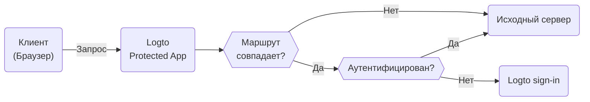

# Protected App — интеграция аутентификации без SDK

Protected App предназначен для устранения сложности [интеграций SDK](/quick-starts) путем отделения слоя [аутентификации](https://auth.wiki/authentication) от вашего приложения. Мы обрабатываем аутентификацию, позволяя вам сосредоточиться на основной функциональности. После аутентификации пользователя Protected App обслуживает контент с вашего сервера.

## Как работает Protected App \{#how-protected-app-works}

Protected App, работающий на базе Cloudflare, функционирует глобально на периферийных сетях, обеспечивая низкую задержку и высокую доступность для вашего приложения.

Protected App поддерживает состояние сеанса и информацию о пользователе. Если пользователь не аутентифицирован, Protected App перенаправляет его на страницу входа. После аутентификации Protected App оборачивает запрос пользователя с аутентификацией и информацией о пользователе, затем пересылает его на исходный сервер.

Этот процесс визуализирован в следующей блок-схеме:



## Защитите ваш исходный сервер \{#protect-your-origin-server}

Исходный сервер, который может быть как физическим, так и виртуальным устройством, не принадлежащим Protected App от Logto, это место, где находится контент вашего приложения. Подобно серверу Content Delivery Network (CDN), Protected App управляет процессами аутентификации и извлекает контент с вашего исходного сервера. Поэтому, если пользователи получают прямой доступ к вашему исходному серверу, они могут обойти аутентификацию, и ваше приложение больше не будет защищено.

Поэтому важно защитить соединения с исходным сервером, это предотвращает обнаружение и доступ злоумышленников к вашему исходному серверу без аутентификации. Существует несколько способов сделать это:

1. Валидация HTTP заголовков
2. Валидация JSON Web Tokens (JWT)

### Валидация HTTP заголовков \{#http-header-validation}

Защита вашего исходного сервера может быть достигнута с использованием [HTTP Basic Authentication](https://developer.mozilla.org/en-US/docs/Web/HTTP/Authentication#basic_authentication_scheme) для защиты вашего исходного сервера.

Каждый запрос от Protected App включает следующий заголовок:

```
Authorization: Basic base64(appId:appSecret)
```

Проверяя этот заголовок, вы можете подтвердить, что запрос исходит от Protected App, и отклонить любые запросы, которые не включают этот заголовок.

Если вы используете Nginx или Apache, вы можете обратиться к следующим руководствам для реализации HTTP Basic Authentication на вашем исходном сервере:

1. Nginx: [Настройка HTTP Basic Authentication](https://docs.nginx.com/nginx/admin-guide/security-controls/configuring-http-basic-authentication/)
2. Apache: [Аутентификация и авторизация](https://httpd.apache.org/docs/2.4/howto/auth.html)

Чтобы проверить заголовки в вашем приложении, обратитесь к [примеру HTTP Basic Authentication](https://developers.cloudflare.com/workers/examples/basic-auth/) от Cloudflare, чтобы узнать, как ограничить доступ с использованием схемы HTTP Basic.

### Валидация JSON Web Tokens (JWT) \{#json-web-tokens-jwt-validation}

Другой способ защитить ваш исходный сервер — использовать JSON Web Tokens (JWT).

Каждый аутентифицированный запрос от Protected App включает следующий заголовок:

```
Logto-ID-Token: <JWT>
```

JWT называется [ID токен](https://auth.wiki/id-token), который подписан Logto и содержит информацию о пользователе. Проверяя этот JWT, вы можете подтвердить, что запрос исходит от Protected App, и отклонить любые запросы, которые не включают этот заголовок.

Токен зашифрован и подписан как [JWS](https://auth.wiki/jws) токен.

Шаги валидации:

1. [Валидация JWT](https://datatracker.ietf.org/doc/html/rfc7519#section-7.2)
2. [Валидация подписи JWS](https://datatracker.ietf.org/doc/html/rfc7515#section-5.2)
3. Эмитент токена — `https://<your-logto-domain>/oidc` (выпущен вашим сервером аутентификации Logto)

```js
const express = require('express');
const jwksClient = require('jwks-rsa');
const jwt = require('jsonwebtoken');

const ISSUER = 'https://<your-logto-domain>/oidc';
const CERTS_URL = 'https://<your-logto-domain>/oidc/jwks';

const client = jwksClient({
  jwksUri: CERTS_URL,
});

const getKey = (header, callback) => {
  client.getSigningKey(header.kid, function (err, key) {
    callback(err, key?.getPublicKey());
  });
};

const verifyToken = (req, res, next) => {
  const token = req.headers['Logto-ID-Token'];

  // Убедитесь, что входящий запрос содержит наш заголовок токена
  if (!token) {
    return res
      .status(403)
      .send({ status: false, message: 'missing required Logto-ID-Token header' });
  }

  jwt.verify(token, getKey, { issuer: ISSUER }, (err, decoded) => {
    if (err) {
      return res.status(403).send({ status: false, message: 'invalid id token' });
    }

    req.user = decoded;
    next();
  });
};

const app = express();

app.use(verifyToken);

app.get('/', (req, res) => {
  res.send('Hello World!');
});

app.listen(3000);
```

## Получение состояния аутентификации и информации о пользователе \{#get-authentication-state-and-user-information}

Если вам нужно получить информацию об аутентификации и пользователе для вашего приложения, вы также можете использовать заголовок `Logto-ID-Token`.

Если вы хотите только декодировать токен, вы можете использовать следующий код:

```js
const express = require('express');

const decodeIdToken = (req, res, next) => {
  const token = req.headers['Logto-ID-Token'];

  if (!token) {
    return res.status(403).send({
      status: false,
      message: 'missing required Logto-ID-Token header',
    });
  }

  const parts = token.split('.');
  if (parts.length !== 3) {
    throw new Error('Invalid ID token');
  }

  const payload = parts[1];
  const decodedPayload = atob(payload.replace(/-/g, '+').replace(/_/g, '/'));
  const claims = JSON.parse(decodedPayload);

  req.user = claims;
  next();
};

const app = express();

app.use(decodeIdToken);

app.get('/', (req, res) => {
  res.json(req.user);
});

app.listen(3000);
```

## Получение оригинального хоста \{#get-the-original-host}

Если вам нужно получить оригинальный хост, запрашиваемый клиентом, вы можете использовать заголовок `Logto-Host` или `x-forwarded-host`.

## Настройка правил аутентификации \{#customize-authentication-rules}

По умолчанию Protected App будет защищать все маршруты. Если вам нужно настроить правила аутентификации, вы можете установить поле "Custom authentication rules" в Console.

Оно поддерживает регулярные выражения, вот два сценария:

1. Чтобы защитить только маршруты `/admin` и `/privacy` с аутентификацией: `^/(admin|privacy)/.*`
2. Чтобы исключить JPG изображения из аутентификации: `^(?!.*\.jpg$).*$`

## Локальная разработка \{#local-development}

Protected App предназначен для работы с вашим исходным сервером. Однако, если ваш исходный сервер не доступен публично, вы можете использовать такие инструменты, как [ngrok](https://ngrok.com/) или [Cloudflare Tunnels](https://developers.cloudflare.com/pages/how-to/preview-with-cloudflare-tunnel/), чтобы открыть ваш локальный сервер для интернета.

## Переход на интеграцию SDK \{#transition-to-sdk-integration}

Protected App предназначен для упрощения процесса аутентификации. Однако, если вы решите перейти на интеграцию SDK для лучшего контроля и настройки, вы можете [создать новое приложение](/integrate-logto/integrate-logto-into-your-application) в Logto и настроить [интеграцию SDK](/quick-starts). Для плавного перехода вы можете повторно использовать конфигурации приложения из Protected App. Protected App фактически является "Traditional Web App" в Logto, вы можете найти "[AppId](/integrate-logto/application-data-structure#application-id)" и "[AppSecret](/integrate-logto/application-data-structure#application-secret)" в настройках приложения. После завершения перехода вы можете удалить Protected App из вашего приложения.

## Связанные ресурсы \{#related-resources}

<Url href="https://www.youtube.com/watch?v=ZBrXW3iZyKY">
  Protected App: Создайте аутентификацию вашего приложения в несколько кликов. Код не требуется.
</Url>

<Url href="https://blog.logto.io/protected-app">Мотивация за Protected App</Url>

<Url href="https://blog.logto.io/fastest-way-to-build-auth-system">
  Самый быстрый способ создать систему аутентификации
</Url>
