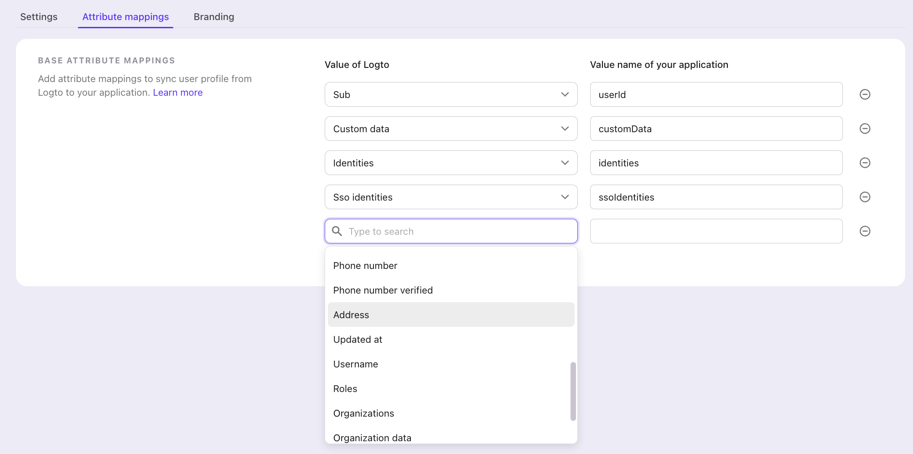

# Настройка атрибутов утверждений SAML

Атрибуты SAML являются ключевыми компонентами утверждений SAML, которые содержат конкретную информацию об аутентифицированном пользователе. Эти атрибуты могут включать идентификаторы пользователей, роли, разрешения и другие соответствующие данные пользователя, которые Поставщик услуг (SP) может использовать для целей авторизации и персонализации.

## Понимание атрибутов SAML \{#understanding-saml-attributes}

В аутентификации SAML:

- Атрибуты — это пары "имя-значение", содержащие информацию о пользователе
- Они включены в утверждение SAML, отправляемое от Провайдера идентификации (Logto) к Поставщику услуг
- Они помогают Поставщикам услуг принимать обоснованные решения о доступе пользователей и персонализации

## Отображение атрибутов в Logto \{#attribute-mapping-in-logto}

Отображение атрибутов позволяет вам определить, как информация о пользователе из Logto должна быть сопоставлена с конкретными атрибутами в утверждении SAML. Это сопоставление гарантирует, что ваш Поставщик услуг получит информацию о пользователе в ожидаемом формате и под ожидаемыми именами атрибутов.

Когда вы настраиваете отображение атрибутов:

1. Вы указываете, какие свойства пользователя из Logto должны быть включены в утверждение SAML
2. Вы определяете пользовательские имена атрибутов, которые ожидает ваш Поставщик услуг
3. Сопоставленные атрибуты автоматически включаются в утверждение SAML во время аутентификации

### Общие атрибуты \{#common-attributes}

Некоторые часто используемые атрибуты SAML включают:

- Sub (ID пользователя)
- Email
- Организации
- Имя
- Предпочитаемое имя пользователя

Правильно настроив отображение атрибутов, вы гарантируете, что ваш Поставщик услуг получит всю необходимую информацию о пользователе для предоставления соответствующего доступа и персонализации для ваших пользователей.

Вы можете сопоставить всю доступную информацию о пользователе из Logto с ожидаемыми атрибутами вашего SP, используя настройки отображения атрибутов.
