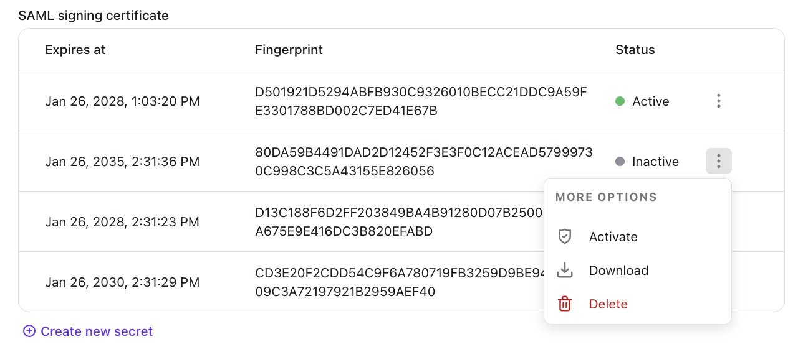
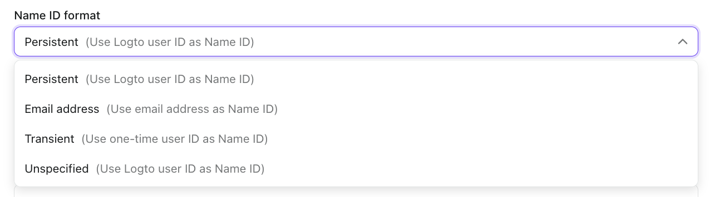
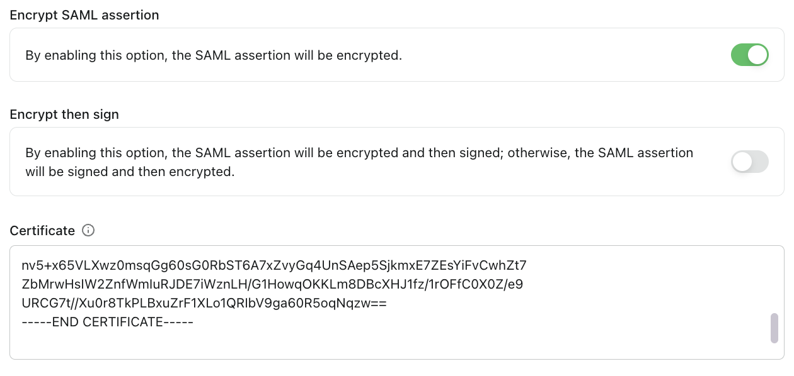

# Настройка базовой интеграции SAML

Это руководство поможет вам настроить ваше SAML-приложение в Logto. Следуйте этим шагам, чтобы настроить базовую интеграцию SAML.

## Настройки приложения \{#application-settings}

### Основная информация \{#basic-information}

- **Имя приложения** (Обязательно): Введите имя для вашего SAML-приложения. Это имя поможет вам идентифицировать приложение в Logto.
- **Описание**: Добавьте необязательное описание, чтобы предоставить больше деталей о вашем приложении.

### Конфигурация провайдера услуг SAML \{#saml-service-provider-configuration}

- **URL службы потребления утверждений (Reply URL)** (Обязательно): Введите URL, куда Logto должен отправить SAML-утверждение после успешной аутентификации. Этот URL должен совпадать с ACS URL, указанным в вашем приложении Service Provider (SP).

- **Идентификатор сущности провайдера услуг (SP Entity ID)** (Обязательно): Введите уникальный идентификатор для вашего Service Provider. Это значение должно совпадать с Entity ID, найденным в вашем приложении SP. SP Entity ID — это строковый ввод, который обычно следует формату URI (но это не обязательно).
  - Общие форматы включают:
    - `urn:your-domain.com:sp:saml:{serviceProviderId}`
    - `https://your-domain/saml/{serviceProviderId}`

## Метаданные SAML IdP \{#saml-idp-metadata}

После настройки основных параметров Logto предоставит вам важные метаданные провайдера идентификации SAML (IdP), которые вам нужно будет настроить в вашем Service Provider:

### URL метаданных IdP \{#idp-metadata-url}

Используйте этот URL для настройки вашего SP с метаданными IdP. Метаданные содержат всю необходимую информацию для интеграции SAML.

### URL службы единого входа \{#single-sign-on-service-url}

Это URL, куда ваш SP должен отправлять запросы аутентификации SAML.

### Идентификатор сущности IdP \{#idp-entity-id}

Уникальный идентификатор для провайдера идентификации.

:::note
"URL службы единого входа" и "Идентификатор сущности IdP" уже включены в метаданные IdP, поэтому вам не нужно настраивать их отдельно, если ваш SP может обрабатывать URL метаданных.
:::

### Сертификат подписи SAML \{#saml-signing-certificate}

Logto использует этот сертификат для подписи SAML-утверждений. Вам нужно будет настроить это в вашем SP для проверки подписей:

- **Истекает**: Дата истечения срока действия сертификата
- **Отпечаток пальца**: Уникальный отпечаток пальца сертификата для проверки
- **Статус**: Текущий статус сертификата (Активен или Неактивен)

:::note Важные правила управления сертификатами

- В один момент времени может быть активен только один сертификат. Активный сертификат будет использоваться в URL метаданных IdP.
- URL метаданных IdP будет недоступен, если нет активного сертификата.
- Вы не можете удалить активный сертификат. Чтобы удалить сертификат, вы должны сначала деактивировать его.
- Когда вы активируете неактивный сертификат, текущий активный сертификат будет автоматически деактивирован.

:::

### Дополнительные настройки \{#additional-settings}

#### Формат идентификатора имени \{#name-id-format}

Выберите, как вы хотите, чтобы идентификатор пользователя был отформатирован в SAML-утверждении. По умолчанию используется "Persistent", который использует идентификатор пользователя Logto в качестве идентификатора имени.

Вы можете найти четыре доступных формата, предоставленных Logto:

- **Persistent** (Использовать идентификатор пользователя Logto в качестве идентификатора имени): Создает постоянный, не повторяющийся идентификатор, который остается неизменным в течение сессий. Это идеально для поддержания стабильной идентичности пользователя при множественных входах и рекомендуется для большинства корпоративных приложений.

- **Адрес электронной почты** (Использовать адрес электронной почты в качестве идентификатора имени): Использует адрес электронной почты пользователя в качестве идентификатора. Это полезно, когда ваш Service Provider полагается на адреса электронной почты для идентификации пользователей или когда вам нужны идентификаторы, читаемые человеком.

- **Transient** (Использовать одноразовый идентификатор пользователя в качестве идентификатора имени): Генерирует временный, одноразовый идентификатор, который изменяется с каждым запросом аутентификации. Это обеспечивает повышенную конфиденциальность и подходит для приложений, где не требуется постоянное отслеживание пользователей.

- **Неопределенный** (Использовать идентификатор пользователя Logto в качестве идентификатора имени на данный момент): Похож на формат Persistent, но указывает, что не требуется конкретный формат. Это предлагает гибкость, при этом используя стабильный идентификатор пользователя Logto в качестве идентификатора.

#### Шифрование SAML-утверждения \{#encrypt-saml-assertion}

Переключите эту опцию, если вы хотите зашифровать SAML-утверждение для повышения безопасности. Когда включено, SAML-утверждение будет зашифровано перед отправкой в ваш SP.

:::note
Когда вы включаете шифрование SAML-утверждения, вы должны предоставить сертификат подписи вашего Service Provider. Этот сертификат будет использоваться для шифрования SAML-утверждения, гарантируя, что только ваш SP сможет расшифровать и прочитать содержимое утверждения.
:::
