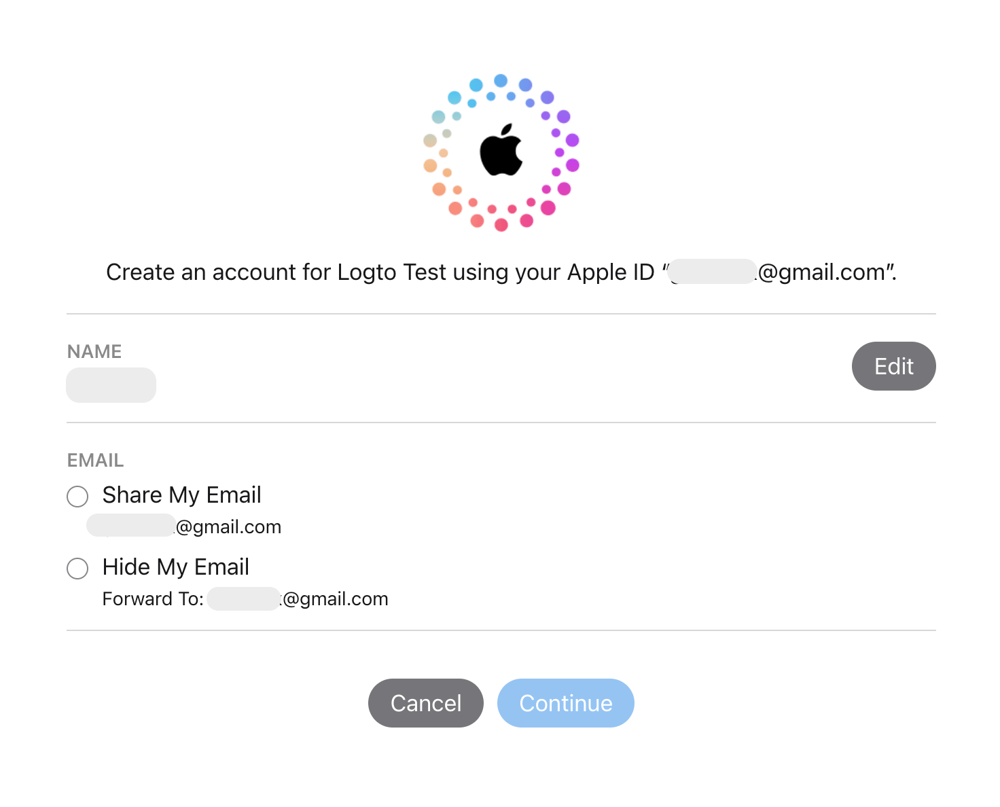

import GuideTip from '../../fragments/_guide-tip.mdx';

import Integration from './_integration.mdx';

# Настройка социального входа через Apple

Официальный коннектор Logto для социального входа через Apple.

<GuideTip />

## Начало работы \{#get-started}

Если вы не знакомы с концепцией коннектора или не знаете, как добавить этот коннектор в ваш опыт входа, пожалуйста, ознакомьтесь с [руководством Logto](/connectors/social-connectors).

<Integration />

### Подводные камни настройки области действия \{#pitfalls-of-configuring-scope}

Если вы настроили ваше приложение на запрос адресов электронной почты пользователей после того, как они уже вошли с помощью Apple, вы не сможете получить адреса электронной почты этих существующих пользователей, даже если они снова войдут, используя Apple ID. Чтобы решить эту проблему, вам нужно проинструктировать ваших пользователей посетить [страницу управления учетной записью Apple ID](https://appleid.apple.com/account/manage) и удалить ваше приложение из раздела "Вход через Apple". Это можно сделать, выбрав "Прекратить использование входа через Apple" на странице деталей вашего приложения.

Например, если ваше приложение запрашивает как адрес электронной почты, так и имя пользователей (`email name` область действия), экран согласия, который новые пользователи видят во время первого входа, должен выглядеть примерно так:

См. обсуждение разработчиков [здесь](https://forums.developer.apple.com/forums/thread/132223).

## Тестирование коннектора Apple \{#test-apple-connector}

Вот и все. Коннектор Apple должен быть доступен как в веб-приложениях, так и в нативных приложениях. Не забудьте [включить социальный коннектор в опыте входа](/connectors/social-connectors/#enable-social-sign-in).
