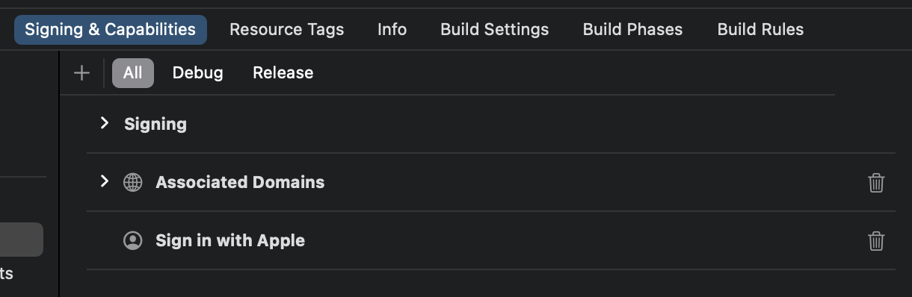

:::note

Вход через Apple обязателен для AppStore, если в вашем приложении есть другие методы социального входа.
Наличие входа через Apple на устройствах Android полезно, если вы также предоставляете приложение для Android.

:::

Вам нужно зарегистрироваться в [Apple Developer Program](https://developer.apple.com/programs/) перед продолжением.

### Включение входа через Apple для вашего приложения \{#enable-sign-in-with-apple-for-your-app}

:::caution

Даже если вы хотите реализовать вход через Apple только в веб-приложении, вам все равно нужно иметь существующее приложение, которое поддерживает экосистему AppStore (т.е. иметь действительный App ID).

:::

Вы можете сделать это через Xcode -> Настройки проекта -> Подпись и возможности, или посетить [Certificates, Identifiers & Profiles](https://developer.apple.com/account/resources/identifiers/list/bundleId).

Смотрите раздел "Enable an App ID" в [официальной документации Apple](https://developer.apple.com/documentation/sign_in_with_apple/configuring_your_environment_for_sign_in_with_apple) для получения дополнительной информации.

### Создание идентификатора \{#create-an-identifier}

1. Посетите [Certificates, Identifiers & Profiles](https://developer.apple.com/account/resources/identifiers/list/serviceId), затем нажмите кнопку "+" рядом с "Identifier".
2. На странице "Register a new identifier" выберите "Services IDs" и нажмите "Continue".
3. Заполните "Description" и "Identifier" (например, `Logto Test` и `io.logto.test`), затем нажмите "Continue".
4. Проверьте информацию и нажмите "Register".

### Включение входа через Apple для вашего идентификатора \{#enable-sign-in-with-apple-for-your-identifier}

Нажмите на идентификатор, который вы только что создали. Отметьте "Sign in with Apple" на странице деталей и нажмите "Configure".

В открывшемся модальном окне выберите App ID, для которого вы только что включили вход через Apple.

Введите домен вашего экземпляра Logto без протокола и порта, например, `your.logto.domain`; затем введите "Return URL" (т.е. Redirect URI), который является URL Logto с `/callback/${connector_id}`, например, `https://your.logto.domain/callback/apple-universal`. Вы можете получить случайно сгенерированный `connector_id` после создания Apple коннектора в Admin Console.

Нажмите "Next", затем "Done", чтобы закрыть модальное окно. Нажмите "Continue" в правом верхнем углу, затем нажмите "Save", чтобы сохранить вашу конфигурацию.

:::caution

Apple НЕ разрешает Return URLs с HTTP протоколом и доменом `localhost`.

Если вы хотите протестировать локально, вам нужно отредактировать файл `/etc/hosts`, чтобы сопоставить localhost с пользовательским доменом и настроить локальную HTTPS среду. [mkcert](https://github.com/FiloSottile/mkcert) может помочь вам в настройке локального HTTPS.

:::

## Настройка области действия \{#configure-scope}

Чтобы получить электронную почту пользователя от Apple, вам нужно настроить область действия, чтобы включить `email`. Для получения как электронной почты, так и имени, вы можете использовать `name email` в качестве области действия. Смотрите [официальную документацию Apple](https://developer.apple.com/documentation/sign_in_with_apple/sign_in_with_apple_js/incorporating_sign_in_with_apple_into_other_platforms#3332113) для получения дополнительной информации.

:::note

Пользователь может выбрать скрытие своего адреса электронной почты от вашего приложения. В этом случае вы не сможете получить реальный адрес электронной почты. Вместо этого будет возвращен адрес электронной почты, такой как `random@privaterelay.appleid.com`.

:::
