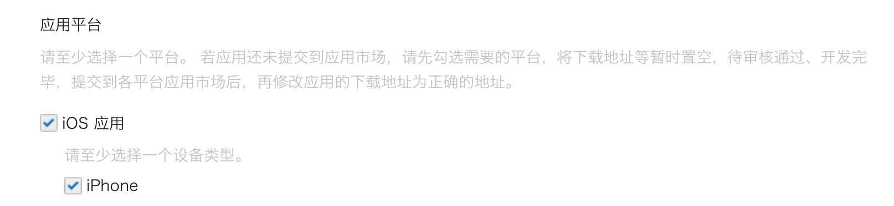
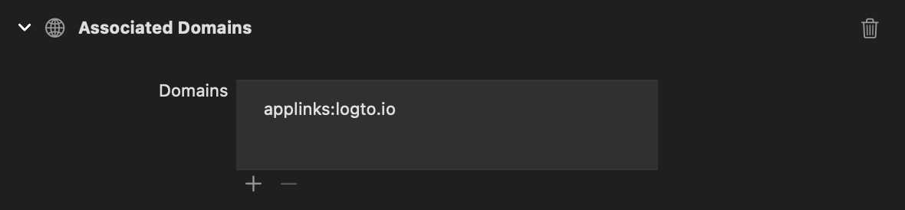
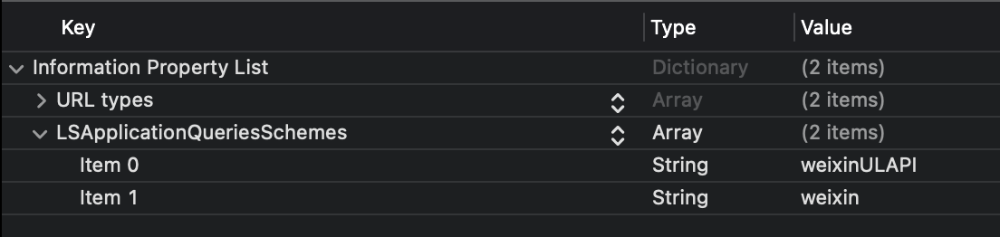

import GuideTip from '../../fragments/_guide-tip.mdx';

# Настройка социального входа через WeChat (Native)

Официальный коннектор Logto для социального входа через WeChat в нативных приложениях (iOS и Android).

<GuideTip />

## Начало работы \{#get-started}

Если вы не знаете концепцию коннектора или не знаете, как добавить этот коннектор в ваш опыт входа, пожалуйста, ознакомьтесь с [руководством Logto](/connectors/social-connectors).

В нативных приложениях вы не можете использовать веб как метод входа в WeChat: требуется навигация в приложение WeChat, а также использование их SDK.

Мы знаем, что это звучит страшно, но не волнуйтесь. Мы легко справимся с этим в этом руководстве.

## Создание мобильного приложения на платформе WeChat Open Platform \{#create-a-mobile-app-in-the-wechat-open-platform}

:::tip

Вы можете пропустить некоторые разделы, если уже завершили их.

:::

### Создание аккаунта \{#create-an-account}

Откройте https://open.weixin.qq.com/, нажмите кнопку "Sign Up" в правом верхнем углу, затем завершите процесс регистрации.

### Создание мобильного приложения \{#create-a-mobile-app}

Войдите в систему с только что созданным аккаунтом. На вкладке "Mobile Application" (移动应用) нажмите большую зеленую кнопку "Create a mobile app" (创建移动应用).


Давайте заполним необходимую информацию в форме заявки.


#### Основная информация \{#basic-info}

Большинство из них довольно просты, и у нас есть несколько советов:

- Если вы просто хотите протестировать вход через WeChat и приложение не находится в App Store, в разделе "App is available" выберите "No", чтобы пропустить "App download link".
- "App operation flow chart" выглядит сложно. По нашему опыту, вам нужно подготовить простой блок-схему и несколько скриншотов приложения, чтобы повысить вероятность прохождения проверки.

Нажмите "Next step", чтобы продолжить.

#### Информация о платформе \{#platform-info}

Вы можете настроить одну или обе платформы iOS и Android для интеграции Logto с нативным входом WeChat.

**iOS приложение**

Отметьте "iOS app" (iOS 应用), затем отметьте тип целевого устройства вашего приложения соответственно.



Если вы выбрали "No" для доступности в App Store, вы можете пропустить заполнение "AppStore download address" здесь.

Заполните _Bundle ID_, _Test version Bundle ID_ и _Universal Links_ (на самом деле, нужен только один ссылочный 😂).

:::note

_Bundle ID_ и _Test version Bundle ID_ могут быть одинаковыми значениями.

:::

:::tip

WeChat требует универсальную ссылку для нативного входа. Если вы не настроили или не знаете, что это такое, пожалуйста, обратитесь к [официальной документации Apple](https://developer.apple.com/ios/universal-links/).

:::

**Android приложение**

Отметьте "Android app" (Android 应用).


Заполните _Application Signing Signature_ (应用签名) и _Application Package Name_ (应用包名).

:::note

Вам нужно подписать ваше приложение, чтобы получить подпись. Обратитесь к [Sign your app](https://developer.android.com/studio/publish/app-signing) для получения дополнительной информации.

:::

После завершения подписания вы можете выполнить задачу `signingReport`, чтобы получить подпись.

```bash
./gradlew your-android-project:signingReport
```

Значение `MD5` из отчета соответствующего варианта сборки будет _Application Signing Signature_ (应用签名), но не забудьте удалить все двоеточия из значения и привести его к нижнему регистру.

Например, `1A:2B:3C:4D` -> `1a2b3c4d`.

#### Ожидание результата проверки \{#waiting-for-the-review-result}

После завершения информации о платформе нажмите "Submit Review", чтобы продолжить. Обычно проверка проходит быстро и завершается в течение 1-2 дней.

Мы подозреваем, что проверяющий назначается случайным образом при каждом отправлении, так как стандарт плавающий. Вас могут отклонить в первый раз, но не сдавайтесь! Укажите ваше текущее состояние и спросите у проверяющего, как его изменить.

## Включение нативного входа WeChat в вашем приложении \{#enable-wechat-native-sign-in-in-your-app}

### iOS \{#ios}

Мы предполагаем, что вы интегрировали [Logto iOS SDK](/quick-starts/swift) в ваше приложение. В этом случае все довольно просто, и вам даже не нужно читать документацию WeChat SDK:

**1. Настройте универсальную ссылку и схему URL в вашем проекте Xcode**

В проекте Xcode -> вкладка Signing & Capabilities, добавьте возможность "Associated Domains" и универсальную ссылку, которую вы настроили ранее.



Затем перейдите на вкладку "Info", добавьте [пользовательскую схему URL](https://developer.apple.com/documentation/xcode/defining-a-custom-url-scheme-for-your-app) с WeChat App ID.


Наконец, откройте ваш `Info.plist`, добавьте `weixinULAPI` и `weixin` под `LSApplicationQueriesSchemes`.



:::note

Мы знаем, что эти действия не очень разумны, но это минимальное работоспособное решение, которое мы нашли. См. [магическое официальное руководство](https://developers.weixin.qq.com/doc/oplatform/en/Mobile_App/Access_Guide/iOS.html) для получения дополнительной информации.

:::

**2. Добавьте `LogtoSocialPluginWechat` в ваш проект Xcode**

Добавьте фреймворк:


И добавьте `-ObjC` в ваши Build Settings > Linking > Other Linker Flags:


:::note

Плагин включает WeChat Open SDK 1.9.2. Вы можете напрямую использовать `import WechatOpenSDK` после импорта плагина.

:::

**3. Добавьте плагин в ваши параметры инициализации `LogtoClient`**

```swift
let logtoClient = LogtoClient(
  useConfig: config,
  socialPlugins: [LogtoSocialPluginWechat()]
)
```

**4. Правильно обработайте `onOpenURL`**

:::note

Функция `LogtoClient.handle(url:)` будет обрабатывать все нативные коннекторы, которые вы включили. Вам нужно вызвать ее только один раз.

:::

```swift
// SwiftUI
YourRootView()
  .onOpenURL { url in
      LogtoClient.handle(url: url)
  }

// или AppDelegate
func application(_ app: UIApplication, open url: URL, options: /*...*/) -> Bool {
  LogtoClient.handle(url: url)
}
```

### Android \{#android}

Мы предполагаем, что вы интегрировали [Logto Android SDK](/quick-starts/android) в ваше приложение. В этом случае все довольно просто, и вам даже не нужно читать документацию WeChat SDK:

**1. Добавьте `Wechat Open SDK` в ваш проект**

Убедитесь, что репозиторий `mavenCentral()` находится в ваших репозиториях проекта Gradle:

```kotlin
repositories {
  // ...
  mavenCentral()
}
```

Добавьте Wechat Open SDK в ваши зависимости:

```kotlin
dependencies {
  // ...
  api("com.tencent.mm.opensdk:wechat-sdk-android:6.8.0")  // kotlin-script
  // или
  api 'com.tencent.mm.opensdk:wechat-sdk-android:6.8.0'   // groovy-script
}
```

**2. Введите `WXEntryActivity` в ваш проект**

Создайте пакет `wxapi` под корнем вашего пакета и добавьте `WXEntryActivity` в пакет `wxapi` (Возьмем `com.sample.app` как пример):

```kotlin
// WXEntryActivity.kt
package com.sample.app.wxapi

import io.logto.sdk.android.auth.social.wechat.WechatSocialResultActivity

class WXEntryActivity: WechatSocialResultActivity()
```

```java
// WXEntryActivity.java
package com.sample.app.wxapi

import io.logto.sdk.android.auth.social.wechat.WechatSocialResultActivity

public class WXEntryActivity extends WechatSocialResultActivity {}
```

Окончательное расположение `WXEntryActivity` в проекте должно выглядеть так (Возьмем Kotlin как пример):

```bash
src/main/kotlin/com/sample/app/wxapi/WXEntryActivity.kt
```

**3. Измените `AndroidManifest.xml`**

Добавьте следующую строку в ваш `AndroidManifest.xml`:

```xml
\<?xml version="1.0" encoding="utf-8"?>
\<manifest xmlns:android="http://schemas.android.com/apk/res/android"
  package="com.sample.app">

  \<application>
    \<!-- строка, которую нужно добавить -->
    \<activity android:name=".wxapi.WXEntryActivity" android:exported="true"/>
  \</application>

\</manifest>
```

## Тестирование нативного коннектора WeChat \{#test-wechat-native-connector}

Вот и все. Не забудьте [включить социальный коннектор в опыте входа](/connectors/social-connectors/#enable-social-sign-in).

Как только нативный коннектор WeChat будет включен, вы можете собрать и запустить ваше приложение, чтобы проверить, работает ли оно.

:::caution

WeChat не имеет плана для тех устройств, на которых не установлено приложение WeChat. Logto скроет этот коннектор во время входа в систему, если это так (что является рекомендуемым способом из [официального руководства по разработке](https://developers.weixin.qq.com/doc/oplatform/en/Mobile_App/WeChat_Login/Development_Guide.html)).

:::
