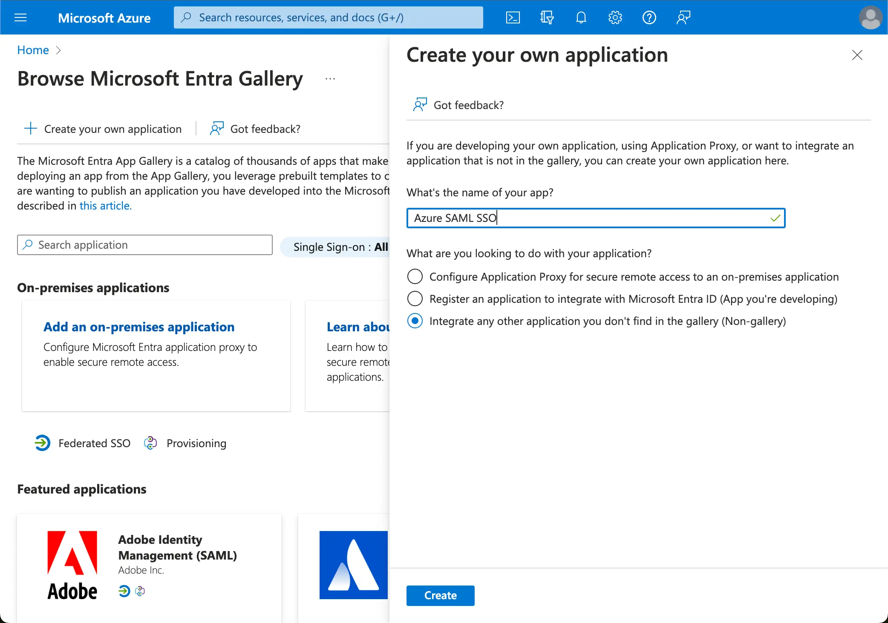

Начните интеграцию Azure AD SSO, создав SSO-приложение на стороне Azure AD.

1. Перейдите на [портал Azure](https://portal.azure.com/) и войдите как администратор.
2. Выберите сервис `Microsoft Entra ID`.
3. Перейдите в `Enterprise applications` с помощью бокового меню. Нажмите `New application` и выберите `Create your own application`.

1. Введите имя приложения и выберите `Integrate any other application you don't find in the gallery (Non-gallery)`.
2. Выберите `Setup single sign-on` > `SAML`.

1. Следуйте инструкциям, на первом шаге вам нужно будет заполнить основную конфигурацию SAML, используя следующую информацию, предоставленную Logto.

- **Audience URI(SP Entity ID)**: Это глобально уникальный идентификатор для вашего сервиса Logto, функционирующий как EntityId для SP во время запросов аутентификации к IdP. Этот идентификатор является ключевым для безопасного обмена утверждениями SAML и другими данными, связанными с аутентификацией, между IdP и Logto.
- **ACS URL**: URL сервиса потребления утверждений (ACS) — это место, куда отправляется утверждение SAML с POST-запросом. Этот URL используется IdP для отправки утверждения SAML в Logto. Он действует как URL обратного вызова, где Logto ожидает получить и обработать ответ SAML, содержащий информацию о личности пользователя.

Нажмите `Save`, чтобы продолжить.
