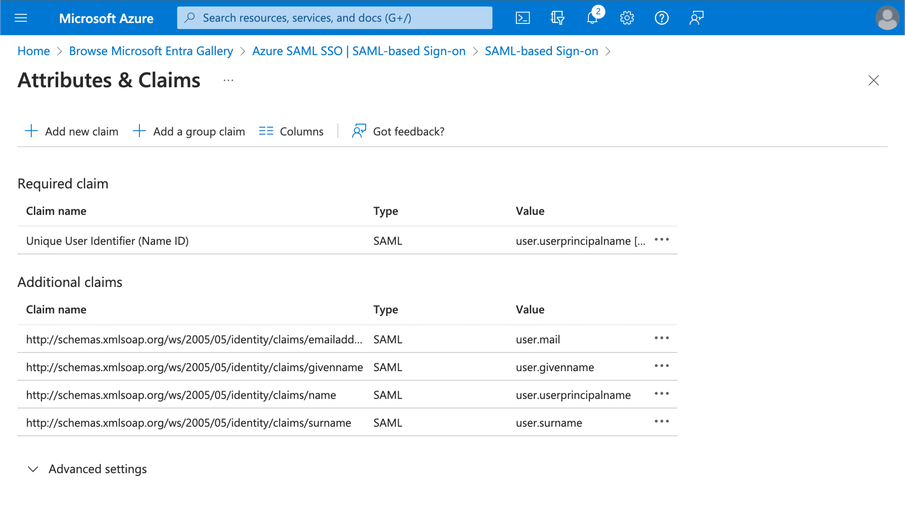

Logto предоставляет гибкий способ сопоставления атрибутов пользователя, возвращаемых от провайдера идентификации (IdP), с атрибутами пользователя в Logto. По умолчанию Logto будет синхронизировать следующие атрибуты пользователя от IdP:

- id: Уникальный идентификатор пользователя. Logto будет считывать утверждение `nameID` из SAML-ответа в качестве идентификатора SSO пользователя.
- email: Адрес электронной почты пользователя. Logto будет считывать утверждение `email` из SAML-ответа в качестве основного адреса электронной почты пользователя по умолчанию.
- name: Имя пользователя.

Вы можете управлять логикой сопоставления атрибутов пользователя как на стороне Azure AD, так и на стороне Logto.

1. Сопоставьте атрибуты пользователя AzureAD с атрибутами пользователя Logto на стороне Logto.

   Посетите раздел `Attributes & Claims` вашего приложения Azure AD SSO.

   Скопируйте следующие имена атрибутов (с префиксом пространства имен) и вставьте их в соответствующие поля в Logto.

   - `http://schemas.xmlsoap.org/ws/2005/05/identity/claims/emailaddress`
   - `http://schemas.xmlsoap.org/ws/2005/05/identity/claims/name` (Рекомендация: обновите это значение атрибута на `user.displayname` для улучшения пользовательского опыта)

1. Сопоставьте атрибуты пользователя AzureAD с атрибутами пользователя Logto на стороне AzureAD.

   Посетите раздел `Attributes & Claims` вашего приложения Azure AD SSO.

   Нажмите `Edit` и обновите поля `Additional claims` на основе настроек атрибутов пользователя Logto:

   - обновите значение имени утверждения на основе настроек атрибутов пользователя Logto.
   - удалите префикс пространства имен.
   - нажмите `Save`, чтобы продолжить.

   В итоге должны получиться следующие настройки:

Вы также можете указать дополнительные атрибуты пользователя на стороне Azure AD. Logto будет хранить запись оригинальных атрибутов пользователя, возвращенных от IdP, в поле `sso_identity` пользователя.
