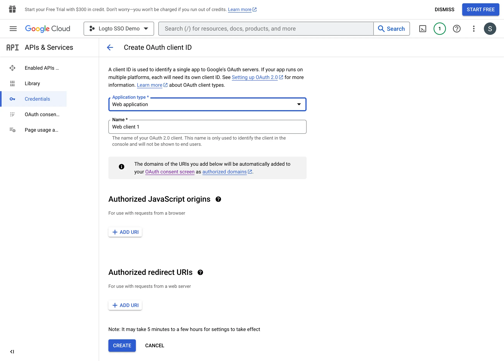

Перейдите на страницу [Credentials](https://console.cloud.google.com/apis/credentials) и нажмите кнопку `Create Credentials`. Выберите опцию `OAuth client ID` из выпадающего меню, чтобы создать новые OAuth учетные данные для вашего приложения.

Продолжайте настройку OAuth учетных данных, заполнив следующую информацию:

1. Выберите `Web application` в качестве типа приложения.
2. Заполните `Name` вашего клиентского приложения, например, `Logto SSO Connector`. Это поможет вам в будущем идентифицировать учетные данные.
3. Заполните `Authorized redirect URIs` с URI обратного вызова Logto. Это URI, на который Google перенаправит браузер пользователя после успешной аутентификации. После успешной аутентификации с IdP, IdP перенаправляет браузер пользователя обратно на этот указанный URI вместе с кодом авторизации. Logto завершит процесс аутентификации на основе кода авторизации, полученного с этого URI.
4. Заполните `Authorized JavaScript origins` с источником URI обратного вызова Logto. Это гарантирует, что только ваше приложение Logto может отправлять запросы на сервер Google OAuth.
5. Нажмите кнопку `Create`, чтобы создать OAuth учетные данные.
