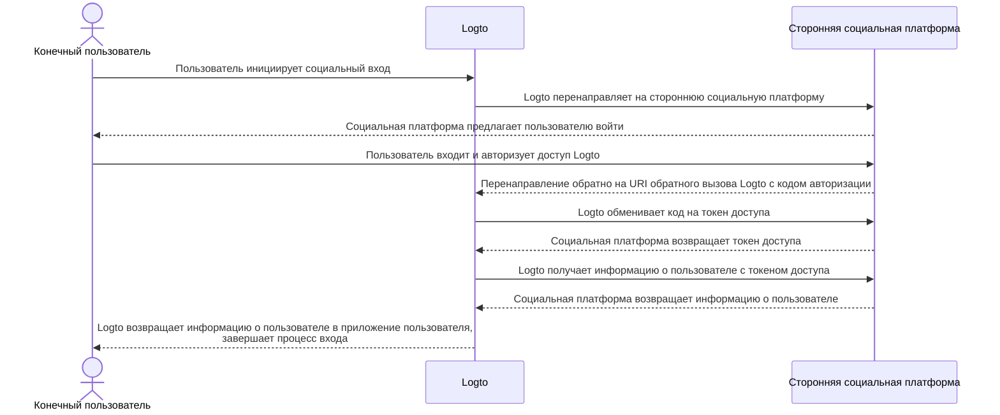

# Реализация коннекторов

После ознакомления со структурой файлов коннектора, давайте обсудим реализацию и основную идею разработки коннектора.

Мы рассмотрим простой пример для социальных и безпарольных коннекторов, чтобы вы могли создать свой коннектор почти с той же идеей.

В этой части мы не будем углубляться в детали конкретных параметров (таких как `config`), так как это не является целью данного руководства. Разработчики, которые реализуют новые коннекторы, должны читать документы, предоставленные сторонними поставщиками услуг, и эти документы должны подробно объяснять параметры.

## Создание социального коннектора \{#build-a-social-connector}

Возьмем в качестве примера коннектор GitHub.

Большинство потоков авторизации социальных коннекторов подчиняются [OAuth Authorization Code Flow](https://openid.net/specs/openid-connect-basic-1_0.html).

:::note
Большинство _социальных коннекторов_, получение профиля пользователя с аутентификацией конечных пользователей следует двухэтапной схеме (предполагается, что все шаги успешны):

1. Начать запрос аутентификации и получить аутентификацию пользователя.
2. Получить `токен доступа` с помощью `authCode`, предоставленного поставщиком коннектора.
3. Запросить общедоступный профиль пользователя, используя `токен доступа`.

:::



Для выполнения этого потока нам нужно иметь следующие три метода:

### getAuthorizationUri \{#getauthorizationuri}

`getAuthorizationUri` генерирует URL перенаправления, который может направить конечных пользователей на страницу, требующую аутентификации пользователей.

Интерфейс определен как `GetAuthorizationUri` в [`@logto/connector-kit`](https://github.com/logto-io/logto/blob/master/packages/toolkit/connector-kit/src/types/social.ts).

Вам разрешено хранить важную информацию, связанную с входом, используя `setSession` (второй входной параметр `GetAuthorizationUri`) для метода `getUserInfo`.

Перечисленные параметры обязательны:

- `authorizationEndpoint` можно найти на сайте документации GitHub OAuth, это страница, куда должен перейти конечный пользователь для аутентификации
- `config`, который включает `clientId` и `clientSecret` в сценарии GitHub
- `state`, случайная строка для защиты от CSRF
- `redirectUri` страницы перенаправления после успешной аутентификации конечного пользователя

```typescript
const getAuthorizationUri = async ({ state, redirectUri }) => {
  const queryParameters = new URLSearchParams({
    client_id: config.clientId, // `config` содержит учетные данные вашего приложения GitHub
    redirect_uri: redirectUri,
    state,
  });

  return `${authorizationEndpoint}?${queryParameters.toString()}`;
};
```

### getAccessToken \{#getaccesstoken}

`getAccessToken` получает токен доступа с кодом авторизации, выданным после успешной аутентификации конечных пользователей.

Помимо `config`, упомянутого в предыдущем методе `getAuthorizationUri`, мы также хотим получить:

- авторизационный `code` из параметров, переданных на страницу перенаправления
- `accessTokenEndpoint`, который является конечной точкой для получения токена доступа с кодом авторизации

```typescript
const getAccessToken = async (config: GithubConfig, code: string) => {
  const { clientId: client_id, clientSecret: client_secret } = config;

  const httpResponse = await got.post({
    url: accessTokenEndpoint,
    json: {
      client_id,
      client_secret,
      code,
    },
    timeout: defaultTimeout,
  });

  const result = accessTokenResponseGuard.safeParse(qs.parse(httpResponse.body));

  if (!result.success) {
    throw new ConnectorError(ConnectorErrorCodes.InvalidResponse, result.error);
  }

  const { access_token: accessToken } = result.data;

  assert(accessToken, new ConnectorError(ConnectorErrorCodes.SocialAuthCodeInvalid));

  return { accessToken };
};
```

### getUserInfo \{#getuserinfo}

`getUserInfo` получает информацию о пользователе с токеном доступа, полученным на предыдущем шаге.

Интерфейс определен как `GetUserInfo` в [`@logto/connector-kit`](https://github.com/logto-io/logto/blob/master/packages/toolkit/connector-kit/src/types/social.ts).

Для целей входа вы можете получить необходимую информацию, используя функцию `getSession`.

`userInfoEndpoint` — это конечная точка, используемая для получения информации о пользователе.

Вы можете проверить официальные документы, чтобы найти конкретную информацию о пользователе, доступную на конечной точке информации о пользователе и соответствующую область действия.

`id`, назначенный провайдером идентификации коннектора (в данном случае GitHub), обязателен; другая информация является необязательной. Если вы можете получить `email` или `phone` из профиля пользователя, УБЕДИТЕСЬ, что они "проверены". Вам также нужно согласовать возвращаемые ключи с именами полей в [профиле пользователя Logto](/user-management/user-data/#basic-data).

```typescript
const getUserInfo = async (
  data: { code: string; config: GithubConfig },
  getSession: GetSession,
  { set: SetStorageValue, get: GetStorageValue }
) => {
  const { code, config } = data;
  const { accessToken } = await getAccessToken(config, code);

  try {
    const httpResponse = await got.get(userInfoEndpoint, {
      headers: {
        authorization: `token ${accessToken}`,
      },
      timeout: defaultTimeout,
    });

    const result = userInfoResponseGuard.safeParse(parseJson(httpResponse.body));

    if (!result.success) {
      throw new ConnectorError(ConnectorErrorCodes.InvalidResponse, result.error);
    }

    const { id, avatar_url: avatar, email, name } = result.data;

    return {
      id: String(id),
      avatar: conditional(avatar),
      email: conditional(email),
      name: conditional(name),
    };
  } catch (error: unknown) {
    if (error instanceof HTTPError) {
      const { statusCode, body: rawBody } = error.response;

      if (statusCode === 401) {
        throw new ConnectorError(ConnectorErrorCodes.SocialAccessTokenInvalid);
      }

      throw new ConnectorError(ConnectorErrorCodes.General, JSON.stringify(rawBody));
    }

    throw error;
  }
};
```

Полную реализацию можно найти [здесь](https://github.com/logto-io/connectors/blob/master/packages/connector-github/src/index.ts).

Для получения более подробной информации о настраиваемых параметрах, см. README коннектора GitHub или официальные документы GitHub.

:::note
Пример, который мы обсуждали, основан на типе гранта Authorization Code протокола OAuth, который используется в коннекторе GitHub Logto. Однако стоит отметить, что другой тип гранта, тип гранта Implicit, также может использоваться для получения профиля пользователя и, фактически, предоставляет access_token непосредственно в ответе на аутентификацию. Несмотря на это удобство, тип гранта Authorization Code обычно рекомендуется вместо типа Implicit из-за его более высокой безопасности.

Вы также можете создать коннектор на основе OIDC или других открытых протоколов, это зависит от вашего случая использования, а также от совместимости социальной платформы, к которой вы хотите подключиться.
:::

## Создание безпарольного коннектора \{#build-a-passwordless-connector}

Давайте рассмотрим реализацию коннектора прямой почты Aliyun, чтобы понять процесс создания безпарольного коннектора.

Безпарольные коннекторы используются для отправки случайного кода на электронную почту или телефон конечных пользователей. В результате требуется метод `sendMessage`.

### sendMessage \{#sendmessage}

Для отправки сообщения нам нужно правильно настроить `config` и `endpoint`.

- `endpoint` — это конечная точка, к которой подключаются ваши API вызовы
- `config` содержит `templates` (шаблоны содержимого для отправки кода в различных пользовательских потоках), `clientId` и `clientSecret` (для доступа к API запросам)

```typescript
const sendMessage = async (data, inputConfig) => {
  const { to, type, payload } = data;
  const config = inputConfig ?? (await getConfig(defaultMetadata.id));
  validateConfig<AliyunDmConfig>(config, aliyunDmConfigGuard);
  const { accessKeyId, accessKeySecret, accountName, fromAlias, templates } = config;
  const template = templates.find((template) => template.usageType === type);

  assert(
    template,
    new ConnectorError(
      ConnectorErrorCodes.TemplateNotFound,
      `Cannot find template for type: ${type}`
    )
  );

  const parameters = {
    AccessKeyId: accessKeyId,
    AccountName: accountName,
    ReplyToAddress: 'false',
    AddressType: '1',
    ToAddress: to,
    FromAlias: fromAlias,
    Subject: template.subject,
    HtmlBody:
      typeof payload.code === 'string'
        ? template.content.replace(/{{code}}/g, payload.code)
        : template.content,
  };

  try {
    const httpResponse = await request(
      endpoint,
      { Action: 'SingleSendMail', ...staticConfigs, ...parameters },
      accessKeySecret
    );

    const result = sendEmailResponseGuard.safeParse(parseJson(httpResponse.body));

    if (!result.success) {
      throw new ConnectorError(ConnectorErrorCodes.InvalidResponse, result.error);
    }

    return result.data;
  } catch (error: unknown) {
    if (error instanceof HTTPError) {
      const {
        response: { body: rawBody },
      } = error;

      assert(typeof rawBody === 'string', new ConnectorError(ConnectorErrorCodes.InvalidResponse));

      errorHandler(rawBody);
    }

    throw error;
  }
};

const request = async (
  url: string,
  parameters: PublicParameters & Record<string, string>,
  accessKeySecret: string
) => {
  const finalParameters: Record<string, string> = {
    ...parameters,
    SignatureNonce: String(Math.random()),
    Timestamp: new Date().toISOString(),
  };
  const signature = getSignature(finalParameters, accessKeySecret, 'POST');

  const payload = new URLSearchParams();

  for (const [key, value] of Object.entries(finalParameters)) {
    payload.append(key, value);
  }
  payload.append('Signature', signature);

  return got.post({
    url,
    headers: {
      'Content-Type': 'application/x-www-form-urlencoded',
    },
    form: payload,
  });
};
```

Полную реализацию можно найти [здесь](https://github.com/logto-io/connectors/blob/master/packages/connector-aliyun-dm/src/index.ts).

Для получения более подробной информации о настраиваемых параметрах, см. README коннектора прямой почты Aliyun или официальные документы прямой почты Aliyun.

## Что дальше? \{#whats-more}

Чтобы увидеть определение методов коннектора и сформировать представление о дизайне интерфейса коннектора, см. [`@logto/connector-kit`](https://github.com/logto-io/logto/tree/master/packages/toolkit/connector-kit). Вы также можете найти ссылку на _ConnectorMetadata_ в "[Коннекторы - ConnectorMetadata](/connectors/connector-data-structure/#connectors-local-storage-connectormetadata)" и "[Структура файлов коннектора](/logto-oss/develop-your-connector/connector-file-structure/)", которые помогут вам понять, как организовать вашу реализацию.

- Схема конфигурации коннектора [_Zod_](https://github.com/colinhacks/zod) обязательна для всех коннекторов. Это очень важно, так как мы выполняем проверку типов перед сохранением `config` в базу данных и вызовом API, которые требуют информации `config`.
- Все _SMS коннекторы_ и _email коннекторы_ требуют метода `sendMessage` для вызова API отправки сообщений поставщиков услуг, используя конфигурации из базы данных. Разработчики также могут повторно использовать этот метод для отправки тестового сообщения с несохраненной конфигурацией при настройке коннекторов в Admin Console.
- Генератор URL авторизации `getAuthorizationUri` и получатель профиля пользователя `getUserInfo` требуются для всех _социальных коннекторов_ (`getAccessToken` считается необязательным шагом в `getUserInfo`).
- Все методы коннекторов работают через API вызовы, в результате чего разработчикам коннекторов необходимо проверять документы и обрабатывать возможные неудачные ответы API вызовов.

## Установка собственных коннекторов \{#install-your-own-connectors}

Мы предполагаем, что вы уже завершили создание собственного коннектора. Пройдите следующие шаги для его ручной установки:

1. Скопируйте папку коннектора, которую вы реализовали, в каталог `/packages/connectors` проекта [`logto-io/logto`](https://github.com/logto-io/logto).
2. Установите зависимости репозитория коннекторов, введя `pnpm pnpm:devPreinstall && pnpm i` в корневом каталоге папки logto.
3. Соберите коннектор с помощью `pnpm connectors build`.
4. Свяжите локальные коннекторы, используя `pnpm cli connector link`.
5. Перезапустите экземпляр Logto с помощью `pnpm dev` в корневом каталоге `logto-io/logto`, и вы сможете найти успешно установленные коннекторы.

Теперь вы можете протестировать и попробовать ваш коннектор, чтобы убедиться, что он работает так, как ожидалось.

Если вы хотите добавить коннекторы, которые уже были опубликованы в NPM или официальные коннекторы Logto, вы можете ознакомиться с [Использование Logto CLI - Управление коннекторами](/logto-oss/using-cli/manage-connectors/#add-connectors).
