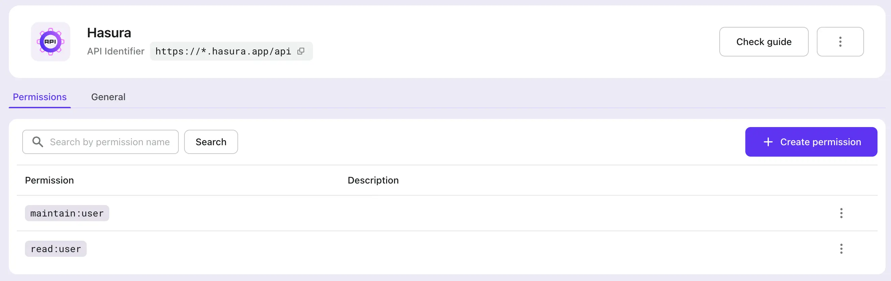
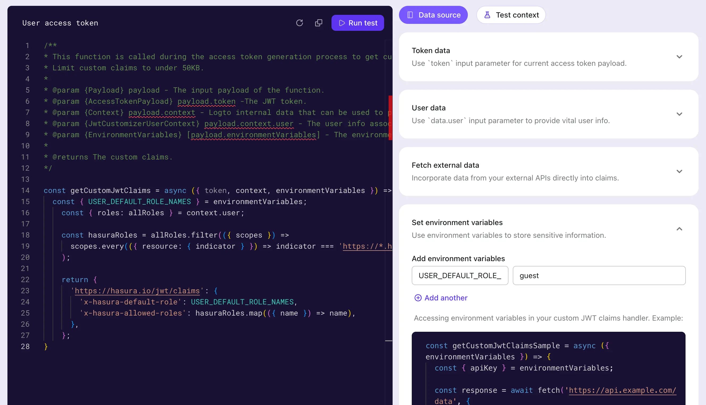

# Добавление аутентификации в ваше приложение на Hasura

[Hasura](https://hasura.io/) — это инструмент, который может быстро предоставить соответствующие GraphQL и REST API, подходящие для ваших данных. Учитывая безопасность данных, Hasura также предоставляет возможность тонкой настройки управления доступом для каждого отдельного API.

Обычно пользователи Hasura используют другие сервисы управления идентификацией и аутентификацией, и Logto является одним из самых популярных среди них.

В этом посте мы предполагаем, что вы уже используете сервисы Hasura. Мы расскажем, как интегрировать Hasura и Logto, чтобы максимально повысить безопасность ваших данных. Если у вас нет аккаунта Logto, зарегистрируйтесь и начните использовать его сейчас!

## Предыстория \{#background}

Hasura использует [управление доступом на основе ролей](https://hasura.io/docs/latest/auth/overview/), в то время как Logto использует стандартное [управление доступом на основе ролей (RBAC)](/authorization/role-based-access-control).

В модели Logto и лучших практиках для RBAC мы советуем пользователям использовать `scope` для соответствия самой мелкой гранулярности разрешений, использовать `role` как набор `scope` для удобных пакетных операций и, в конечном итоге, проверять `scope` (обычно на стороне поставщиков ресурсов), чтобы убедиться, что пользователь может выполнить конкретную операцию.

В Hasura `role` соответствует самой мелкой гранулярности разрешений, и проверки разрешений проводятся относительно `role`. Поэтому при настройке Logto мы рекомендуем сопоставлять одну `role` с точно одним `scope`. Этот подход может связать разрешения Logto и Hasura, чтобы избежать путаницы и неправильного использования.

Hasura может поддерживать управление доступом с использованием Webhook или JWT. В нашем предыдущем [посте в блоге](https://blog.logto.io/logto-x-hasura) мы рассказали, как использовать Webhook, а в следующих разделах мы объясним, как использовать управление доступом Hasura в режиме JWT.

## Начало работы \{#get-started}

Начнем с простого примера. Предположим, у пользователя уже есть два API в Hasura, `GET /user` и `PATCH /user`, соответствующие двум ролям: `user:reader` и `user:maintainer`, соответственно.

### 1. Создание ресурса API Hasura в Logto \{#1-create-hasura-api-resource-in-logto}

Создайте ресурс API Hasura в Logto.


### 2. Создание ролей в соответствии с настройками Hasura в Logto \{#2-create-roles-according-to-hasura-setup-in-logto}

Нам нужно создать два `scope` для ресурса API Hasura, упомянутого в шаге 1, а именно `read:user` и `maintain:user`, а затем создать две роли: `user:reader` (содержащую `read:user` scope) и `user:maintainer` (включающую `maintain:user` scope), чтобы соответствовать один-к-одному с ролями Hasura. И назначьте эти роли пользователям Logto по мере необходимости.




### 3. Настройка переменной окружения Hasura `HASURA_GRAPHQL_JWT_SECRET` для включения режима JWT \{#3-configure-hasura-environment-variable-hasura_graphql_jwt_secret-to-enable-jwt-mode}

Изучив [опции конфигурации JWT Hasura](https://hasura.io/docs/latest/auth/authentication/jwt/#hasura-jwt-configuration-options), нам нужно добавить и настроить переменную окружения `HASURA_GRAPHQL_JWT_SECRET`, прежде чем мы сможем использовать JWT для управления доступом.

Существует множество различных опций, которые можно настроить, но здесь мы представляем самый простой случай: необходимо настроить только `jwk_url`. Это значение можно получить из вашего Logto OpenID конфигурационного эндпоинта (https://your.logto.domain/oidc/.well-known/openid-configuration).


### 4. Настройка дополнительных утверждений токена доступа пользователя \{#4-customize-user-access-token-extra-claims}

Используя функцию пользовательских утверждений токена Logto, настройте логику для добавления дополнительных утверждений в токен доступа пользователя.



Настройте метод `getCustomJwtClaims` для добавления данных в JWT, на которые полагается Hasura для реализации управления доступом. Это могут быть данные, связанные с пользователем, который авторизуется в данный момент, включая `role`, которые он имеет, и которые можно получить через `context`.

Мы также определили переменную окружения `USER_DEFAULT_ROLE_NAMES`, чтобы избежать жесткого кодирования.

### 5. Интеграция Logto SDK \{#5-integrate-logto-sdk}

После настройки Logto и Hasura интегрируйте ваше приложение с Logto SDK. Здесь мы используем пример на React, чтобы просмотреть токен доступа пользователя, выданный Logto после входа пользователя.


Сначала мы назначаем ранее созданные роли `user:reader` и `user:maintainer` пользователю, а затем входим в систему как этот пользователь.

```tsx
const config: LogtoConfig = {
  endpoint: 'http://localhost:3001',
  appId: '<your-application-id>',
  appSecret: '<your-application-secret>',
  scopes: [
    ...// существующие области
    'read:user',
    'maintain:user',
  ],
  resources: [
    ...// существующие ресурсы
    'https://*.hasura.app/api',
  ],
};
```

Получите токен доступа пользователя и запросите API Hasura:

```tsx
const accessToken = await logto.getAccessToken('https://*.hasura.app/api');

// Перед отправкой запроса в Hasura
request.headers.set('Authorization', `Bearer ${accessToken}`);
request.headers.set('x-Hasura-Role', '<required-role-for-the-endpoint>');
```

## Заключение \{#conclusion}

В этой статье мы предоставляем еще один метод управления доступом на основе JWT, поддерживаемый Hasura, помимо Webhook.

Сравнивая процессы управления доступом Hasura с использованием [Webhook](https://hasura.io/docs/latest/auth/authentication/webhook/) и [JWT](https://hasura.io/docs/latest/auth/authentication/jwt/), мы видим, что подход с Webhook отправляет Webhook в Logto и ждет ответа с каждым запросом Hasura; в то время как подход на основе JWT может использоваться непрерывно до истечения срока действия JWT.

Подход на основе JWT может уменьшить нагрузку на сеть и устранить сетевую задержку, вызванную Webhook; в то же время подход с Webhook может синхронизировать изменения в разрешениях пользователей в реальном времени.

Пользователи могут выбрать подходящий подход, основываясь на этих выводах, в сочетании с их реальными бизнес-потребностями.
