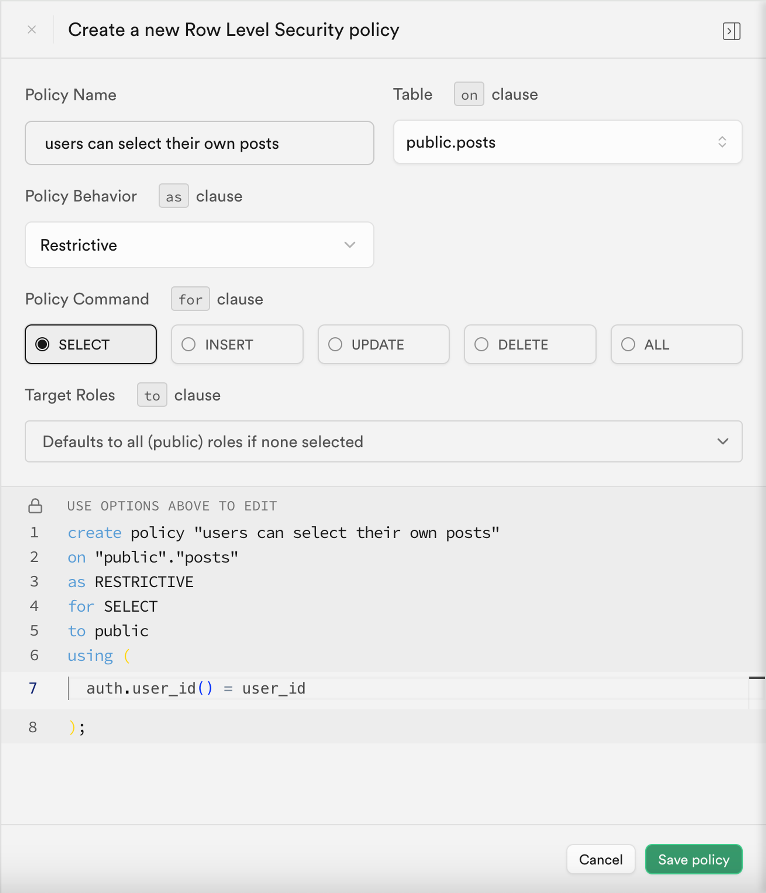
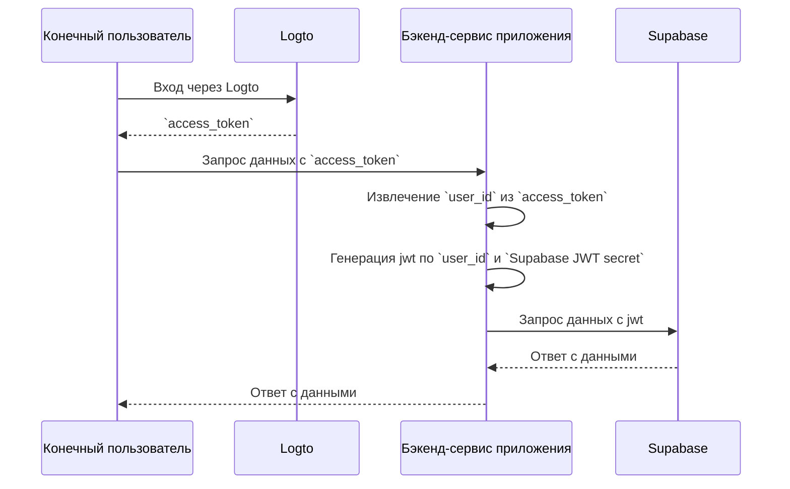

# Добавление аутентификации в ваше приложение на Supabase

## Основы Supabase \{#supabase-basics}

Supabase использует [Postgres's Row-Level Security](https://www.postgresql.org/docs/current/ddl-rowsecurity.html) для управления разрешениями доступа к данным. Проще говоря, создавая политики безопасности на уровне строк для таблиц в базе данных, мы можем ограничивать и управлять тем, кто может читать, записывать и обновлять данные в таблице.

Предположим, у вас есть таблица с именем "posts" в вашей базе данных со следующим содержимым:


Поле `user_id` в таблице представляет пользователя, которому принадлежат данные каждого поста. Вы можете ограничить доступ каждого пользователя только к его собственным данным постов на основе поля `user_id`.

Однако, прежде чем это можно будет реализовать, Supabase должен иметь возможность идентифицировать текущего пользователя, получающего доступ к базе данных.

### Добавление данных пользователя в запросы Supabase \{#add-user-data-to-the-supabase-requests}

Благодаря поддержке JWT в Supabase, когда наше приложение взаимодействует с Supabase, мы можем генерировать JWT, содержащий данные пользователя, используя секрет JWT, предоставленный Supabase. Затем мы используем этот JWT в качестве заголовка Аутентификации при выполнении запросов. При получении запроса Supabase автоматически проверяет действительность JWT и позволяет получить доступ к данным, содержащимся в нем, на протяжении последующих процессов.

Во-первых, мы можем получить секрет JWT, предоставленный Supabase, из "Настроек проекта" в панели управления Supabase:


Затем, когда мы используем SDK Supabase для выполнения запросов к Supabase, мы используем этот секрет для генерации нашего JWT и прикрепляем его в качестве заголовка Аутентификации к запросу. (Обратите внимание, что этот процесс происходит в бэкенд-сервисе вашего приложения, и секрет JWT никогда не должен быть раскрыт третьим сторонам).

```jsx
import { createClient } from '@supabase/supabase-js';
import { sign } from 'jsonwebtoken';

/*
 * Примечание:
 * Вы можете найти SUPABASE_URL, SUPABASE_ANON_KEY в том же месте, где вы найдете секрет JWT.
 */
const SUPABASE_URL = process.env.SUPABASE_URL;
const SUPABASE_ANON_KEY = process.env.SUPABASE_ANON_KEY;

const SUPABASE_JWT_SECRET = process.env.SUPABASE_JWT_SECRET;

export const getSupabaseClient = (userId) => {
  const jwtPayload = {
    userId,
  };

  const jwt = sign(jwtPayload, SUPABASE_JWT_SECRET, {
    expiresIn: '1h', // Только для демонстрации
  });

  const client = createClient(SUPABASE_URL, SUPABASE_ANON_KEY, {
    global: {
      headers: {
        Authorization: `Bearer ${jwt}`,
      },
    },
  });

  return client;
};
```

Далее перейдите в SQL Editor в панели управления Supabase и создайте функцию для получения userId, переданного в запросе:


Код, использованный на изображении, следующий:

```sql
create or replace function auth.user_id() returns text as $$
  select nullif(current_setting('request.jwt.claims', true)::json->>'userId', '')::text;
$$ language sql stable;
```

Как показано в коде, в Supabase вы можете получить полезную нагрузку JWT, который мы генерируем, вызвав `request.jwt.claims`. Поле `userId` внутри полезной нагрузки — это значение, которое мы установили.

С помощью этой функции Supabase может определить пользователя, который в данный момент получает доступ к базе данных.

### Создание политики безопасности на уровне строк \{#create-row-level-security-policy}

Далее мы можем создать политику безопасности на уровне строк, чтобы ограничить доступ каждого пользователя только к его собственным данным постов на основе поля `user_id` в таблице posts.

1. Перейдите на страницу Table Editor в панели управления Supabase и выберите таблицу posts.
2. Нажмите "Add RLS Policy" в верхней части таблицы.
3. В появившемся окне нажмите "Create policy".
4. Введите имя политики и выберите команду SELECT Policy.
5. В блоке `using` кода ниже введите:

```sql
auth.user_id() = user_id
```



Используя такие политики, достигается контроль доступа к данным в Supabase.

В реальных приложениях вы создадите различные политики для ограничения действий пользователей, таких как вставка и изменение данных. Однако это выходит за рамки данной статьи. Для получения дополнительной информации о безопасности на уровне строк (RLS) обратитесь к [Secure your data using Postgres Row Level Security](https://supabase.com/docs/guides/database/postgres/row-level-security).

### Основной процесс интеграции с Logto \{#basic-integration-process-with-logto}

Как упоминалось ранее, поскольку Supabase использует RLS для управления доступом, ключ к интеграции с Logto (или любой другой службой аутентификации) заключается в получении идентификатора пользователя авторизованного пользователя и его отправке в Supabase. Весь процесс иллюстрируется на диаграмме ниже:



Далее мы объясним, как интегрировать Logto с Supabase на основе этой диаграммы процесса.

## Интеграция Logto \{#logto-integration}

Logto предлагает руководства по интеграции для различных фреймворков и языков программирования.

Как правило, приложения, созданные с использованием этих фреймворков и языков, делятся на категории, такие как нативные приложения, SPA (одностраничные приложения), традиционные веб-приложения и приложения M2M (машина-машина). Вы можете посетить страницу [Logto quick starts](/quick-starts), чтобы интегрировать Logto в ваше приложение на основе используемого вами технологического стека. После этого следуйте инструкциям ниже, чтобы интегрировать Logto в ваш проект в зависимости от типа вашего приложения.

### Нативное приложение или SPA \{#native-app-or-spa}

Как нативные приложения, так и SPA работают на вашем устройстве, и учетные данные (токен доступа), полученные после входа, хранятся локально на вашем устройстве.

Поэтому при интеграции вашего приложения с Supabase вам необходимо взаимодействовать с Supabase через ваш бэкенд-сервис, так как вы не можете раскрывать конфиденциальную информацию (например, секрет JWT Supabase) на устройстве каждого пользователя.

Предположим, вы создаете ваше SPA с использованием React и Express. Вы успешно интегрировали Logto в ваше приложение, следуя [Logto React SDK Guide](/quick-starts/react) (вы можете обратиться к коду в нашем [react sample](https://github.com/logto-io/js/tree/master/packages/react-sample)). Кроме того, вы добавили проверку токена доступа Logto на ваш бэкенд-сервер в соответствии с документацией [Protect your API on Node (Express)](/authorization/api-resources/node-express).

Далее вы будете использовать токен доступа, полученный от Logto, для запроса данных пользователя с вашего бэкенд-сервера:

```jsx
import { useLogto } from '@logto/react';
import { useState, useEffect } from 'react';
import PostList from './PostList';

const endpoint = '<https://www.mysite.com/api/posts>';
const resource = '<https://www.mysite.com/api>';

function PostPage() {
  const { isAuthenticated, getAccessToken } = useLogto();
  const [posts, setPosts] = useState();

  useEffect(() => {
    const fetchPosts = async () => {
      const response = await fetch(endpoint, {
        headers: {
          Authorization: `Bearer ${await getAccessToken(resource)}`,
        },
      });
      setPosts(response.json());
    };

    if (isAuthenticated) {
      void fetchPosts();
    }
  }, [isAuthenticated, getAccessToken]);

  return <PostList posts={posts} />;
}

export default PostPage;
```

На вашем бэкенд-сервере вы уже извлекли идентификатор вошедшего пользователя из токена доступа с помощью middleware:

```jsx
// auth-middleware.ts
import { createRemoteJWKSet, jwtVerify } from 'jose';

//...

export const verifyAuthFromRequest = async (ctx, next) => {
  // Извлечение токена
  const token = extractBearerTokenFromHeaders(ctx.request.headers);

  const { payload } = await jwtVerify(
    token, // Исходный токен Bearer, извлеченный из заголовка запроса
    createRemoteJWKSet(new URL('https://<your-logto-domain>/oidc/jwks')), // генерация jwks с использованием jwks_uri, запрошенного с сервера Logto
    {
      // ожидаемый эмитент токена, должен быть выдан сервером Logto
      issuer: 'https://<your-logto-domain>/oidc',
      // ожидаемая аудитория токена, должна быть индикатором ресурса текущего API
      audience: '<your request listener resource indicator>',
    }
  );

  // если вы используете RBAC
  assert(payload.scope.includes('some_scope'));

  // логика пользовательской полезной нагрузки
  ctx.auth = {
    userId: payload.sub,
  };

  return next();
};
```

Теперь вы можете использовать `getSupabaseClient`, описанный выше, чтобы прикрепить `userId` к JWT, используемому в последующих запросах к Supabase. Кроме того, вы можете создать middleware для создания клиента Supabase для запросов, которые необходимо взаимодействовать с Supabase:

```jsx
export const withSupabaseClient = async (ctx, next) => {
  ctx.supabase = getSupabaseClient(ctx.auth.userId);

  return next();
};
```

В последующем процессе обработки вы можете напрямую вызвать `ctx.supabase` для взаимодействия с Supabase:

```jsx
const fetchPosts = async (ctx) => {
  const { data } = await ctx.supabase.from('posts').select('*');

  return data;
};
```

В этом коде Supabase вернет только данные постов, принадлежащие текущему пользователю, на основе ранее установленных политик.

### Традиционное веб-приложение \{#traditional-web-app}

Основное отличие традиционного веб-приложения от нативного приложения или SPA заключается в том, что традиционное веб-приложение рендерит и обновляет страницы исключительно на веб-сервере. Поэтому учетные данные пользователя управляются непосредственно веб-сервером, в то время как в нативных приложениях и SPA они находятся на устройстве пользователя.

При интеграции Logto с традиционным веб-приложением в Supabase вы можете напрямую получить идентификатор вошедшего пользователя с бэкенда.

Взяв в качестве примера проект на Next.js, после интеграции Logto с вашим проектом, следуя [Next.js SDK Guide](/quick-starts/next-app-router), вы можете использовать SDK Logto для получения информации о пользователе и создания соответствующего JWT для взаимодействия с Supabase.

```jsx
import { getLogtoContext } from '@logto/next-server-actions';
import { logtoConfig } from '@/logto';
import { getSupabaseClient } from '@/utils';
import PostList from './PostList';

export default async function PostPage() {
  const { claims } = await getLogtoContext(logtoConfig);

  // Значение `sub` в `claims` — это идентификатор пользователя.
  const supabase = getSupabaseClient(claims.sub);

  const { data: posts } = await supabase.from('posts').select('*');

  return <PostList posts={posts} />;
}
```

### Приложение машина-машина \{#machine-to-machine-app}

Машина-машина (M2M) часто используется, когда вашему приложению необходимо напрямую взаимодействовать с серверами ресурсов, такими как статический сервис, который ежедневно получает посты и т. д.

Вы можете использовать руководство [Machine-to-machine: Auth with Logto](/quick-starts/m2m) для аутентификации приложения машина-машина. Интеграция между Supabase и приложениями машина-машина аналогична интеграции с нативными приложениями и SPA (как описано в разделе "[Нативное приложение или SPA](#native-app-or-spa)"). Она включает получение токена доступа от Logto и его проверку через защищенный бэкенд API.

Однако важно отметить, что нативные приложения и SPA обычно предназначены для конечных пользователей, поэтому полученный идентификатор пользователя представляет самого пользователя. Однако токен доступа для приложений машина-машина представляет само приложение, и поле `sub` в полезной нагрузке токена доступа является идентификатором клиента приложения M2M, а не конкретного пользователя. Поэтому в процессе разработки важно различать, какие данные предназначены для приложений M2M.

Более того, если вы хотите, чтобы конкретное приложение M2M получало доступ к Supabase от имени всей службы, чтобы обойти ограничения RLS, вы можете использовать секрет `service_role` Supabase для создания клиента Supabase. Это полезно, когда вы хотите выполнять некоторые административные или автоматизированные задачи, требующие доступа ко всем данным без ограничений, установленных политиками безопасности на уровне строк для отдельных пользователей.

Секрет `service_role` можно найти на той же странице, что и секрет JWT:


При создании клиента Supabase используйте секрет `service_role`, и тогда этот клиент сможет получить доступ ко всем данным в базе данных:

```jsx
import { createClient } from '@supabase/supabase-js';

// ...
const SUPABASE_SERVICE_ROLE_SECRET = process.env.SUPABASE_SERVICE_ROLE_SECRET;

const client = createClient(SUPABASE_URL, SUPABASE_SERVICE_ROLE_SECRET, {
  // ...options
});
```
