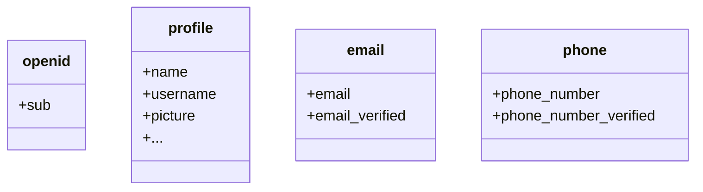

По умолчанию возвращаются ограниченные утверждения. Если вам нужно больше информации, вы можете запросить дополнительные области действия для доступа к большему количеству утверждений.

:::info
"Утверждение" — это заявление, сделанное о субъекте; "Область действия" — это группа утверждений. В данном случае утверждение — это информация о пользователе.
:::

Вот ненормативный пример отношения область действия - утверждение:

:::tip
Утверждение "sub" означает "субъект", что является уникальным идентификатором пользователя (т.е. ID пользователя).
:::

Logto SDK всегда будет запрашивать три области действия: `openid`, `profile` и `offline_access`.
