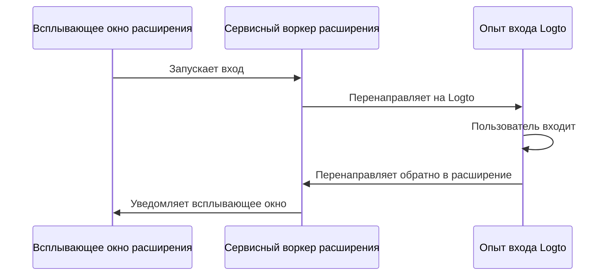

import RegardingRedirectBasedSignIn from '../../fragments/_regarding-redirect-based-sign-in.mdx';

### Поток аутентификации \{#the-authentication-flow}

Предположим, вы разместили кнопку "Войти" в всплывающем окне вашего расширения Chrome, поток аутентификации будет выглядеть следующим образом:



Для других интерактивных страниц в вашем расширении вам просто нужно заменить участника `Всплывающее окно расширения` на имя страницы. В этом руководстве мы сосредоточимся на всплывающей странице.

<RegardingRedirectBasedSignIn />

### Обновите `manifest.json` \{#update-the-manifestjson}

Logto SDK требует следующих разрешений в `manifest.json`:

```json title="manifest.json"
{
  "permissions": ["identity", "storage"],
  "host_permissions": ["https://*.logto.app/*"]
}
```

- `permissions.identity`: Требуется для Chrome Identity API, который используется для входа и выхода.
- `permissions.storage`: Требуется для хранения сессии пользователя.
- `host_permissions`: Требуется для Logto SDK для взаимодействия с Logto API.

:::note
Если вы используете пользовательский домен на Logto Cloud, вам нужно обновить `host_permissions`, чтобы они соответствовали вашему домену.
:::

### Настройка фонового скрипта (сервисного воркера) \{#set-up-a-background-script-service-worker}

В фоновом скрипте вашего расширения Chrome инициализируйте Logto SDK:

```js title="service-worker.js"
import LogtoClient from '@logto/chrome-extension';

export const logtoClient = new LogtoClient({
  endpoint: '<your-logto-endpoint>'
  appId: '<your-logto-app-id>',
});
```

Замените `<your-logto-endpoint>` и `<your-logto-app-id>` на фактические значения. Вы можете найти эти значения на странице приложения, которую вы только что создали в Logto Console.

Если у вас нет фонового скрипта, вы можете следовать [официальному руководству](https://developer.chrome.com/docs/extensions/develop/concepts/service-workers/basics) для его создания.

:::info
**Почему нам нужен фоновый скрипт?**

Обычные страницы расширения, такие как всплывающее окно или страница опций, не могут работать в фоновом режиме и могут быть закрыты во время процесса аутентификации. Фоновый скрипт обеспечивает правильную обработку процесса аутентификации.
:::

Затем нам нужно слушать сообщения от других страниц расширения и обрабатывать процесс аутентификации:

```js title="service-worker.js"
chrome.runtime.onMessage.addListener((message, sender, sendResponse) => {
  // В приведенном ниже коде, так как мы возвращаем `true` для каждого действия, нам нужно вызвать `sendResponse`
  // чтобы уведомить отправителя. Вы также можете обрабатывать ошибки здесь или использовать другие способы уведомления отправителя.

  if (message.action === 'signIn') {
    const redirectUri = chrome.identity.getRedirectURL('/callback');
    logtoClient.signIn(redirectUri).finally(sendResponse);
    return true;
  }

  if (message.action === 'signOut') {
    const redirectUri = chrome.identity.getRedirectURL();
    logtoClient.signOut(redirectUri).finally(sendResponse);
    return true;
  }

  return false;
});
```

Вы можете заметить, что в приведенном выше коде используются два URI перенаправления. Они оба создаются с помощью `chrome.identity.getRedirectURL`, который является [встроенным API Chrome](https://developer.chrome.com/docs/extensions/reference/api/identity#method-getRedirectURL) для генерации URL перенаправления для потоков аутентификации. Два URI будут:

- `https://<extension-id>.chromiumapp.org/callback` для входа.
- `https://<extension-id>.chromiumapp.org/` для выхода.

Обратите внимание, что эти URI недоступны, и они используются только для Chrome для запуска определенных действий в процессе аутентификации.

### Обновите настройки приложения Logto \{#update-logto-application-settings}

Теперь нам нужно обновить настройки приложения Logto, чтобы разрешить созданные нами URI перенаправления.

1. Перейдите на страницу приложения в Logto Console.
2. В разделе "Redirect URIs" добавьте URI: `https://<extension-id>.chromiumapp.org/callback`.
3. В разделе "Post sign-out redirect URIs" добавьте URI: `https://<extension-id>.chromiumapp.org/`.
4. В разделе "CORS allowed origins" добавьте URI: `chrome-extension://<extension-id>`. SDK в расширении Chrome будет использовать этот источник для взаимодействия с Logto API.
5. Нажмите **Сохранить изменения**.

Не забудьте заменить `<extension-id>` на ваш фактический ID расширения. Вы можете найти ID расширения на странице `chrome://extensions`.

### Добавьте кнопки входа и выхода во всплывающее окно \{#add-sign-in-and-sign-out-buttons-to-the-popup}

Мы почти закончили! Давайте добавим кнопки входа и выхода и другую необходимую логику на страницу всплывающего окна.

В файле `popup.html`:

```html title="popup.html"
<button id="sign-in">Войти</button> <button id="sign-out">Выйти</button>
```

В файле `popup.js` (предполагается, что `popup.js` включен в `popup.html`):

```js title="popup.js"
document.getElementById('sign-in').addEventListener('click', async () => {
  await chrome.runtime.sendMessage({ action: 'signIn' });
  // Вход завершен (или не удался), вы можете обновить интерфейс здесь.
});

document.getElementById('sign-out').addEventListener('click', async () => {
  await chrome.runtime.sendMessage({ action: 'signOut' });
  // Выход завершен (или не удался), вы можете обновить интерфейс здесь.
});
```

### Контрольная точка: протестируйте поток аутентификации \{#checkpoint-test-the-authentication-flow}

Теперь вы можете протестировать поток аутентификации в вашем расширении Chrome:

1. Откройте всплывающее окно расширения.
2. Нажмите на кнопку "Войти".
3. Вы будете перенаправлены на страницу входа Logto.
4. Войдите в свою учетную запись Logto.
5. Вы будете перенаправлены обратно в Chrome.

### Проверьте состояние аутентификации \{#check-authentication-state}

Поскольку Chrome предоставляет унифицированные API для хранения, кроме потока входа и выхода, все остальные методы Logto SDK могут использоваться непосредственно на странице всплывающего окна.

В вашем `popup.js` вы можете повторно использовать экземпляр `LogtoClient`, созданный в фоновом скрипте, или создать новый с той же конфигурацией:

```js title="popup.js"
import LogtoClient from '@logto/chrome-extension';

const logtoClient = new LogtoClient({
  endpoint: '<your-logto-endpoint>'
  appId: '<your-logto-app-id>',
});

// Или повторно используйте экземпляр logtoClient, созданный в фоновом скрипте
import { logtoClient } from './service-worker.js';
```

Затем вы можете создать функцию для загрузки состояния аутентификации и профиля пользователя:

```js title="popup.js"
const loadAuthenticationState = async () => {
  const isAuthenticated = await logtoClient.isAuthenticated();
  // Обновите интерфейс на основе состояния аутентификации

  if (isAuthenticated) {
    const user = await logtoClient.getIdTokenClaims(); // { sub: '...', email: '...', ... }
    // Обновите интерфейс с профилем пользователя
  }
};
```

Вы также можете объединить функцию `loadAuthenticationState` с логикой входа и выхода:

```js title="popup.js"
document.getElementById('sign-in').addEventListener('click', async () => {
  await chrome.runtime.sendMessage({ action: 'signIn' });
  await loadAuthenticationState();
});

document.getElementById('sign-out').addEventListener('click', async () => {
  await chrome.runtime.sendMessage({ action: 'signOut' });
  await loadAuthenticationState();
});
```

Вот пример страницы всплывающего окна с состоянием аутентификации:


### Другие соображения \{#other-considerations}

- **Сборка сервисного воркера**: Если вы используете сборщик, такой как Webpack или Rollup, вам нужно явно установить цель на `browser` или аналогичную, чтобы избежать ненужной сборки модулей Node.js.
- **Разрешение модулей**: Logto Chrome extension SDK является модулем только для ESM.

Смотрите наш [пример проекта](https://github.com/logto-io/js/tree/HEAD/packages/chrome-extension-sample) для полного примера с TypeScript, Rollup и другими конфигурациями.
