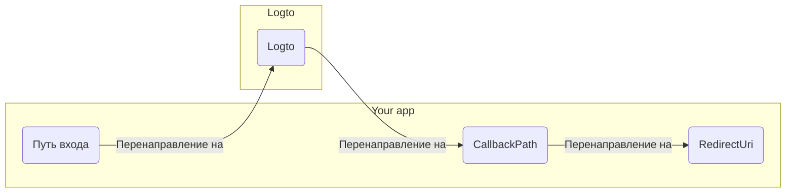

import RegardingRedirectBasedSignIn from '../../fragments/_regarding-redirect-based-sign-in.mdx';

Прежде чем мы продолжим, есть два запутанных термина в .NET Core middleware аутентификации, которые нам нужно прояснить:

1. **CallbackPath**: URI, на который Logto перенаправит пользователя после входа (это "redirect URI" в Logto)
2. **RedirectUri**: URI, на который будет выполнено перенаправление после выполнения необходимых действий в middleware аутентификации Logto.

Процесс входа можно проиллюстрировать следующим образом:

 

Аналогично, .NET Core также имеет **SignedOutCallbackPath** и **RedirectUri** для процесса выхода.

Для ясности мы будем называть их следующим образом:

| Термин, который мы используем   | Термин .NET Core      |
| ------------------------------- | --------------------- |
| Redirect URI Logto              | CallbackPath          |
| Redirect URI после выхода Logto | SignedOutCallbackPath |
| Redirect URI приложения         | RedirectUri           |

<RegardingRedirectBasedSignIn />
