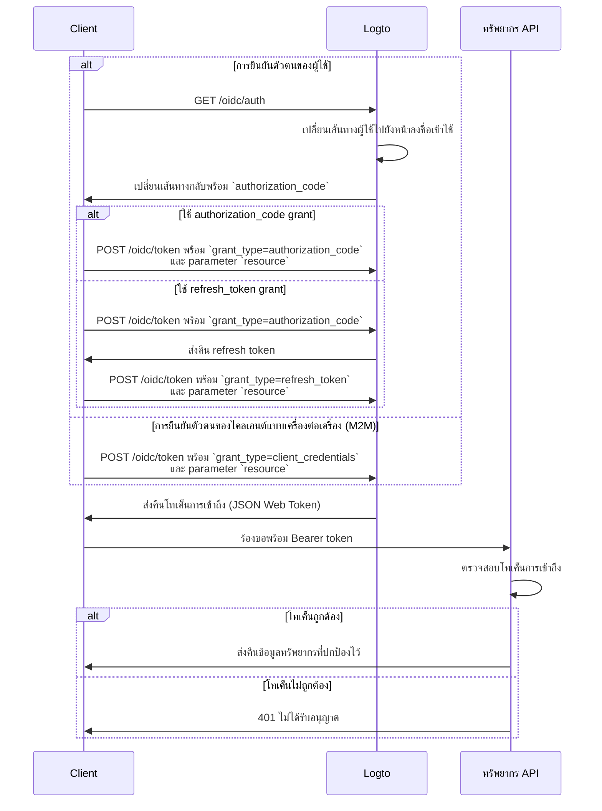

import illustration from '@site/docs/authorization/assets/rbac-global-api-resources.png';
import AuthorizationRequestExample from '@site/docs/authorization/fragments/AuthorizationRequestExample';
import ClientCredentialsRequestExample from '@site/docs/authorization/fragments/ClientCredentialsRequestExample';
import TokenRequestExample from '@site/docs/authorization/fragments/TokenRequestExample';
import TabItem from '@theme/TabItem';
import Tabs from '@theme/Tabs';

# ปกป้องทรัพยากร API ระดับโกลบอล

export const resource = 'https://api.your-app.com';

ปกป้อง API ที่ใช้ทั่วทั้งผลิตภัณฑ์ของคุณด้วยการควบคุมการเข้าถึงตามบทบาท (RBAC) ใน Logto กำหนดบทบาทและสิทธิ์ระดับโกลบอลเพื่อควบคุมการเข้าถึงของผู้ใช้และไคลเอนต์ทั้งหมดในแอปพลิเคชันของคุณ

## ทรัพยากร API ระดับโกลบอลคืออะไร? \{#what-are-global-api-resources}

ทรัพยากร API ระดับโกลบอล คือ endpoint หรือบริการในแอปพลิเคชันของคุณที่ผู้ใช้ทุกคนสามารถเข้าถึงได้ ไม่ว่าจะอยู่ในองค์กรหรือผู้เช่าใดก็ตาม โดยทั่วไปจะเป็น API ที่เปิดเผยต่อสาธารณะ บริการหลักของผลิตภัณฑ์ หรือ endpoint ใด ๆ ที่ไม่ได้จำกัดขอบเขตกับองค์กรใดองค์กรหนึ่ง

**กรณีการใช้งาน เช่น**

- API สาธารณะหรือ endpoint ที่ใช้ร่วมกันกับผู้ใช้ทั้งหมด
- Microservices ที่ไม่ได้ผูกกับระบบหลายผู้เช่า (multi-tenancy)
- API หลักของแอปพลิเคชัน (เช่น `/api/users`, `/api/products`) ที่ลูกค้าทุกคนใช้

Logto ช่วยให้คุณรักษาความปลอดภัย API เหล่านี้ด้วย OAuth 2.1 ร่วมกับการควบคุมการเข้าถึงตามบทบาทที่ยืดหยุ่น

## วิธีการทำงานใน Logto \{#how-it-works-in-logto}

- **ทรัพยากร API และสิทธิ์ถูกลงทะเบียนในระดับโกลบอล:** แต่ละ API ที่คุณต้องการปกป้องจะถูกกำหนดด้วย resource indicator (URI) ที่ไม่ซ้ำกัน พร้อมชุดสิทธิ์ (scopes) ที่ควบคุมการเข้าถึง
- **การเข้าถึงถูกควบคุมด้วยบทบาทระดับโกลบอล:** คุณสามารถกำหนดสิทธิ์ให้กับบทบาท แล้วนำบทบาทนั้นไปกำหนดให้กับผู้ใช้หรือไคลเอนต์
- **แยกจากสิทธิ์ระดับองค์กร:** ทรัพยากร API ระดับโกลบอลไม่มีบริบทขององค์กร อย่างไรก็ตาม สามารถใช้ร่วมกับบทบาทขององค์กรเพื่อเพิ่มชั้นบริบทได้หากจำเป็น หากต้องการปกป้อง API ระดับองค์กร ดู [ปกป้องทรัพยากร API ระดับองค์กร](/authorization/organization-level-api-resources)


### ภาพรวมการนำไปใช้ \{#implementation-overview}

1. **ลงทะเบียนทรัพยากร API ของคุณ** และกำหนดสิทธิ์ใน Logto
2. **กำหนดบทบาท** พร้อมสิทธิ์ที่จำเป็นสำหรับการเข้าถึง API
3. **กำหนดบทบาท** ให้กับผู้ใช้หรือไคลเอนต์
4. **ใช้ OAuth 2.0 authorization flows** เพื่อขอรับโทเค็นการเข้าถึงสำหรับ API (parameter `resource` ต้องตรงกับ API identifier ที่ลงทะเบียนไว้)
5. **ตรวจสอบโทเค็นการเข้าถึง** ใน API ของคุณเพื่อบังคับใช้สิทธิ์

### ทำความเข้าใจ resource indicator \{#understanding-resource-indicators}

Logto สร้างแบบจำลองทรัพยากร API ตาม [RFC 8707: Resource Indicators for OAuth 2.0](https://www.rfc-editor.org/rfc/rfc8707.html) โดย **resource indicator** คือ URI ที่ระบุ API หรือบริการเป้าหมายที่ร้องขออย่างไม่ซ้ำกัน

**ประเด็นสำคัญ**

- Resource indicator ต้องเป็น absolute URI (เช่น `https://api.example.com`)
- ไม่มี fragment component; หลีกเลี่ยงการใช้ query string หากเป็นไปได้
- Resource indicator ช่วยให้รองรับ audience-restricted token และสถาปัตยกรรม multi-API

**ตัวอย่าง**

- Management API: `https://my-tenant.logto.app/api`
- Custom global API: `https://api.yourapp.com`

### กระบวนการอนุญาต: การยืนยันตัวตนและปกป้อง API ของคุณ \{#authorization-flow-authenticating-and-securing-your-api}

ขั้นตอนด้านล่างนี้ใช้ได้ทั้งกรณีการยืนยันตัวตนของผู้ใช้ (browser / app) และกรณี backend แบบเครื่องต่อเครื่อง (M2M)

โปรดทราบว่า flow นี้ไม่ได้แสดงรายละเอียดพารามิเตอร์หรือ header ทั้งหมด แต่เน้นขั้นตอนสำคัญ อ่านต่อเพื่อดูตัวอย่างการทำงานจริง



_การยืนยันตัวตนของผู้ใช้ = browser / app. M2M = backend service หรือ script ที่ใช้ client credentials._

:::note
parameter `resource` ต้องตรงกับ API identifier (resource indicator) ที่คุณลงทะเบียนใน Logto
:::

## ขั้นตอนการนำไปใช้ \{#implementation-steps}

### ลงทะเบียนทรัพยากร API ของคุณ \{#register-your-api-resources}

1. ไปที่ <CloudLink to="/api-resources">Console → API resources</CloudLink>
2. สร้าง API resource ใหม่ (เช่น `https://api.yourapp.com/org`) และกำหนดสิทธิ์ (scopes)

สำหรับขั้นตอนการตั้งค่าแบบละเอียด ดู [กำหนด API resources พร้อมสิทธิ์](/authorization/role-based-access-control#define-api-resources-with-permissions)

### ตั้งค่าบทบาทระดับโกลบอล \{#set-up-global-roles}

1. ไปที่ <CloudLink to="/roles">Console → Roles</CloudLink>
2. สร้างบทบาทที่แมปกับสิทธิ์ของ API ของคุณ (เช่น `read:products`, `write:products`)
3. กำหนดบทบาทเหล่านี้ให้กับผู้ใช้หรือไคลเอนต์ที่ต้องการเข้าถึง API

สำหรับขั้นตอนการตั้งค่าแบบละเอียด ดู [ใช้บทบาทระดับโกลบอล](/authorization/role-based-access-control#configure-global-roles)

### ขอรับโทเค็นการเข้าถึงสำหรับทรัพยากร API ระดับโกลบอล \{#obtain-access-tokens-for-global-api-resources}

ก่อนเข้าถึงทรัพยากร API ระดับโกลบอล ไคลเอนต์ของคุณต้องขอโทเค็นการเข้าถึง Logto จะออก [JSON Web Token (JWT)](https://auth.wiki/jwt) เป็นโทเค็นการเข้าถึงสำหรับทรัพยากร API ระดับโกลบอล โดยปกติจะใช้ [OAuth 2.0 authorization code flow](https://auth.wiki/authorization-code-flow), [refresh token flow](https://auth.wiki/refresh-token) หรือ [client credentials flow](https://auth.wiki/client-credentials-flow)

#### Authorization code หรือ refresh token flow \{#authorization-code-or-refresh-token-flow}

SDK อย่างเป็นทางการของ Logto ทั้งหมดรองรับการขอโทเค็นการเข้าถึงสำหรับทรัพยากร API ระดับโกลบอลด้วย refresh token flow ในตัว คุณยังสามารถใช้ไลบรารี OAuth 2.0 / OIDC client มาตรฐานเพื่อใช้งาน flow นี้ได้

<Tabs groupId="user-client">
<TabItem value="logto-sdk" label="Logto SDK">

เมื่อเริ่มต้น Logto client ให้เพิ่ม resource indicator ลงใน parameter `resources` (array) จากนั้นเพิ่มสิทธิ์ (scopes) ที่ต้องการลงใน parameter `scopes`

เมื่อผู้ใช้ได้รับการยืนยันตัวตนแล้ว ให้ส่ง resource indicator ใน parameter `resource` หรือ parameter ที่ชื่อใกล้เคียงกันขณะขอโทเค็นการเข้าถึง (เช่น เรียก `getAccessToken()`)

ดูรายละเอียดแต่ละ SDK ได้ที่ [Quick starts](/quick-starts)

</TabItem>
<TabItem value="oauth-client" label="OAuth 2.0 / OIDC client library">

เมื่อกำหนดค่า OAuth 2.0 client หรือเริ่มต้น authorization code flow ให้แน่ใจว่าคุณใส่ parameter `resource` และ scopes ที่ต้องการใน authorization request

บางไลบรารีอาจไม่รองรับ parameter `resource` โดยตรง แต่โดยทั่วไปจะอนุญาตให้ส่ง parameter เพิ่มเติมใน authorization request ได้ ตรวจสอบเอกสารของไลบรารีที่คุณใช้

ตัวอย่าง authorization request ที่ไม่เป็นทางการพร้อม parameter `resource` และ `scope`:

<AuthorizationRequestExample resource={resource} scope="read:products write:products" />

เมื่อผู้ใช้ได้รับการยืนยันตัวตนแล้ว คุณจะได้รับ authorization code นำ code นี้ไปแลกเป็น access token โดยส่ง POST request ไปที่ endpoint `/oidc/token` ของ Logto พร้อม parameter `resource` ใน request body

ตัวอย่าง token request ที่ไม่เป็นทางการโดยใช้ grant type authorization code:

<TokenRequestExample grantType="authorization_code" resource={resource} />

คุณยังสามารถใช้ grant type `refresh_token` เพื่อขอโทเค็นการเข้าถึงใหม่โดยไม่ต้องให้ผู้ใช้โต้ตอบ ตราบใดที่มี parameter `resource` ใน request

ตัวอย่าง token request ที่ไม่เป็นทางการโดยใช้ grant type refresh token:

<TokenRequestExample grantType="refresh_token" resource={resource} />

</TabItem>
</Tabs>

#### Client credentials flow \{#client-credentials-flow}

สำหรับกรณีเครื่องต่อเครื่อง (M2M) คุณสามารถใช้ client credentials flow เพื่อขอโทเค็นการเข้าถึงสำหรับทรัพยากร API ระดับโกลบอลของคุณ โดยส่ง POST request ไปที่ endpoint `/oidc/token` ของ Logto เพื่อขอโทเค็นโดยใช้ client ID และ secret ของคุณ

มีสอง parameter สำคัญที่ต้องใส่ใน request:

- `resource`: URI ของ resource indicator ของ API ที่คุณต้องการเข้าถึง (เช่น `https://api.yourapp.com`)
- `scope`: สิทธิ์ที่คุณต้องการร้องขอสำหรับ API (เช่น `read:products write:products`)

ตัวอย่าง token request ที่ไม่เป็นทางการโดยใช้ grant type client credentials:

<ClientCredentialsRequestExample
  resource="https://api.yourapp.com"
  scope="read:products write:products"
/>

### ตรวจสอบ JWT access token ใน API ของคุณ \{#validating-jwt-access-tokens-in-your-api}

JWT ที่ออกโดย Logto จะมีการอ้างสิทธิ์ (claims) ที่ API ของคุณสามารถใช้เพื่อบังคับใช้การอนุญาต

เมื่อ API ของคุณได้รับ request พร้อม access token ที่ออกโดย Logto คุณควร:

- ตรวจสอบลายเซ็นของโทเค็น (โดยใช้ JWKs ของ Logto)
- ยืนยันว่าโทเค็นยังไม่หมดอายุ (`exp` claim)
- ตรวจสอบว่า `iss` (ผู้ออก) ตรงกับ endpoint Logto ของคุณ
- ตรวจสอบว่า `aud` (ผู้รับ) ตรงกับ resource identifier ของ API ที่คุณลงทะเบียนไว้ (เช่น `https://api.yourapp.com`)
- แยก claim `scope` (คั่นด้วยช่องว่าง) และตรวจสอบสิทธิ์ที่จำเป็น

สำหรับคู่มือแบบ step-by-step และเฉพาะภาษา ดู [วิธีตรวจสอบ access token](/authorization/validate-access-tokens)

### ตัวเลือก: จัดการเมื่อสิทธิ์ของผู้ใช้เปลี่ยนแปลง \{#optional-handle-user-permission-change}

:::info
👷 กำลังดำเนินการ 🚧
:::

## แนวปฏิบัติที่ดีและเคล็ดลับด้านความปลอดภัย \{#best-practices-and-security-tips}

- **ตั้งชื่อสิทธิ์ให้สอดคล้องกับธุรกิจ:** ใช้ชื่อที่ชัดเจนและสื่อถึงการกระทำจริง
- **ตั้งอายุโทเค็นให้สั้น:** ลดความเสี่ยงหากโทเค็นรั่วไหล
- **จำกัด scope ที่ให้:** ให้โทเค็นเฉพาะสิทธิ์ที่จำเป็นจริง ๆ
- **ใช้ audience restriction:** ตรวจสอบ claim `aud` เสมอเพื่อป้องกันการนำไปใช้ผิดวัตถุประสงค์

## คำถามที่พบบ่อย \{#faqs}

<details>
<summary>

### ถ้าไคลเอนต์ของฉันไม่รองรับ parameter resource ล่ะ? \{#what-if-my-client-doesn-t-support-the-resource-parameter}

</summary>

ตั้งค่า API resource เริ่มต้นใน Logto Console โทเค็นจะใช้ audience นี้โดยอัตโนมัติเมื่อไม่มีการระบุ parameter resource ใน token request

</details>

<details>
<summary>

### ทำไม API ของฉันถึงได้ 401 Unauthorized? \{#why-do-i-get-401-unauthorized-from-my-api}

</summary>

ตรวจสอบปัญหาทั่วไปดังต่อไปนี้:

- **ลายเซ็นของโทเค็น:** ตรวจสอบว่า backend ของคุณดึง JWKs ที่ถูกต้องจาก Logto
- **หมดอายุโทเค็น:** ตรวจสอบว่าโทเค็นยังไม่หมดอายุ (`exp` claim)
- **ผู้รับ (Audience):** ตรวจสอบว่า claim `aud` ตรงกับ resource indicator ที่คุณลงทะเบียนไว้
- **scope ที่จำเป็น:** ตรวจสอบว่าโทเค็นมีสิทธิ์ที่จำเป็นใน claim `scope`

</details>

<details>
<summary>

### จะทดสอบโดยไม่ต้องมีไคลเอนต์เต็มรูปแบบได้อย่างไร? \{#how-do-i-test-without-a-full-client}

</summary>

ใช้ [personal access token](/user-management/personal-access-token) เพื่อจำลองการเรียก API แบบยืนยันตัวตน วิธีนี้ช่วยให้คุณทดสอบ endpoint ของ API ได้โดยไม่ต้องพัฒนา OAuth flow ครบชุดในแอปของคุณ

</details>

<details>
<summary>

### ขอ scope แบบ prefix หรือแบบย่อได้ไหม? \{#can-i-use-scope-prefixes-or-shortened-versions}

</summary>

ไม่ได้ ชื่อ scope ต้อง **ตรงกับ** ชื่อสิทธิ์ที่กำหนดไว้ใน API resource ของคุณเท่านั้น ไม่สามารถใช้ prefix หรือแบบย่อแทนได้

**ตัวอย่าง:**

ถ้า API resource ของคุณกำหนดไว้ว่า:

- `read:elections`
- `write:elections`

คุณต้องร้องขอ:

```swift
scopes: ["read:elections", "write:elections"]
```

แบบนี้จะ **ไม่ได้ผล**:

```swift
scopes: ["read", "write"]  // ❌ ไม่ตรงกับชื่อสิทธิ์
```

</details>

## อ่านเพิ่มเติม \{#further-reading}

<Url href="/authorization/validate-access-tokens">วิธีตรวจสอบ access token</Url>
<Url href="/use-cases/authorization/rbac-in-practice">
  RBAC ในทางปฏิบัติ: การนำการอนุญาตที่ปลอดภัยไปใช้กับแอปของคุณ
</Url>
<Url href="/developers/custom-token-claims">ปรับแต่ง token claims</Url>
<Url href="https://www.rfc-editor.org/rfc/rfc8707.html">RFC 8707: Resource Indicators</Url>
