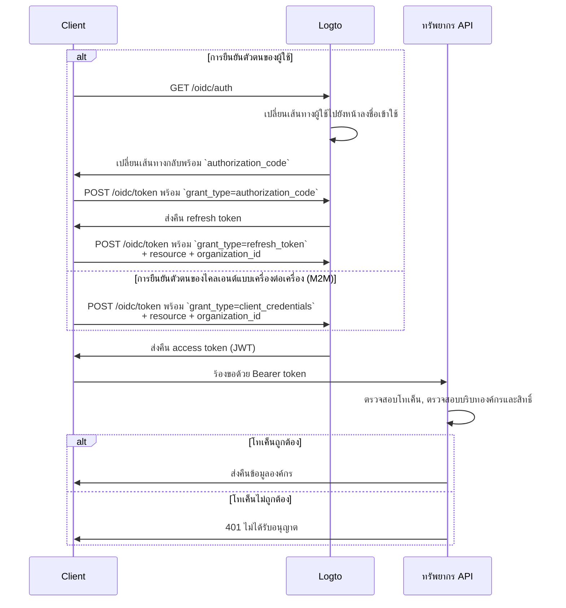

import illustration from '@site/docs/authorization/assets/rbac-organization-level-api-resources.png';
import AuthorizationRequestExample from '@site/docs/authorization/fragments/AuthorizationRequestExample';
import ClientCredentialsRequestExample from '@site/docs/authorization/fragments/ClientCredentialsRequestExample';
import TokenRequestExample from '@site/docs/authorization/fragments/TokenRequestExample';
import HandleUserPermissionChange from '@site/docs/authorization/fragments/_handle-user-permission-change.mdx';
import TabItem from '@theme/TabItem';
import Tabs from '@theme/Tabs';

import InspectOrganizationClaim from './fragments/_inspect-organization-claim.md';
import OrganizationTokenWarning from './fragments/_organization-token-warning.md';

# ปกป้องทรัพยากร API ระดับองค์กร

export const resource = 'https://api.your-app.com/organizations';

ผสมผสานทรัพยากร API กับเทมเพลตองค์กรเพื่อจำกัดการเข้าถึง API และข้อมูลภายในแต่ละองค์กร เพื่อให้มั่นใจถึงการแยกข้อมูลในระดับผู้เช่า (tenant) สำหรับ SaaS ของคุณ

## ทรัพยากร API ระดับองค์กรคืออะไร? \{#what-are-organization-level-api-resources}

ทรัพยากร API ระดับองค์กร คือ endpoint หรือบริการในแอปพลิเคชันของคุณที่ **ถูกกำหนดขอบเขตให้กับองค์กรใดองค์กรหนึ่ง** API เหล่านี้จะบังคับใช้การอนุญาต (authorization) และการเข้าถึงตามบริบทขององค์กร เพื่อให้แน่ใจว่าผู้ใช้หรือไคลเอนต์จะเข้าถึงข้อมูลและการกระทำที่เกี่ยวข้องกับองค์กรของตนเท่านั้น

**ตัวอย่างการใช้งาน**

- API สำหรับจัดการสมาชิกองค์กร, บทบาท หรือการตั้งค่า (เช่น `/organizations/{organizationId}/members`)
- แดชบอร์ด, การวิเคราะห์ หรือรายงานที่จำกัดขอบเขตในแต่ละองค์กร
- Endpoint สำหรับการเรียกเก็บเงิน, การสมัครสมาชิก หรือการตรวจสอบที่ผูกกับองค์กร
- API ใด ๆ ที่การกระทำและข้อมูลถูกแยกตามผู้เช่า (tenant)

Logto ช่วยให้คุณรักษาความปลอดภัยให้กับ API องค์กรเหล่านี้โดยใช้ OAuth 2.1 และ RBAC พร้อมรองรับสถาปัตยกรรม SaaS แบบหลายผู้เช่า (multi-tenant)

สิทธิ์เหล่านี้ถูกจัดการผ่าน **บทบาทขององค์กร (organization roles)** ที่กำหนดไว้ใน [เทมเพลตองค์กร](/authorization/organization-template) ทุกองค์กรจะใช้เทมเพลตเดียวกัน เพื่อให้แน่ใจว่ามีโมเดลสิทธิ์ที่สอดคล้องกันในทุกองค์กร

## วิธีการทำงานใน Logto \{#how-it-works-in-logto}

- **ทรัพยากร API และสิทธิ์ถูกลงทะเบียนในระดับโกลบอล:** ทรัพยากร API แต่ละรายการจะถูกกำหนดด้วย resource indicator (URI) ที่ไม่ซ้ำกันและชุดสิทธิ์ (scopes) ใน Logto
- **บทบาทในระดับองค์กร:** บทบาทขององค์กรถูกกำหนดในเทมเพลตองค์กร สิทธิ์ของทรัพยากร API (scopes) จะถูกกำหนดให้กับบทบาทขององค์กร ซึ่งจะถูกกำหนดให้กับผู้ใช้หรือไคลเอนต์ **ภายในแต่ละองค์กร**
- **การอนุญาตที่รับรู้บริบท:** เมื่อไคลเอนต์ร้องขอโทเค็นการเข้าถึงพร้อมทั้ง API resource และ `organization_id` Logto จะออกโทเค็นที่มีทั้งบริบทขององค์กรและ API audience สิทธิ์ (scopes) ของโทเค็นจะถูกกำหนดโดยบทบาทของผู้ใช้ในองค์กรที่ระบุ
- **แยกจากทรัพยากรโกลบอล:** ทรัพยากร API สามารถเข้าถึงได้ทั้งแบบมีหรือไม่มีบริบทองค์กร RBAC ขององค์กรจะถูกนำมาใช้ก็ต่อเมื่อมี `organization_id` ในคำขอ สำหรับ API ที่ใช้ร่วมกันระหว่างผู้ใช้ทุกคน ดู [ปกป้องทรัพยากร API ระดับโกลบอล](/authorization/global-api-resources)

### ภาพรวมการใช้งาน \{#implementation-overview}

1. **ลงทะเบียนทรัพยากร API ของคุณ** และกำหนดสิทธิ์ (scopes) ใน Logto
2. **กำหนดบทบาทองค์กร** ในเทมเพลตองค์กรและกำหนดสิทธิ์ API ที่เกี่ยวข้อง
3. **กำหนดบทบาท** ให้กับผู้ใช้หรือไคลเอนต์ภายในแต่ละองค์กร
4. **ร้องขอโทเค็นการเข้าถึง** สำหรับ API พร้อม `organization_id` เพื่อรวมบริบทขององค์กร
5. **ตรวจสอบโทเค็นการเข้าถึง** ใน API ของคุณ โดยบังคับใช้ทั้งบริบทองค์กรและสิทธิ์

### วิธีที่ Logto ใช้ RBAC ระดับองค์กร \{#how-logto-applies-organization-rbac}

- หากคุณร้องขอโทเค็นการเข้าถึง **โดยไม่มี** `organization_id` จะพิจารณาเฉพาะบทบาท/สิทธิ์ระดับโกลบอลเท่านั้น
- หากคุณร้องขอโทเค็นการเข้าถึง **พร้อม** `organization_id` Logto จะประเมินบทบาทของผู้ใช้ในองค์กรและสิทธิ์ที่เกี่ยวข้องสำหรับองค์กรนั้น
- JWT ที่ได้จะมีทั้ง API audience (`aud` claim) และบริบทองค์กร (`organization_id` claim) โดย scopes จะถูกกรองเฉพาะที่ได้รับจากบทบาทของผู้ใช้ในองค์กรนั้น

### กระบวนการอนุญาต: การยืนยันตัวตนและรักษาความปลอดภัย API ด้วยบริบทองค์กร \{#authorization-flow-authenticating-and-securing-apis-with-organization-context}

แผนภาพต่อไปนี้แสดงให้เห็นว่าไคลเอนต์ (เว็บ, มือถือ หรือ backend) ขอและใช้โทเค็นองค์กรเพื่อเข้าถึงทรัพยากร API ระดับองค์กรอย่างไร

โปรดทราบว่า flow นี้ไม่ได้ลงรายละเอียดพารามิเตอร์หรือ header ที่จำเป็นทั้งหมด แต่เน้นขั้นตอนสำคัญที่เกี่ยวข้อง อ่านต่อเพื่อดูตัวอย่างการใช้งานจริง

_การยืนยันตัวตนของผู้ใช้ = เบราว์เซอร์/แอป. M2M = บริการ backend หรือ script ที่ใช้ client credentials + บริบทองค์กร_

## ขั้นตอนการใช้งาน \{#implementation-steps}

### ลงทะเบียนทรัพยากร API ของคุณ \{#register-your-api-resource}

1. ไปที่ <CloudLink to="/api-resources">Console → API resources</CloudLink>
2. สร้างทรัพยากร API ใหม่ (เช่น `https://api.yourapp.com/org`) และกำหนดสิทธิ์ (scopes)

สำหรับขั้นตอนการตั้งค่าแบบละเอียด ดู [กำหนดทรัพยากร API พร้อมสิทธิ์](/authorization/role-based-access-control#define-api-resources-with-permissions)

### ตั้งค่าบทบาทองค์กร \{#set-up-organization-roles}

1. ไปที่ <CloudLink to="/organization-template/organization-roles">Console → Organization template → Organization roles</CloudLink>
2. สร้างบทบาทองค์กร (เช่น `admin`, `member`) และกำหนดสิทธิ์ API ให้แต่ละบทบาท
3. กำหนดบทบาทให้กับผู้ใช้หรือไคลเอนต์ภายในแต่ละองค์กร หากยังไม่เป็นสมาชิก ให้เชิญหรือเพิ่มเข้าก่อน

สำหรับขั้นตอนการตั้งค่าแบบละเอียด ดู [การใช้บทบาทองค์กร](/authorization/role-based-access-control#configure-organization-roles)

### ขอรับโทเค็นองค์กรสำหรับทรัพยากร API \{#obtain-organization-tokens-for-api-resources}

ไคลเอนต์/แอปของคุณควรร้องขอโทเค็นโดยระบุทั้ง `resource` และ `organization_id` เพื่อเข้าถึง API ระดับองค์กร Logto จะออกโทเค็นองค์กรเป็น [JSON Web Tokens (JWTs)](https://auth.wiki/jwt) คุณสามารถขอรับได้ทั้งผ่าน [refresh token flow](https://auth.wiki/refresh-token) หรือ [client credentials flow](https://auth.wiki/client-credentials-flow)

#### Refresh token flow \{#refresh-token-flow}

เกือบทุก SDK อย่างเป็นทางการของ Logto รองรับการขอโทเค็นองค์กรผ่าน refresh token flow ได้ทันที คุณยังสามารถใช้ไลบรารี OAuth 2.0 / OIDC client มาตรฐานเพื่อใช้งาน flow นี้ได้

<Tabs groupId="user-client">
<TabItem value="logto-sdk" label="Logto SDK">

เมื่อเริ่มต้น Logto SDK ให้เพิ่ม `urn:logto:scope:organizations` และสิทธิ์ขององค์กรที่ต้องการ (scopes) ลงในพารามิเตอร์ `scopes`

บาง SDK ของ Logto มี scope สำหรับองค์กรที่กำหนดไว้ล่วงหน้า เช่น `UserScope.Organizations` ใน JavaScript SDK

<InspectOrganizationClaim />

เมื่อเรียก `getAccessToken()` ให้ระบุทั้ง API resource (`resource`) และรหัสองค์กร (`organizationId`) เพื่อขอโทเค็นองค์กร

ดูรายละเอียดของแต่ละ SDK ได้ที่ [Quick starts](/quick-starts)

</TabItem>
<TabItem value="oauth-client" label="OAuth 2.0 / OIDC client library">

เมื่อกำหนดค่า OAuth 2.0 client หรือเริ่มต้น authorization code flow ให้แน่ใจว่าคุณรวมพารามิเตอร์ต่อไปนี้:

- `resource`: ตั้งค่าเป็นตัวระบุทรัพยากร API ที่ลงทะเบียนใน Logto (เช่น `https://api.your-app.com/organizations`)
- `scope`: รวม scope องค์กรที่กำหนดไว้ (`urn:logto:scope:organizations`), `offline_access` (เพื่อรับ refresh token) และสิทธิ์ API เฉพาะที่คุณต้องการ (เช่น `manage:members view:analytics`)

บางไลบรารีอาจไม่รองรับ `resource` โดยตรง แต่โดยทั่วไปจะอนุญาตให้ส่งพารามิเตอร์เพิ่มเติมใน authorization request ได้ ตรวจสอบเอกสารของไลบรารีที่คุณใช้

ตัวอย่างที่ไม่เป็นทางการของ authorization request อาจมีลักษณะดังนี้:

<AuthorizationRequestExample
  resource={resource}
  scope="urn:logto:scope:organizations invite:member manage:billing"
/>

เมื่อผู้ใช้ได้รับการยืนยันตัวตนแล้ว คุณจะได้รับ authorization code ใช้ code นี้โดยส่ง POST ไปที่ endpoint `/oidc/token` ของ Logto

ตัวอย่างที่ไม่เป็นทางการของ token request:

<TokenRequestExample grantType="authorization_code" />

<OrganizationTokenWarning />

คุณจะได้รับ refresh token ที่สามารถใช้ขอโทเค็นองค์กรได้

<InspectOrganizationClaim />

สุดท้าย ใช้ refresh token เพื่อขอโทเค็นองค์กรโดยส่ง POST ไปที่ endpoint `/oidc/token` ของ Logto อย่าลืมระบุ:

- พารามิเตอร์ `resource` ตั้งค่าเป็นตัวระบุทรัพยากร API (เช่น `https://api.yourapp.com/org`)
- พารามิเตอร์ `organization_id` ตั้งค่าเป็นรหัสองค์กรที่ต้องการ
- (ไม่บังคับ) พารามิเตอร์ `scope` เพื่อจำกัดสิทธิ์ที่ต้องการเพิ่มเติม (เช่น `manage:members view:reports`)

ตัวอย่างที่ไม่เป็นทางการของ token request:

<TokenRequestExample
  grantType="refresh_token"
  resource={resource}
  organizationId="your-organization-id"
/>

</TabItem>
</Tabs>

#### Client credentials flow \{#client-credentials-flow}

สำหรับกรณีเครื่องต่อเครื่อง (M2M) คุณสามารถใช้ client credentials flow เพื่อขอโทเค็นการเข้าถึงสำหรับสิทธิ์ทรัพยากร API ระดับองค์กร โดยส่ง POST ไปที่ endpoint `/oidc/token` ของ Logto พร้อมพารามิเตอร์องค์กร คุณสามารถขอโทเค็นองค์กรโดยใช้ client ID และ secret ของคุณ

พารามิเตอร์สำคัญที่ต้องรวมในคำขอ:

- `resource`: ตัวระบุทรัพยากร API (เช่น `https://api.yourapp.com/org`)
- `organization_id`: รหัสองค์กรที่คุณต้องการโทเค็น
- `scope`: สิทธิ์ทรัพยากร API ระดับองค์กรที่คุณต้องการ (เช่น `invite:member`, `manage:billing`)

ตัวอย่างที่ไม่เป็นทางการของ token request ด้วย client credentials grant type:

<ClientCredentialsRequestExample
  resource="https://api.yourapp.com/org"
  organizationId="your-organization-id"
  scope="invite:member manage:billing"
/>

### ตรวจสอบโทเค็นองค์กร \{#validate-organization-tokens}

โทเค็นองค์กร (JWTs) ที่ออกโดย Logto จะมี claim ที่ API ของคุณสามารถใช้เพื่อบังคับใช้การควบคุมการเข้าถึงระดับองค์กร

เมื่อแอปของคุณได้รับโทเค็นองค์กร คุณควร:

- ตรวจสอบลายเซ็นของโทเค็น (โดยใช้ JWKs ของ Logto)
- ยืนยันว่าโทเค็นไม่หมดอายุ (`exp` claim)
- ตรวจสอบว่า `iss` (issuer) ตรงกับ endpoint Logto ของคุณ
- ตรวจสอบว่า `aud` (audience) ตรงกับตัวระบุทรัพยากร API ที่คุณลงทะเบียน (เช่น `https://api.yourapp.com/org`)
- ตรวจสอบ claim `organization_id` เพื่อให้แน่ใจว่าโทเค็นถูกจำกัดขอบเขตกับองค์กรที่ถูกต้อง
- แยก claim `scope` (คั่นด้วยช่องว่าง) และตรวจสอบสิทธิ์ที่ต้องการ
- หาก path ของ API มีรหัสองค์กร (เช่น `/organizations/{organizationId}/members`) ให้ตรวจสอบว่า claim `organization_id` ตรงกับพารามิเตอร์ path

สำหรับคู่มือแบบทีละขั้นตอนและเฉพาะภาษา ดู [วิธีตรวจสอบโทเค็นการเข้าถึง](/authorization/validate-access-tokens)

<HandleUserPermissionChange type="organization" />

## แนวปฏิบัติที่ดีและเคล็ดลับด้านความปลอดภัย \{#best-practices-and-security-tips}

- **ตรวจสอบบริบทองค์กรเสมอ:** อย่าเชื่อถือแค่โทเค็น ให้ตรวจสอบ claim `organization_id` สำหรับทุก API ที่จำกัดขอบเขตองค์กร
- **ใช้ข้อจำกัด audience:** ตรวจสอบ claim `aud` เสมอเพื่อให้แน่ใจว่าโทเค็นสำหรับองค์กรที่ต้องการ
- **ให้สิทธิ์สอดคล้องกับธุรกิจ:** ใช้ชื่อที่ชัดเจนและตรงกับการกระทำจริง กำหนดเฉพาะสิ่งที่จำเป็นสำหรับแต่ละบทบาทองค์กร
- **แยกสิทธิ์ API และ non-API** หากเป็นไปได้ (แต่ทั้งสองอย่างสามารถอยู่ในบทบาทเดียวกันได้)
- **กำหนดอายุโทเค็นให้สั้น:** ลดความเสี่ยงหากโทเค็นรั่วไหล
- **ทบทวนเทมเพลตองค์กรของคุณเป็นประจำ:** อัปเดตบทบาทและสิทธิ์เมื่อผลิตภัณฑ์ของคุณเปลี่ยนแปลง

## คำถามที่พบบ่อย \{#faqs}

### ถ้าฉันไม่ใส่ `organization_id` ในคำขอโทเค็นจะเกิดอะไรขึ้น? \{#what-if-i-don-t-include-organization-id-in-my-token-request}

จะพิจารณาเฉพาะบทบาท/สิทธิ์ระดับโกลบอลเท่านั้น RBAC ขององค์กรจะไม่ถูกบังคับใช้

### สามารถผสมสิทธิ์องค์กรและ non-organization ในบทบาทเดียวกันได้หรือไม่? \{#can-i-mix-organization-and-non-organization-permissions-in-a-single-role}

ไม่ได้ สิทธิ์องค์กร (รวมถึงสิทธิ์ API ระดับองค์กร) ถูกกำหนดโดยเทมเพลตองค์กรและไม่สามารถผสมกับสิทธิ์ API โกลบอลได้ อย่างไรก็ตาม คุณสามารถสร้างบทบาทที่มีทั้งสิทธิ์องค์กรและสิทธิ์ API ระดับองค์กรได้

## อ่านเพิ่มเติม \{#further-reading}

<Url href="/authorization/validate-access-tokens">วิธีตรวจสอบโทเค็นการเข้าถึง</Url>
<Url href="/developers/custom-token-claims">ปรับแต่ง token claims</Url>
<Url href="/use-cases/multi-tenancy/build-multi-tenant-saas-application">
  กรณีศึกษา: สร้างแอป SaaS แบบหลายผู้เช่า
</Url>
<Url href="https://www.rfc-editor.org/rfc/rfc8707.html">RFC 8707: Resource Indicators</Url>
