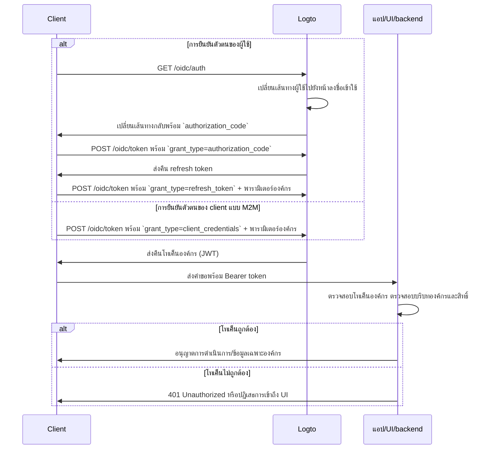

import illustration from '@site/docs/authorization/assets/rbac-organization-permissions.png';
import AuthorizationRequestExample from '@site/docs/authorization/fragments/AuthorizationRequestExample';
import ClientCredentialsRequestExample from '@site/docs/authorization/fragments/ClientCredentialsRequestExample';
import TokenRequestExample from '@site/docs/authorization/fragments/TokenRequestExample';
import HandleUserPermissionChange from '@site/docs/authorization/fragments/_handle-user-permission-change.mdx';
import TabItem from '@theme/TabItem';
import Tabs from '@theme/Tabs';

import InspectOrganizationClaim from './fragments/_inspect-organization-claim.md';
import OrganizationTokenWarning from './fragments/_organization-token-warning.md';

# ปกป้องสิทธิ์ขององค์กร (ที่ไม่ใช่ API)

ใช้เทมเพลตองค์กรเพื่อจัดการและบังคับใช้บทบาทและสิทธิ์ในระดับองค์กรใน Logto เพื่อควบคุมการเข้าถึงฟีเจอร์และเวิร์กโฟลว์ภายในแอปในบริบทขององค์กร

## สิทธิ์ขององค์กร (ที่ไม่ใช่ API) คืออะไร? \{#what-are-organization-non-api-permissions}

สิทธิ์ขององค์กร (ที่ไม่ใช่ API) จะควบคุมสิ่งที่ผู้ใช้สามารถทำได้ **ภายในบริบทขององค์กร** แต่จะไม่ **ถูกบังคับใช้ในระดับ API** โดยจะควบคุมการเข้าถึงฟีเจอร์ของแอป องค์ประกอบ UI เวิร์กโฟลว์ หรือการดำเนินการทางธุรกิจ แทนที่จะเป็น API ฝั่ง backend

**ตัวอย่างการใช้งาน เช่น**

- เชิญหรือจัดการสมาชิกภายในองค์กร
- กำหนดหรือเปลี่ยนบทบาทขององค์กร
- จัดการการเรียกเก็บเงิน การตั้งค่า หรือฟังก์ชันผู้ดูแลระบบขององค์กร
- เข้าถึงแดชบอร์ด การวิเคราะห์ หรือเครื่องมือภายในที่ไม่มี API endpoint

Logto ช่วยให้คุณรักษาความปลอดภัยสิทธิ์ขององค์กรเหล่านี้โดยใช้ OAuth 2.1 และ RBAC พร้อมรองรับสถาปัตยกรรม SaaS แบบหลายผู้เช่า

สิทธิ์เหล่านี้ถูกจัดการผ่าน **บทบาทขององค์กร** ที่กำหนดไว้ใน [เทมเพลตองค์กร](/authorization/organization-template) โดยทุกองค์กรจะใช้เทมเพลตเดียวกัน เพื่อให้แนวทางสิทธิ์สอดคล้องกันในทุกองค์กร

## วิธีการทำงานใน Logto \{#how-it-works-in-logto}

- **RBAC ระดับองค์กร:** บทบาทและสิทธิ์ถูกกำหนดในเทมเพลตองค์กร เมื่อผู้ใช้เข้าร่วมองค์กร จะได้รับบทบาทหนึ่งหรือมากกว่าเพื่อรับสิทธิ์ที่กำหนด
- **การบังคับใช้ที่ไม่ใช่ API:** การตรวจสอบสิทธิ์จะเกิดขึ้นใน UI ของแอป เวิร์กโฟลว์ หรือ logic ฝั่ง backend ของคุณ ไม่จำเป็นต้องผ่าน API gateway
- **แยกจากการปกป้อง API:** สิทธิ์ขององค์กร (ที่ไม่ใช่ API) จะแตกต่างจากสิทธิ์ของทรัพยากร API คุณสามารถผสมผสานทั้งสองแบบสำหรับกรณีการใช้งานขั้นสูง

  

### ภาพรวมการนำไปใช้ \{#implementation-overview}

1. **กำหนดสิทธิ์ขององค์กร** ใน Logto ภายใต้เทมเพลตองค์กร
2. **สร้างบทบาทขององค์กร** ที่รวมสิทธิ์ที่จำเป็นสำหรับการดำเนินการเฉพาะขององค์กร
3. **กำหนดบทบาท** ให้กับผู้ใช้หรือ client ในแต่ละองค์กร
4. **ขอโทเค็นองค์กร (JWT)** สำหรับองค์กรปัจจุบันโดยใช้ refresh token หรือ client credentials flow
5. **ตรวจสอบ access token** ใน UI หรือ backend ของแอปเพื่อบังคับใช้สิทธิ์ขององค์กร

### กระบวนการอนุญาต: การยืนยันตัวตนและปกป้องสิทธิ์ขององค์กร \{#authorization-flow-authenticating-and-securing-organization-permissions}

แผนภาพต่อไปนี้แสดงวิธีที่ client (เว็บ, มือถือ, หรือ backend) ขอและใช้โทเค็นองค์กรเพื่อบังคับใช้สิทธิ์ที่ไม่ใช่ API

โปรดทราบว่า flow นี้ไม่ได้รวมรายละเอียดพารามิเตอร์หรือ header ทั้งหมด แต่เน้นขั้นตอนสำคัญ อ่านต่อเพื่อดูตัวอย่างการทำงานจริง

_การยืนยันตัวตนของผู้ใช้ = เบราว์เซอร์/แอป M2M = บริการ backend หรือ script ที่ใช้ client credentials + บริบทองค์กร_

## ขั้นตอนการนำไปใช้ \{#implementation-steps}

### ลงทะเบียนสิทธิ์ขององค์กร \{#register-organization-permissions}

1. ไปที่ <CloudLink to="/organization-template/organization-permissions">Console → เทมเพลตองค์กร → สิทธิ์ขององค์กร</CloudLink>
2. กำหนดสิทธิ์ขององค์กรที่คุณต้องการ (เช่น `invite:member`, `manage:billing`, `view:analytics`)

สำหรับขั้นตอนการตั้งค่าแบบเต็ม ดู [กำหนดสิทธิ์ขององค์กร](/authorization/role-based-access-control#define-organization-permissions)

### ตั้งค่าบทบาทขององค์กร \{#set-up-organization-roles}

1. ไปที่ <CloudLink to="/organization-template/organization-roles">Console → เทมเพลตองค์กร → บทบาทขององค์กร</CloudLink>
2. สร้างบทบาทที่รวมสิทธิ์ขององค์กรที่คุณกำหนดไว้ก่อนหน้า (เช่น `admin`, `member`, `billing`)
3. กำหนดบทบาทเหล่านี้ให้กับผู้ใช้หรือ client ในแต่ละองค์กร

สำหรับขั้นตอนการตั้งค่าแบบเต็ม ดู [ใช้บทบาทขององค์กร](/authorization/role-based-access-control#configure-organization-roles)

### ขอรับโทเค็นองค์กร (ที่ไม่ใช่ API) \{#obtain-organization-tokens-non-api}

client/แอปของคุณควรขอโทเค็นองค์กร (ที่ไม่ใช่ API) เพื่อเข้าถึงสิทธิ์ขององค์กร Logto จะออกโทเค็นองค์กรเป็น [JSON Web Tokens (JWTs)](https://auth.wiki/jwt) คุณสามารถขอโทเค็นเหล่านี้ได้โดยใช้ [refresh token flow](https://auth.wiki/refresh-token) หรือ [client credentials flow](https://auth.wiki/client-credentials-flow)

#### Refresh token flow \{#refresh-token-flow}

เกือบทุก SDK อย่างเป็นทางการของ Logto รองรับการขอโทเค็นองค์กรโดยใช้ refresh token flow ได้ทันที ไลบรารี client มาตรฐาน OAuth 2.0 / OIDC ก็สามารถนำไปใช้ได้เช่นกัน

<Tabs groupId="user-client">
<TabItem value="logto-sdk" label="Logto SDK">

เมื่อเริ่มต้น Logto SDK ให้เพิ่ม `urn:logto:scope:organizations` และสิทธิ์ขององค์กรที่ต้องการ (scopes) ลงในพารามิเตอร์ `scopes`

บาง SDK ของ Logto มี scope สำหรับองค์กรที่กำหนดไว้ล่วงหน้า เช่น `UserScope.Organizations` ใน JavaScript SDK

<InspectOrganizationClaim />

ใช้ `getOrganizationToken` หรือเมธอดที่คล้ายกัน (เช่น `getAccessToken` พร้อม organization ID) เพื่อขอโทเค็นองค์กรสำหรับองค์กรที่ต้องการ

สำหรับรายละเอียดของแต่ละ SDK ดู [Quick starts](/quick-starts)

</TabItem>
<TabItem value="oauth-client" label="OAuth 2.0 / OIDC client library">

เมื่อกำหนดค่า OAuth 2.0 client หรือเริ่มต้น authorization code flow ให้แน่ใจว่าคุณใส่พารามิเตอร์ต่อไปนี้:

- `resource`: ตั้งค่าเป็น `urn:logto:resource:organizations` เพื่อระบุว่าต้องการโทเค็นองค์กร
- `scope`: รวม scope องค์กรที่กำหนดไว้ (`urn:logto:scope:organizations`), `offline_access` (เพื่อรับ refresh token) และสิทธิ์ขององค์กรที่ต้องการ (เช่น `invite:member`, `manage:billing`)

บางไลบรารีอาจไม่รองรับพารามิเตอร์ `resource` โดยตรง แต่โดยทั่วไปจะอนุญาตให้ส่งพารามิเตอร์เพิ่มเติมใน authorization request ได้ ตรวจสอบเอกสารของไลบรารีของคุณ

ตัวอย่างที่ไม่เป็นทางการของ authorization request:

<AuthorizationRequestExample
  scope="urn:logto:scope:organizations invite:member manage:billing"
  resource="urn:logto:resource:organizations"
/>

เมื่อผู้ใช้ได้รับการยืนยันตัวตนแล้ว คุณจะได้รับ authorization code ใช้ code นี้โดยส่ง POST request ไปที่ endpoint `/oidc/token` ของ Logto

ตัวอย่างที่ไม่เป็นทางการของ token request:

<TokenRequestExample grantType="authorization_code" />

<OrganizationTokenWarning />

คุณจะได้รับ refresh token ที่สามารถใช้ขอโทเค็นองค์กรได้

<InspectOrganizationClaim />

สุดท้าย ใช้ refresh token เพื่อขอโทเค็นองค์กรโดยส่ง POST request ไปที่ endpoint `/oidc/token` ของ Logto อย่าลืมใส่:

- พารามิเตอร์ `organization_id` ตั้งค่าเป็น organization ID ที่ต้องการ
- (ไม่บังคับ) พารามิเตอร์ `scope` เพื่อจำกัดสิทธิ์ที่ต้องการเพิ่มเติม (เช่น `manage:members view:reports`)

ตัวอย่างที่ไม่เป็นทางการของ token request:

<TokenRequestExample grantType="refresh_token" organizationId="your-organization-id" />

</TabItem>
</Tabs>

#### Client credentials flow \{#client-credentials-flow}

สำหรับกรณีเครื่องต่อเครื่อง (M2M) คุณสามารถใช้ client credentials flow เพื่อขอ access token สำหรับสิทธิ์ขององค์กร โดยส่ง POST request ไปที่ endpoint `/oidc/token` ของ Logto พร้อมพารามิเตอร์องค์กร คุณสามารถขอโทเค็นองค์กรโดยใช้ client ID และ secret ของคุณ

พารามิเตอร์สำคัญที่ต้องใส่ใน request:

- `organization_id`: ID ขององค์กรที่ต้องการโทเค็น
- `scope`: สิทธิ์ขององค์กรที่ต้องการ (เช่น `invite:member`, `manage:billing`)

ตัวอย่างที่ไม่เป็นทางการของ token request โดยใช้ client credentials grant type:

<ClientCredentialsRequestExample
  organizationId="your-organization-id"
  scope="invite:member manage:billing"
/>

### ตรวจสอบโทเค็นองค์กร \{#validate-organization-tokens}

โทเค็นองค์กร (JWTs) ที่ออกโดย Logto จะมีการอ้างสิทธิ์ (claims) ที่แอป/UI/backend ของคุณสามารถใช้เพื่อบังคับใช้การควบคุมการเข้าถึงในระดับองค์กร

เมื่อแอปของคุณได้รับโทเค็นองค์กร คุณควร:

- ตรวจสอบลายเซ็นของโทเค็น (โดยใช้ JWKs ของ Logto)
- ยืนยันว่าโทเค็นไม่หมดอายุ (`exp` claim)
- ตรวจสอบว่า `iss` (ผู้ออก) ตรงกับ endpoint Logto ของคุณ
- ตรวจสอบว่า `aud` (ผู้รับ) ตรงกับตัวระบุองค์กรที่ฟอร์แมตไว้ (เช่น `urn:logto:organization:{organization_id}`)
- แยก claim `scope` (คั่นด้วยช่องว่าง) และตรวจสอบสิทธิ์ที่ต้องการ

สำหรับคู่มือแบบทีละขั้นตอนและเฉพาะภาษา ดู [วิธีตรวจสอบ access token](/authorization/validate-access-tokens)

<HandleUserPermissionChange type="organization" />

## แนวปฏิบัติที่ดีและเคล็ดลับด้านความปลอดภัย \{#best-practices-and-security-tips}

- **อย่าอาศัยการบังคับใช้เฉพาะ UI:** ควรตรวจสอบสิทธิ์ใน backend สำหรับการดำเนินการสำคัญเสมอ
- **ใช้ข้อจำกัดผู้รับ (audience restriction):** ตรวจสอบ claim `aud` เสมอเพื่อให้แน่ใจว่าโทเค็นสำหรับองค์กรที่ต้องการ
- **ตั้งชื่อสิทธิ์ให้สอดคล้องกับธุรกิจ:** ใช้ชื่อที่ชัดเจนและตรงกับการกระทำจริง กำหนดเฉพาะสิทธิ์ที่จำเป็นสำหรับแต่ละบทบาทองค์กร
- **แยกสิทธิ์ API และที่ไม่ใช่ API** เมื่อเป็นไปได้ (แต่สามารถอยู่ในบทบาทเดียวกันได้)
- **ทบทวนเทมเพลตองค์กรเป็นประจำ** เมื่อผลิตภัณฑ์ของคุณพัฒนา

## คำถามที่พบบ่อย \{#faqs}

### สามารถผสมสิทธิ์ขององค์กรและที่ไม่ใช่องค์กรในบทบาทเดียวกันได้หรือไม่? \{#can-i-mix-organization-and-non-organization-permissions-in-a-single-role}

ไม่ได้ สิทธิ์ขององค์กร (รวมถึงสิทธิ์ API ระดับองค์กร) ถูกกำหนดโดยเทมเพลตองค์กรและไม่สามารถผสมกับสิทธิ์ API ระดับโกลบอลได้ อย่างไรก็ตาม คุณสามารถสร้างบทบาทที่มีทั้งสิทธิ์ขององค์กรและสิทธิ์ API ระดับองค์กรได้

### ควรบังคับใช้สิทธิ์ที่ไม่ใช่ API ที่ไหน? \{#where-should-i-enforce-non-api-permissions}

ตรวจสอบสิทธิ์ที่ไม่ใช่ API ทั้งใน UI (สำหรับการจำกัดฟีเจอร์) และใน logic ฝั่ง server สำหรับการดำเนินการที่สำคัญ

## อ่านเพิ่มเติม \{#further-reading}

<Url href="/authorization/validate-access-tokens">วิธีตรวจสอบ access token</Url>
<Url href="/developers/custom-token-claims">การปรับแต่ง token claims</Url>
<Url href="/use-cases/multi-tenancy/build-multi-tenant-saas-application">
  กรณีศึกษา: สร้างแอป SaaS แบบหลายผู้เช่า
</Url>
