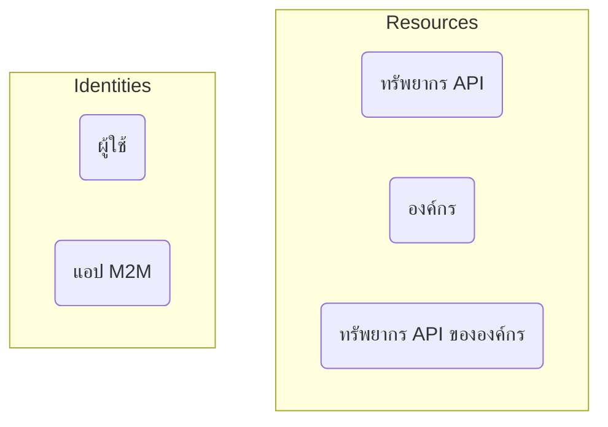

# การยืนยันตัวตน (Authentication) กับ การอนุญาต (Authorization)

ความแตกต่างระหว่าง **การยืนยันตัวตน (Authentication)** และ **การอนุญาต (Authorization)** สามารถสรุปได้ดังนี้:

- **การยืนยันตัวตน (Authentication)** ตอบคำถามว่า “คุณมีอัตลักษณ์ใด?”
- **การอนุญาต (Authorization)** ตอบคำถามว่า “คุณสามารถทำอะไรได้บ้าง?”

สำหรับบทนำเกี่ยวกับระบบจัดการเอกลักษณ์และการเข้าถึงของลูกค้า (CIAM) แบบครบถ้วน สามารถดูได้จากชุดบทความของเรา:

- [CIAM 101: Authentication, Identity, SSO](https://blog.logto.io/ciam-101-intro-authn-sso/)
- [CIAM 102: Authorization & Role-based Access Control](https://blog.logto.io/ciam-102-authz-and-rbac/)

## การยืนยันตัวตน (Authentication) \{#authentication}

Logto รองรับวิธีการยืนยันตัวตนทั้งแบบโต้ตอบและไม่โต้ตอบหลายรูปแบบ ตัวอย่างเช่น:

- **ประสบการณ์การลงชื่อเข้าใช้**: กระบวนการยืนยันตัวตนสำหรับผู้ใช้ปลายทาง
- **การยืนยันตัวตนระหว่างเครื่อง (Machine-to-machine; M2M)**: กระบวนการยืนยันตัวตนสำหรับบริการหรือแอปพลิเคชัน

เป้าหมายสูงสุดของการยืนยันตัวตนเรียบง่ายมาก: เพื่อตรวจสอบและรับตัวระบุที่ไม่ซ้ำของเอนทิตี (ใน Logto คือ ผู้ใช้ หรือ แอปพลิเคชัน)

## การอนุญาต (Authorization) \{#authorization}

ใน Logto การอนุญาตทำผ่านการควบคุมการเข้าถึงตามบทบาท (RBAC). สิ่งนี้ทำให้คุณควบคุมการเข้าถึงของผู้ใช้หรือแอป M2M ของคุณต่อสิ่งต่อไปนี้ได้อย่างเต็มที่:

- **ทรัพยากร API (API resources)**: เอนทิตีระดับโกลบอลที่แสดงด้วย URI แบบสัมบูรณ์
- **องค์กร (Organizations)**: กลุ่มของผู้ใช้หรือแอปพลิเคชัน
- **ทรัพยากร API ขององค์กร (Organization API resources)**: ทรัพยากร API ที่เป็นขององค์กรหนึ่ง

เพื่อเรียนรู้เพิ่มเติมเกี่ยวกับแนวคิดเหล่านี้ ดูแหล่งข้อมูลต่อไปนี้:

- [การควบคุมการเข้าถึงตามบทบาท (RBAC)](/authorization/role-based-access-control)
- [องค์กร (หลายผู้เช่า; Multi-tenancy)](/organizations)

นี่คือภาพแสดงความสัมพันธ์ของแนวคิดเหล่านี้:

โดยสรุป การอนุญาตคือการกำหนดกฎว่าหน่วยในกลุ่ม “Identities” สามารถเข้าถึงหน่วยในกลุ่ม “Resources” ได้บ้าง

## คำถามที่พบบ่อย \{#frequently-asked-questions}

### ฉันต้องระบุว่าผู้ใช้คนใดสามารถลงชื่อเข้าใช้แอปพลิเคชัน \{#i-need-to-specify-which-users-can-sign-in-to-an-application}

ด้วยธรรมชาติของ Single Sign-On (SSO) ปัจจุบัน Logto ไม่รองรับการใช้ “แอปพลิเคชัน” เป็นทรัพยากร โดยคุณสามารถกำหนด “ทรัพยากร API” และ “สิทธิ์ (permissions)” เพื่อควบคุมการเข้าถึงได้แทน

### ฉันต้องการให้ผู้ใช้ของฉันลงชื่อเข้าสู่องค์กร \{#i-need-my-users-to-sign-in-to-an-organization}

ดังที่กล่าวไป การยืนยันตัวตนคือการตรวจสอบตัวตนของเอนทิตี ในขณะที่การควบคุมการเข้าถึงจัดการผ่านการอนุญาต ดังนั้น:

- การตัดสินใจว่าผู้ใช้สังกัดองค์กรใดเป็นประเด็นของ “การอนุญาต”
- กระบวนการลงชื่อเข้าใช้เป็นประเด็นของ “การยืนยันตัวตน”

นั่นหมายความว่า ไม่มีแนวคิด “ลงชื่อเข้าสู่องค์กร” ใน Logto เมื่อผู้ใช้ได้รับการยืนยันตัวตนแล้ว เขาจะถูกอนุญาตให้เข้าถึงทุกทรัพยากร (รวมถึงทรัพยากรขององค์กร) ตามสิทธิ์ที่กำหนด

โมเดลนี้มีประสิทธิภาพและชัดเจน เพราะแยกความกังวลระหว่างการยืนยันตัวตนกับการอนุญาต ซอฟต์แวร์ SaaS สมัยใหม่ทั้งหมด เช่น GitHub และ Notion ใช้โมเดลนี้

อย่างไรก็ตาม บางกรณีคุณจำเป็นต้องสร้างการแมป 1-1 ระหว่างแหล่งที่มาของผู้ใช้กับองค์กร ในกรณีนี้ [Enterprise SSO](/end-user-flows/enterprise-sso) และ [การจัดเตรียม (Provisioning) แบบ Just-in-Time (JIT) ขององค์กร](/organizations/just-in-time-provisioning) จะช่วยได้

### ลูกค้าของเราต้องการปรับแต่งแบรนด์ในหน้าลงชื่อเข้าใช้ \{#our-customers-need-custom-branding-for-their-sign-in-pages}

โปรดดู [การตั้งค่าแบรนด์เฉพาะแอป](/customization/match-your-brand/#app-specific-branding) และ [การตั้งค่าแบรนด์เฉพาะองค์กร](/customization/match-your-brand/#organization-specific-branding) สำหรับการตั้งค่าที่เกี่ยวข้อง
