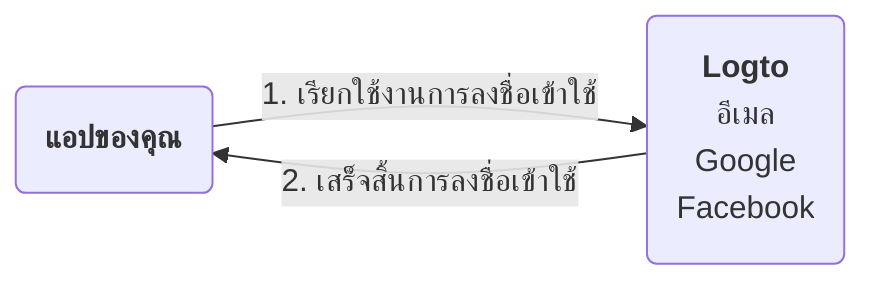
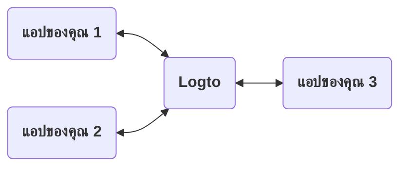
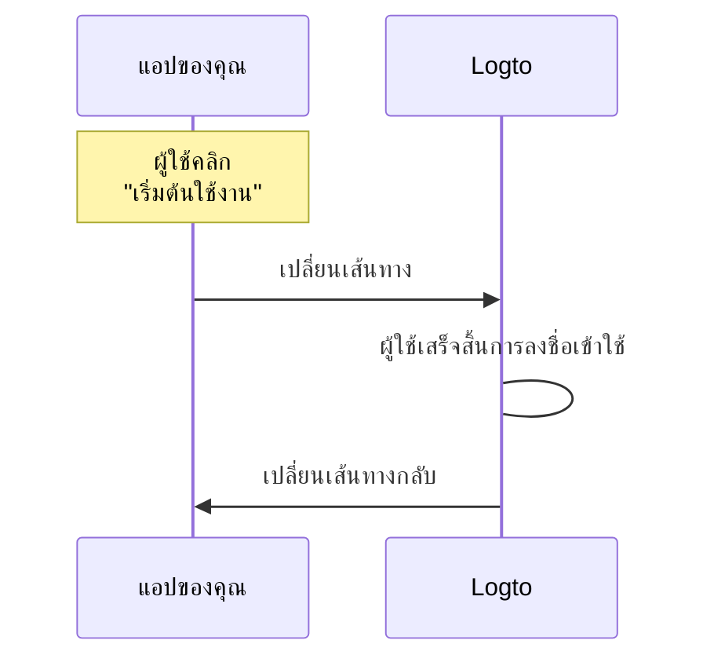
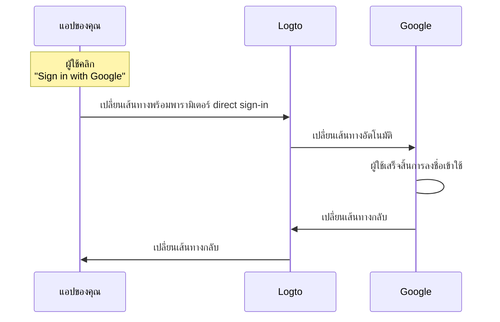

# อธิบายประสบการณ์การลงชื่อเข้าใช้

หน้านี้อธิบายประสบการณ์การลงชื่อเข้าใช้ใน Logto และเหตุผลที่ออกแบบเช่นนี้

## บทนำ \{#introduction}

ประสบการณ์การลงชื่อเข้าใช้คือกระบวนการการยืนยันตัวตน (Authentication) ของผู้ใช้ใน Logto กระบวนการนี้สามารถสรุปได้ดังนี้:


1. แอปของคุณเรียกใช้งานเมธอดการลงชื่อเข้าใช้
2. ผู้ใช้จะถูกเปลี่ยนเส้นทางไปยังหน้าลงชื่อเข้าใช้ของ Logto สำหรับแอปเนทีฟจะเปิดเบราว์เซอร์ของระบบ
3. ผู้ใช้ลงชื่อเข้าใช้และถูกเปลี่ยนเส้นทางกลับไปยังแอปของคุณ (กำหนดเป็น "Redirect URI" ใน Logto)

แม้ว่ากระบวนการจะดูเรียบง่าย แต่บางครั้งการเปลี่ยนเส้นทางอาจดูเกินความจำเป็น อย่างไรก็ตาม วิธีนี้มีข้อดีและความปลอดภัยในหลายด้าน เราจะอธิบายเหตุผลในหัวข้อต่อไปนี้

## ทำไมต้องเปลี่ยนเส้นทาง? \{#why-redirect}

### ความยืดหยุ่น \{#flexibility}

การเปลี่ยนเส้นทางช่วยให้คุณแยกกระบวนการยืนยันตัวตนออกจากแอปของคุณ เมื่อธุรกิจของคุณเติบโต คุณยังคงใช้กระบวนการยืนยันตัวตนเดิมได้โดยไม่ต้องเปลี่ยนแอป เช่น คุณสามารถเพิ่มการยืนยันตัวตนหลายปัจจัย (MFA) หรือเปลี่ยนวิธีการลงชื่อเข้าใช้โดยไม่ต้องแก้ไขแอป



### รองรับหลายแอป \{#multi-app-support}

หากคุณมีหลายแอป ผู้ใช้ของคุณสามารถลงชื่อเข้าใช้เพียงครั้งเดียวและเข้าถึงทุกแอปโดยไม่ต้องลงชื่อเข้าใช้ซ้ำ เหมาะอย่างยิ่งสำหรับธุรกิจ SaaS หรือบริษัทที่มีบริการหลายอย่าง



### แอปเนทีฟ \{#native-apps}

สำหรับแอปเนทีฟ การเปลี่ยนเส้นทางไปยังเบราว์เซอร์ของระบบเป็นวิธีที่ปลอดภัยในการยืนยันตัวตนผู้ใช้ และรองรับทั้ง iOS และ Android ในตัว

- **iOS**: Apple มี [ASWebAuthenticationSession](https://developer.apple.com/documentation/authenticationservices/aswebauthenticationsession) สำหรับการยืนยันตัวตนที่ปลอดภัย
- **Android**: Google มี [Custom Tabs](https://developer.chrome.com/docs/android/custom-tabs) เพื่อประสบการณ์ที่ราบรื่น

### ความปลอดภัย \{#security}

เบื้องหลัง Logto เป็นผู้ให้บริการ [OpenID Connect (OIDC)](https://openid.net/specs/openid-connect-core-1_0.html) ซึ่งเป็นมาตรฐานที่ได้รับการยอมรับอย่างกว้างขวางสำหรับการยืนยันตัวตนผู้ใช้

Logto บังคับใช้มาตรการความปลอดภัยอย่างเข้มงวด เช่น [PKCE](https://tools.ietf.org/html/rfc7636) และปิดใช้งาน flow ที่ไม่ปลอดภัย เช่น implicit flow การเปลี่ยนเส้นทางเป็นวิธีที่ปลอดภัยในการยืนยันตัวตนผู้ใช้และป้องกันการโจมตีที่พบบ่อยได้มากมาย

## ถ้าฉันต้องการแสดงคอมโพเนนต์การลงชื่อเข้าใช้บางอย่างในแอปของฉัน? \{#what-if-i-need-to-show-some-sign-in-components-in-my-app}

บางครั้งทีมของคุณอาจต้องการแสดงคอมโพเนนต์การลงชื่อเข้าใช้ในแอป เช่น ปุ่ม "Sign in with Google" สามารถทำได้โดยใช้ฟีเจอร์ "Direct sign-in" ใน Logto

### ทำงานอย่างไร? \{#how-does-it-work}

สมมติว่าในแอปของคุณมีปุ่ม call-to-action สองปุ่ม: "เริ่มต้นใช้งาน" และ "Sign in with Google" โดยปุ่มเหล่านี้ออกแบบให้:

- "เริ่มต้นใช้งาน": เปลี่ยนเส้นทางไปยังหน้าลงชื่อเข้าใช้ปกติ
- "Sign in with Google": เปลี่ยนเส้นทางไปยังหน้าลงชื่อเข้าใช้ของ Google

ทั้งสองการกระทำต้องดำเนินการลงชื่อเข้าใช้ให้เสร็จและเปลี่ยนเส้นทางกลับไปยังแอปของคุณ

---

#### กระบวนการคลิก "เริ่มต้นใช้งาน" \{#process-of-clicking-get-started}

ในกรณีนี้ ประสบการณ์การลงชื่อเข้าใช้จะเหมือนกับค่าเริ่มต้น ผู้ใช้จะถูกเปลี่ยนเส้นทางไปยังหน้าลงชื่อเข้าใช้ของ Logto และกลับไปยังแอปของคุณ



:::note
หากคุณตั้งค่าวิธีลงชื่อเข้าใช้โซเชียล (เช่น Google, Facebook) ใน Logto ผู้ใช้อาจถูกเปลี่ยนเส้นทางไปยังหน้าลงชื่อเข้าใช้ที่เกี่ยวข้อง ในภาพประกอบนี้จะแสดง flow ทั่วไปเพื่อความเข้าใจง่าย
:::

---

#### กระบวนการคลิก "Sign in with Google" \{#process-of-clicking-sign-in-with-google}

ในกรณีนี้ ผู้ใช้จะถูกเปลี่ยนเส้นทางไปยังหน้าลงชื่อเข้าใช้ของ Google โดยอัตโนมัติโดยไม่ต้องโต้ตอบกับหน้าลงชื่อเข้าใช้ของ Logto ความเร็วของการเปลี่ยนเส้นทางนี้แทบจะทันทีจนผู้ใช้อาจไม่สังเกตเห็น



---

โดยสรุป ฟีเจอร์ direct sign-in เป็นวิธีอัตโนมัติบางขั้นตอนในประสบการณ์การลงชื่อเข้าใช้โดยไม่ลดระดับความปลอดภัย

### ใช้ direct sign-in ในแอปของคุณ \{#use-direct-sign-in-in-your-app}

หากต้องการใช้ direct sign-in คุณต้องส่งพารามิเตอร์ `direct_sign_in` ขณะเรียกใช้งานเมธอดการลงชื่อเข้าใช้ โดยค่าควรอยู่ในรูปแบบที่ Logto รองรับ ตัวอย่างเช่น หากต้องการลงชื่อเข้าใช้ด้วย Google ควรใช้ค่า `social:google`

ใน SDK อย่างเป็นทางการของ Logto บางตัว จะมีออปชันสำหรับ direct sign-in โดยเฉพาะ ตัวอย่างการใช้ direct sign-in ใน `@logto/client` JavaScript SDK:

```ts
client.signIn({
  redirectUri: 'https://some-redirect-uri',
  directSignIn: { method: 'social', target: 'google' },
});
```

ดูรายละเอียดเพิ่มเติมได้ที่ [Direct sign-in](/end-user-flows/authentication-parameters/direct-sign-in)

:::info
เรากำลังทยอยเปิดใช้งานฟีเจอร์นี้ใน SDK อย่างเป็นทางการของ Logto ทุกตัว หากคุณยังไม่พบใน SDK ของคุณ สามารถติดต่อเราได้
:::

## ฉันต้องการให้ผู้ใช้กรอกข้อมูลรับรองในแอปของฉัน \{#i-need-my-users-to-fill-in-their-credentials-in-my-app}

หากคุณต้องการให้ผู้ใช้กรอกข้อมูลรับรอง (เช่น อีเมลและรหัสผ่าน) โดยตรงในแอปของคุณ แทนที่จะเปลี่ยนเส้นทางไปยัง Logto ขณะนี้เรายังไม่รองรับ ในอดีตเคยมี grant แบบ "Resource Owner Password Credentials" แต่ปัจจุบันถือว่าไม่ปลอดภัยและถูก [ยกเลิกอย่างเป็นทางการใน OAuth 2.1](https://datatracker.ietf.org/doc/html/draft-ietf-oauth-security-topics#name-resource-owner-password-cre)

หากต้องการเรียนรู้เพิ่มเติมเกี่ยวกับความเสี่ยงด้านความปลอดภัยของ ROPC grant type โปรดอ่านบทความ [ทำไมคุณควรเลิกใช้ ROPC grant type](https://blog.logto.io/deprecated-ropc-grant-type/)

## แหล่งข้อมูลที่เกี่ยวข้อง \{#related-resources}

<Url href="https://blog.logto.io/oauth-2-1/">OAuth 2.1 มาแล้ว: สิ่งที่คุณควรรู้</Url>
<Url href="https://blog.logto.io/how-pkce-protects-the-authorization-code-flow-for-native-apps">
  PKCE คืออะไร: จากแนวคิดพื้นฐานสู่ความเข้าใจลึกซึ้ง
</Url>
