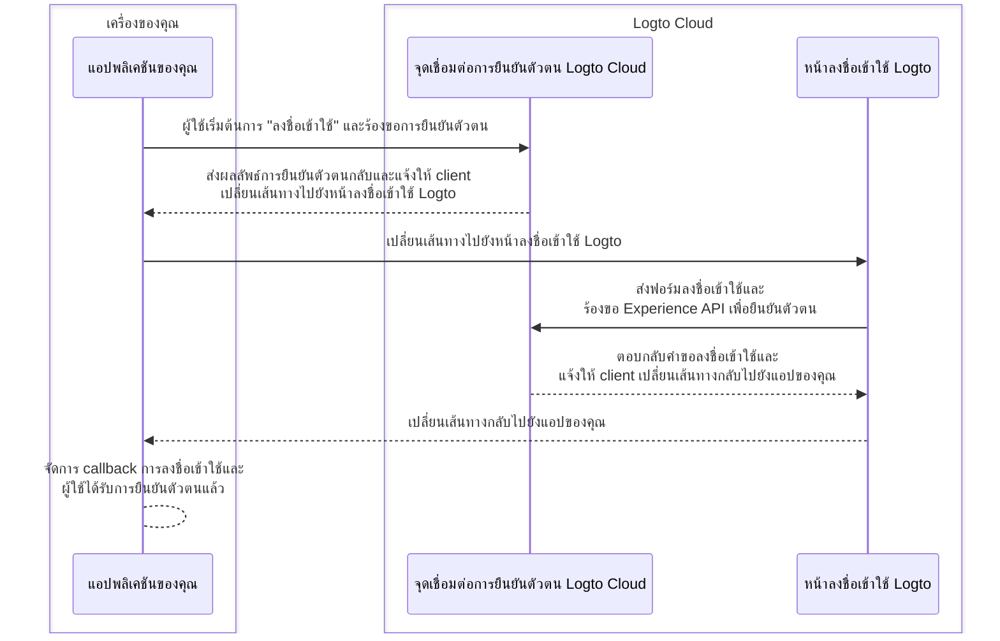
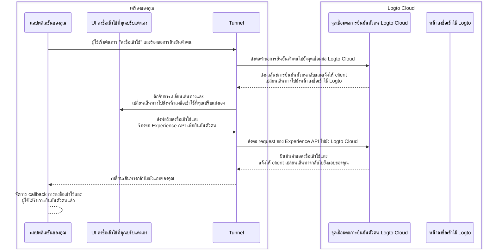

import TabItem from '@theme/TabItem';
import Tabs from '@theme/Tabs';

# ดีบั๊กและทดสอบ UI ที่คุณปรับแต่งเองแบบโลคอล

สำหรับผู้ใช้ Logto Cloud เราได้ทำให้คุณสามารถ "นำ UI ของคุณเองมาใช้" กับ Logto ได้อย่างง่ายดาย ผู้ใช้ Cloud สามารถอัปโหลดไฟล์ zip ที่มี asset ของ UI ที่ปรับแต่งเองได้ที่ <CloudLink to="/sign-in-experience/branding">Console > ประสบการณ์การลงชื่อเข้าใช้ > การสร้างแบรนด์ > นำ UI ของคุณมาใช้</CloudLink> (ดูรายละเอียดเพิ่มเติมได้ที่หน้า [นำ UI ของคุณมาใช้](/customization/bring-your-ui))

อย่างไรก็ตาม ขณะพัฒนาเพจ UI ที่ปรับแต่งเอง ผู้ใช้ต้องการทดสอบและดีบั๊กโค้ดบนเครื่องของตนเองก่อนอัปโหลดขึ้น Logto Cloud คำสั่ง CLI นี้จะช่วยคุณตั้งค่า tunnel โลคอลและเชื่อมต่อ 3 องค์ประกอบต่อไปนี้เข้าด้วยกัน:
จุดเชื่อมต่อการยืนยันตัวตนของ Logto Cloud, แอปพลิเคชันของคุณ และ UI ลงชื่อเข้าใช้ที่คุณปรับแต่งเอง

## ทำไมฉันต้องใช้สิ่งนี้? \{#why-do-i-need-this}

โดยปกติ เมื่อคุณคลิกปุ่ม "ลงชื่อเข้าใช้" ในแอปของคุณ คุณจะถูกนำไปยังหน้าลงชื่อเข้าใช้ที่กำหนดไว้ที่จุดเชื่อมต่อ Logto กระบวนการลงชื่อเข้าใช้ที่สำเร็จสามารถอธิบายได้ดังนี้:



แต่เมื่อคุณกำลังพัฒนา UI ลงชื่อเข้าใช้ที่ปรับแต่งเอง คุณต้องการวิธีนำทางไปยังเพจ UI ลงชื่อเข้าใช้ที่รันอยู่บนเครื่องของคุณแทน
สิ่งนี้ต้องใช้บริการ tunnel โลคอลเพื่อดักจับ request ที่ออกจากแอปของคุณและเปลี่ยนเส้นทางไปยังเพจ UI ลงชื่อเข้าใช้ที่คุณปรับแต่งเอง

นอกจากนี้ คุณต้องโต้ตอบกับ [Logto's Experience API](https://openapi.logto.io/group/endpoint-experience) เพื่อยืนยันตัวตนผู้ใช้และจัดการเซสชัน
บริการนี้ยังช่วยส่งต่อ request ของ Experience API เหล่านี้ไปยัง Logto Cloud เพื่อหลีกเลี่ยงปัญหา CORS

ไดอะแกรมลำดับด้านล่างแสดงให้เห็นว่ากระบวนการ "ลงชื่อเข้าใช้" ที่สำเร็จทำงานอย่างไรเมื่อมี UI ที่ปรับแต่งเองและบริการ tunnel:



เมื่อมีบริการ tunnel คุณสามารถพัฒนาและทดสอบ UI ลงชื่อเข้าใช้ที่ปรับแต่งเองบนเครื่องของคุณได้ โดยไม่ต้องอัปโหลด asset ไปยัง Logto Cloud ทุกครั้งที่มีการเปลี่ยนแปลง

## คำแนะนำ \{#instructions}

### ขั้นตอนที่ 1: รันคำสั่ง \{#step-1-execute-the-command}

สมมติว่า tenant ID ของคุณใน Cloud คือ `foobar` และคุณมีเพจลงชื่อเข้าใช้ที่รันอยู่บน dev server ที่ `http://localhost:4000` คุณสามารถรันคำสั่งนี้ได้ดังนี้:

<Tabs groupId="cmd">

  <TabItem value="cli" label="CLI">

```bash
logto-tunnel -p 9000 --experience-uri http://localhost:4000/ --endpoint https://foobar.logto.app/
```

  </TabItem>
  <TabItem value="npx" label="npx">

```bash
npx @logto/tunnel -p 9000 --experience-uri http://localhost:4000/ --endpoint https://foobar.logto.app/
```

  </TabItem>

</Tabs>

หากคุณตั้งค่าโดเมนแบบกำหนดเองใน Logto ก็สามารถใช้ได้เช่นกัน:

<Tabs groupId="cmd">

  <TabItem value="cli" label="CLI">

```bash
logto-tunnel -p 9000 --experience-uri http://localhost:4000/ --endpoint https://your.custom.domain/
```

  </TabItem>
  <TabItem value="npx" label="npx">

```bash
npx @logto/tunnel -p 9000 --experience-uri http://localhost:4000/ --endpoint https://your.custom.domain/
```

  </TabItem>

</Tabs>

หรืออีกทางหนึ่ง คำสั่งนี้ยังรองรับ asset html แบบ static โดยไม่ต้องรัน dev server ก่อน เพียงตรวจสอบให้แน่ใจว่ามี `index.html` ใน path ที่คุณระบุ

<Tabs groupId="cmd">

  <TabItem value="cli" label="CLI">

```bash
logto-tunnel -p 9000 --experience-path /path/to/your/static/files --endpoint https://foobar.logto.app/
```

  </TabItem>
  <TabItem value="npx" label="npx">

```bash
npx @logto/tunnel -p 9000 --experience-path /path/to/your/static/files --endpoint https://foobar.logto.app/
```

  </TabItem>

</Tabs>

### ขั้นตอนที่ 2: อัปเดต endpoint URI ในแอปของคุณ \{#step-2-update-endpoint-uri-in-your-application}

สุดท้าย รันแอปของคุณและตั้งค่า endpoint ของ Logto ให้เป็นที่อยู่ของ tunnel service `http://localhost:9000/` แทน

ขอยกตัวอย่างแอป React:

```tsx title=App.tsx
import { LogtoProvider, LogtoConfig } from '@logto/react';

// endpoint: 'https://foobar.logto.app/', // จุดเชื่อมต่อ Logto Cloud เดิม
const config: LogtoConfig = {
  endpoint: 'http://localhost:9000/', // ที่อยู่ tunnel service
  appId: '<your-application-id>',
};

const App = () => (
  <LogtoProvider config={config}>
    <YourAppContent />
  </LogtoProvider>
);
```

หากคุณใช้ social sign-in คุณต้องอัปเดต redirect URI ในการตั้งค่าผู้ให้บริการ social ให้เป็นที่อยู่ tunnel service ด้วย

```
http://localhost:9000/callback/<connector-id>
```

หากตั้งค่าทุกอย่างถูกต้อง เมื่อคุณคลิกปุ่ม "ลงชื่อเข้าใช้" ในแอปของคุณ คุณจะถูกนำไปยังหน้าลงชื่อเข้าใช้ที่คุณปรับแต่งเองแทน UI มาตรฐานของ Logto พร้อมเซสชัน (คุกกี้) ที่ถูกต้องสำหรับโต้ตอบกับ Logto Experience API ต่อไป

ขอให้สนุกกับการเขียนโค้ด!

## แหล่งข้อมูลที่เกี่ยวข้อง \{#related-resources}

<Url href="https://blog.logto.io/automate-custom-sign-in-ui-deployment-with-github-actions">
  ทำ deployment UI ลงชื่อเข้าใช้ที่ปรับแต่งเองแบบอัตโนมัติด้วย GitHub Actions workflow
</Url>
